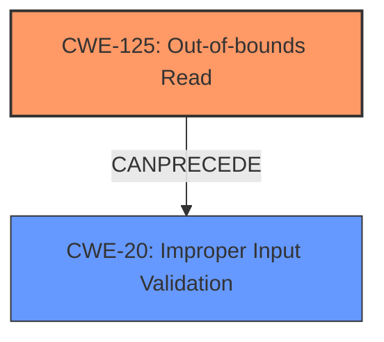

# Final Resolution for CVE-2021-37042

# Summary

| CWE ID  | CWE Name                       | Confidence | CWE Abstraction Level | CWE Vulnerability Mapping Label | CWE-Vulnerability Mapping Notes                                                                                                                     |
| ------- | ------------------------------ | ---------- | ----------------------- | ------------------------------- | ------------------------------------------------------------------------------------------------------------------------------------------------- |
| **CWE-125** | **Out-of-bounds Read**             | 0.7        | Base                    | Primary                         | Allowed - The vulnerability description directly states "out-of-bounds read"                                                                                                                                           |
| **CWE-20**  | **Improper Input Validation**   | 0.6        | Class                    | Contributing                    | Allowed-with-Review - The "Improper verification" may translate to an improper implementation of input validation, which could lead to the **CWE-125**.                                                                                                                             |

## Evidence and Confidence

*   **Confidence Score:** 0.7
*   **Evidence Strength:** MEDIUM

## Relationship Analysis

The primary relationship that impacted the decision was the Parent-Child relationship between **CWE-20** (Improper Input Validation) and the various potential root causes. The "Improper verification" mentioned in the vulnerability description suggests a failure in input validation, making **CWE-20** a relevant contributing factor. While **CWE-20** itself is a Class level CWE and its use is discouraged when more specific Base level CWEs exist, the lack of detailed information about *what* is being improperly verified makes it difficult to pinpoint a more specific root cause.

The relationship between **CWE-20** and **CWE-125** (Out-of-bounds Read) is also crucial. **CWE-20** CanPrecede **CWE-125**, indicating that improper input validation can lead to an out-of-bounds read.

## Vulnerability Chain

The vulnerability chain starts with **improper verification** (**CWE-20**), which leads to the product reading data past the end or before the beginning of the intended buffer (**CWE-125**).

Missing Links:

*   The specific type of input being improperly validated is unknown.
*   The exact mechanism by which the improper verification leads to the out-of-bounds read is unknown.

## Summary of Analysis

The initial analysis correctly identified **CWE-125** as a primary candidate based on the vulnerability description. The criticism provided valuable suggestions for exploring potential root causes and strengthening the analysis.

The final decision is based on the provided evidence and the relationship between CWEs. **CWE-125** is selected as the primary CWE because the vulnerability description explicitly mentions an "out-of-bounds read." **CWE-20** is included as a contributing factor because the "Improper verification" strongly suggests a failure in input validation.

The selected CWEs are at the optimal level of specificity given the available evidence. While more specific CWEs (e.g., **CWE-131**, **CWE-129**) might be relevant, there is insufficient information to determine whether they are the actual root cause. The analysis is primarily based on the provided evidence, specifically the vulnerability description: "Successful exploitation of this vulnerability may cause out-of-bounds read."

The graph relationships influenced the final selection by highlighting the potential chain from input validation to out-of-bounds read. The CanPrecede relationship between **CWE-20** and **CWE-125** reinforces the idea that improper input validation can lead to the observed vulnerability.