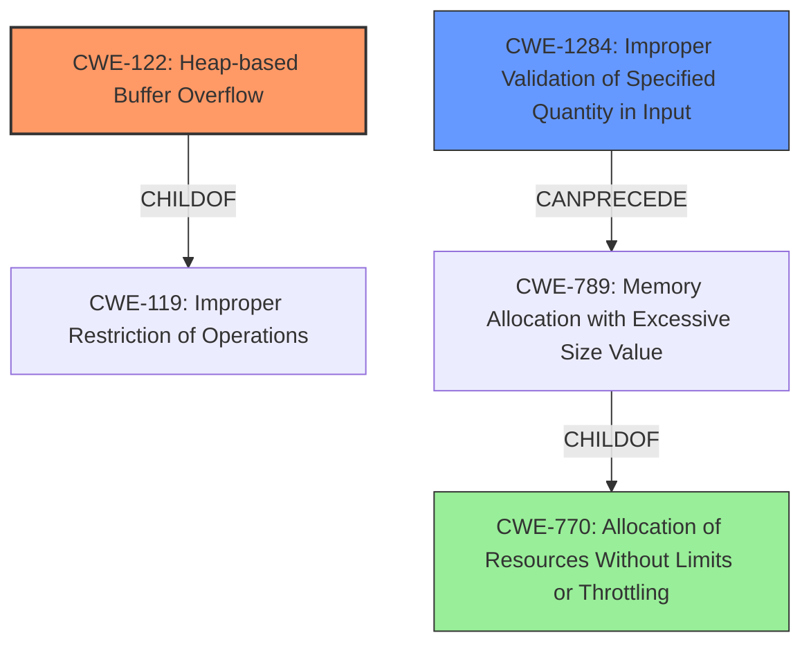

# Final Resolution for CVE-2021-37404

# Summary
| CWE ID   | CWE Name                                                      | Confidence | CWE Abstraction Level | CWE Vulnerability Mapping Label | CWE-Vulnerability Mapping Notes                                                                                                 |
| -------- | ------------------------------------------------------------- | ---------- | --------------------- | ------------------------------- | ----------------------------------------------------------------------------------------------------------------------------- |
| CWE-122  | Heap-based Buffer Overflow                                     | 0.85       | Variant               | Allowed                         | Primary CWE                                                                                                                   |
| CWE-1284 | Improper Validation of Specified Quantity in Input            | 0.70       | Base                  | Allowed                         | Secondary Candidate, contributes to the overflow due to lack of validation on the file path length.                                                 |
| CWE-770  | Allocation of Resources Without Limits or Throttling        | 0.65       | Base                  | Allowed                         | Tertiary Candidate, if the heap buffer overflow is caused by allocating an excessively large buffer due to a lack of limits. |

## Evidence and Confidence

*   **Confidence Score:** 0.80
*   **Evidence Strength:** MEDIUM

## Relationship Analysis
The decision was impacted by the following CWE relationships:
  - Parent-child hierarchical relationships: CWE-122 is a child of CWE-119 (Improper Restriction of Operations within the Bounds of a Memory Buffer).
  - Chain relationships showing progression of vulnerability: CWE-1284 CanPrecede CWE-789 (Memory Allocation with Excessive Size Value), and CWE-789 is a ChildOf CWE-770, so this suggests a possible chain where improper input validation can lead to excessive memory allocation, and possibly to the **heap buffer overflow**.
  - Peer relationships that offered alternative classifications: There were no strong peer relationships that influenced the final decision.
  - Abstraction levels: The selection prioritized Variant and Base level CWEs for specificity.

## Vulnerability Chain
The vulnerability chain starts with the **root cause** of the lack of input validation (CWE-1284).
  - This can lead to allocating an excessively large buffer (CWE-770) either directly or through memory allocation with excessive size value (CWE-789).
  - The lack of proper bounds checking during memory operations on the heap (CWE-119) then manifests as a **heap buffer overflow** (CWE-122).
  - The consequence of the overflow is denial of service or arbitrary code execution, as specified in the vulnerability description.

## Summary of Analysis
The analysis is primarily based on the vulnerability description, which explicitly states a "**heap buffer overflow**". This directly led to the selection of CWE-122 as the primary weakness. The addition of CWE-1284 and its connection to CWE-770 strengthens the analysis by highlighting the **root cause** of missing input validation.

The graph relationships influenced the selection by showing how improper input validation (CWE-1284) can lead to excessive memory allocation (CWE-770), which can then result in a **heap buffer overflow** (CWE-122).

The selected CWEs are at the optimal level of specificity because they directly address the **heap buffer overflow** (CWE-122) and the **root cause** of missing input validation (CWE-1284). CWE-770 is included as a tertiary candidate because it is a possible contributing factor if the overflow is caused by allocating an excessively large buffer.