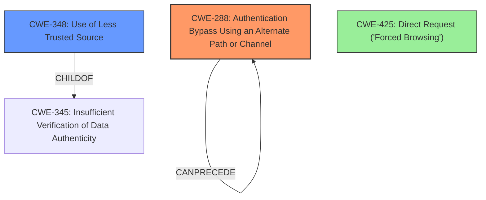

# Final Resolution for CVE-2021-37421

# Summary
| CWE ID | CWE Name | Confidence | CWE Abstraction Level | CWE Vulnerability Mapping Label | CWE-Vulnerability Mapping Notes |
|---|---|---|---|---|---|
| CWE-288 | Authentication Bypass Using an Alternate Path or Channel | 0.9 | Base | Allowed | Primary CWE |
| CWE-348 | Use of Less Trusted Source | 0.7 | Base | Allowed | Secondary Candidate |

## Evidence and Confidence

*   **Confidence Score:** 0.9
*   **Evidence Strength:** HIGH

## Relationship Analysis
The decision was influenced by the need for a more precise CWE that captures the essence of bypassing authentication via a manipulated header.
  - CWE-288 is chosen as the primary CWE because it directly addresses the bypass using an alternate path, aligning with the manipulation of the `X-Forwarded-For` header.
  - CWE-348 is kept as a secondary CWE because it represents the underlying issue of trusting a less reliable source, contributing to the vulnerability.

## Vulnerability Chain
The vulnerability chain starts with the application's reliance on the `X-Forwarded-For` header (CWE-348). This less trusted source is then used to make authorization decisions, leading to a bypass of the intended IP-based access restrictions (CWE-288). The initial flaw (CWE-348) results in the ability to circumvent authentication checks, granting unauthorized access.

## Summary of Analysis
The initial analysis correctly identified the vulnerability. However, the criticism suggested that CWE-288 is a better fit as the primary CWE because it more accurately describes the authentication bypass achieved through an alternate path.
- The vulnerability involves bypassing admin portal access restrictions by manipulating the `X-Forwarded-For` header. The application trusts this header to determine the source IP address for access control, which an attacker can easily spoof. The **lack of proper input validation** on the IP address provided in the `X-Forwarded-For` header directly contributes to this weakness.
- The decision to shift to CWE-288 is based on the fact that the manipulation of the `X-Forwarded-For` header creates an alternate channel that bypasses the intended IP-based restriction. The original authentication mechanism may be in place, but an alternate path allows bypass. The selected CWEs are at the optimal level of specificity. CWE-288 and CWE-348 are both Base level CWEs, which is the preferred level of abstraction.
- "Funnel all access through a single choke point to simplify how users can access a resource. For every access, perform a check to determine if the user has permissions to access the resource." This mitigation highlights the need to have a single, trusted source for authentication and authorization decisions, which directly addresses CWE-288.
- The application trusts the `X-Forwarded-For` header, a less trusted source, to make authorization decisions.

The final selection of CWEs provides a more accurate and detailed representation of the vulnerability, considering both the direct cause (CWE-288) and contributing factors (CWE-348).