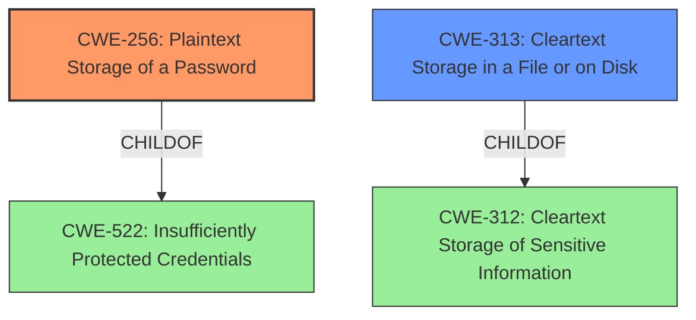

# Analysis Report for CVE-2021-37452

# Vulnerability Analysis Report: CVE-2021-37452

## Description

NCH Quorum v2.03 and earlier allows local users to discover cleartext login information relating to users by reading the local .dat configuration files.

## Vulnerability Description Key Phrases

**Impact:** discover cleartext login information
**Vector:** reading the local .dat configuration files
**Attacker:** local users
**Product:** NCH Quorum
**Version:** v2.03 and earlier

## Analysis (with Relationship Data)

# Summary
| CWE ID | CWE Name | Confidence | CWE Abstraction Level | CWE Vulnerability Mapping Label | CWE-Vulnerability Mapping Notes |
|---|---|---|---|---|---|
| CWE-256 | Plaintext Storage of a Password | 1.0 | Base | Allowed | Primary CWE |
| CWE-313 | Cleartext Storage in a File or on Disk | 0.8 | Variant | Allowed | Secondary Candidate |

## Evidence and Confidence

*   **Confidence Score:** 0.9
*   **Evidence Strength:** HIGH

- **Analysis and Justification:**  
  - *Explanation:* The vulnerability involves storing login information in **cleartext** within `.dat` configuration files, allowing local users to discover this information by reading the files. This directly aligns with CWE-256, "Plaintext Storage of a Password" and CWE-313, "Cleartext Storage in a File or on Disk". The CVE reference summary explicitly states that "Passwords and other sensitive user data are stored without any encryption or hashing." CWE-256 is a more specific match, since the primary **weakness** is the **storage of passwords in plaintext**. CWE-313 is related because it is about storing sensitive information in cleartext to a file or on disk, but the passwords are the primary concern. The MITRE mapping guidance for both CWE-256 and CWE-313 indicates they are ALLOWED.

  - *Relationship Analysis:* CWE-256 is a base CWE, and per the description, storing a password in plaintext may result in a system compromise. CWE-313 is a variant CWE, and is a child of CWE-312 "Cleartext Storage of Sensitive Information."

- **Confidence Score:**  
  - Confidence: 1.0 (High confidence due to the explicit mention of plaintext password storage in the vulnerability description and CVE reference materials)

---

## Criticism of Analysis

Okay, I've reviewed the analysis and the full CWE specifications provided. Here's my critique:

**Overall Assessment:**

The analysis is generally well-reasoned and the primary CWE mapping to `CWE-256: Plaintext Storage of a Password` is accurate and justified. The inclusion of `CWE-313: Cleartext Storage in a File or on Disk` as a secondary candidate is also reasonable, although `CWE-256` is indeed a more specific and appropriate primary mapping. The confidence score of 1.0 for CWE-256 is warranted given the clear indication of plaintext password storage.

**Detailed Critique:**

*   **CWE-256: Plaintext Storage of a Password**

    *   **Mapping Correctness:**  The mapping to CWE-256 is spot-on. The vulnerability description and CVE summary directly indicate that passwords are being stored in plaintext.
    *   **Abstraction Level:**  CWE-256 is a *Base* level CWE, which is appropriate.  The analysis correctly notes this and the mapping guidance explicitly *allows* this CWE due to its abstraction level.
    *   **Relationship Analysis:** The analysis correctly identifies that CWE-256 is a child of CWE-522, "Insufficiently Protected Credentials", and notes how storing a password in plaintext can lead to system compromise.
    *   **Mitigations:** The analysis does not specifically mention the mitigations suggested by the CWE entry. It would be beneficial to add a sentence or two summarizing the recommended mitigations, such as: "Mitigation strategies include avoiding storing passwords in easily accessible locations and considering cryptographic hashes of passwords instead of storing them in plaintext." This would demonstrate a deeper understanding of the CWE's implications.

*   **CWE-313: Cleartext Storage in a File or on Disk**

    *   **Mapping Correctness:** While the vulnerability does involve storing sensitive information in cleartext in a file, `CWE-256` is more precise as it specifically addresses the storage of *passwords*. `CWE-313` is broader and applies to any sensitive information.
    *   **Abstraction Level:** `CWE-313` is a *Variant* CWE, also an acceptable level for mapping. The tool correctly identified this.
    *   **Relationship Analysis:** Correctly identifies CWE-313 as a child of CWE-312, "Cleartext Storage of Sensitive Information".
    *   **Mitigations:** Similar to CWE-256, it would improve the analysis to mention the recommended mitigation for `CWE-313`: "A potential mitigation involves using the provider's controls to encrypt the data at rest, particularly in cloud environments".

*   **Consideration of Other CWEs:**

    *   The Retriever results suggest `CWE-522: Insufficiently Protected Credentials`. While this is a parent of `CWE-256`, the analysis is correct in choosing the more specific child. Mentioning this relationship in the analysis would further strengthen the justification. The analysis could state something like: "While CWE-522 is a possible candidate, it is a broader, class-level CWE, and CWE-256 provides a more precise characterization of the vulnerability."
    *   `CWE-532: Insertion of Sensitive Information into Log File` is not directly applicable, unless the .dat files *themselves* are being logged, which is not indicated in the original description.
    *   `CWE-257: Storing Passwords in a Recoverable Format` is similar to `CWE-256`, but less accurate. The passwords aren't being *encrypted* in a recoverable format, they are being stored *without any encryption*.
    *   `CWE-319: Cleartext Transmission of Sensitive Information` is not applicable. The vulnerability involves storage, not transmission.

**Suggestions for Improvement:**

1.  **Explicitly mention mitigations:**  For both CWE-256 and CWE-313, briefly state the recommended mitigation strategies as outlined in the CWE specifications. This shows a more complete understanding of the weakness and its potential remedies.
2.  **Address and Justify Alternatives:**  Acknowledge the top-ranked CWEs from the Retriever Results (e.g., CWE-522) and explain why the chosen CWE (CWE-256) is a more accurate or specific fit.  This strengthens the analysis by demonstrating a consideration of alternative perspectives.
3.  **Enhance Relationship Analysis:** Expand the relationship analysis to include not just parent/child relationships but also how the chosen CWE relates to the overall impact and attack vector.
4.  **Minor Clarification:** While the confidence level is already high, it could be marginally increased by emphasizing that plaintext *passwords*, specifically, are involved, making `CWE-256` the most appropriate choice.

**Revised Summary Table (incorporating suggestions):**

| CWE ID | CWE Name | Confidence | CWE Abstraction Level | CWE Vulnerability Mapping Label | CWE-Vulnerability Mapping Notes |
|---|---|---|---|---|---|
| CWE-256 | Plaintext Storage of a Password | 1.0 | Base | Allowed | Primary CWE. Mitigations include avoiding storing passwords in easily accessible locations and using cryptographic hashes. |
| CWE-313 | Cleartext Storage in a File or on Disk | 0.8 | Variant | Allowed | Secondary Candidate. A potential mitigation involves encrypting data at rest. CWE-256 is preferred as it specifically addresses passwords. |

By incorporating these suggestions, the analysis will be even more comprehensive and convincing, demonstrating a thorough understanding of the CWE specifications and their application to the given vulnerability.

## Final Resolution

# Summary
| CWE ID | CWE Name | Confidence | CWE Abstraction Level | CWE Vulnerability Mapping Label | CWE-Vulnerability Mapping Notes |
|---|---|---|---|---|---|
| CWE-256 | Plaintext Storage of a Password | 1.0 | Base | Allowed | Primary CWE. Mitigations include avoiding storing passwords in easily accessible locations and using cryptographic hashes. |
| CWE-313 | Cleartext Storage in a File or on Disk | 0.8 | Variant | Allowed | Secondary Candidate. A potential mitigation involves encrypting data at rest. CWE-256 is preferred as it specifically addresses passwords. |

## Evidence and Confidence

*   **Confidence Score:** 1.0
*   **Evidence Strength:** HIGH

## Relationship Analysis
The primary relationship considered was the parent-child relationship between CWE-522 (Insufficiently Protected Credentials) and CWE-256 (Plaintext Storage of a Password). Although CWE-522 is a parent, CWE-256 provides a more specific classification. CWE-313 is a sibling of other cleartext storage CWEs, but it is not password-specific, making it a less optimal primary choice. The abstraction levels (Base and Variant) are both acceptable according to MITRE guidelines, favoring the Base level when possible.

## Vulnerability Chain
The vulnerability chain starts with the **ROOTCAUSE**: **CWE-256 (Plaintext Storage of a Password)**. This leads to the **WEAKNESS** of having passwords stored in an insecure manner, making them accessible to local users who can read the configuration files. The impact is the unauthorized disclosure of user credentials, potentially leading to unauthorized access and further compromise.

## Summary of Analysis
The initial analysis accurately identified **CWE-256 (Plaintext Storage of a Password)** as the primary **weakness**. The vulnerability description states, "NCH Quorum v2.03 and earlier allows local users to discover **cleartext** login information relating to users by reading the local .dat configuration files." This directly supports the selection of **CWE-256**.

The criticism provided useful suggestions, including explicitly mentioning mitigations for **CWE-256** and **CWE-313**, and justifying the selection of **CWE-256** over other potential candidates like **CWE-522 (Insufficiently Protected Credentials)**. The graph relationships confirmed that **CWE-256** is a more specific child of **CWE-522**, making it the optimal choice. **CWE-313 (Cleartext Storage in a File or on Disk)** remains a secondary candidate as it relates to the storage of sensitive information in a file, but **CWE-256** is more directly relevant to the storage of passwords. The final decision is based on the evidence provided, the relationship analysis, and the mapping guidance, ensuring that the selected **CWEs** are at the optimal level of specificity. The high confidence score reflects the clear and direct evidence supporting the classification.

*Report generated on 2025-03-17 00:07:08*
