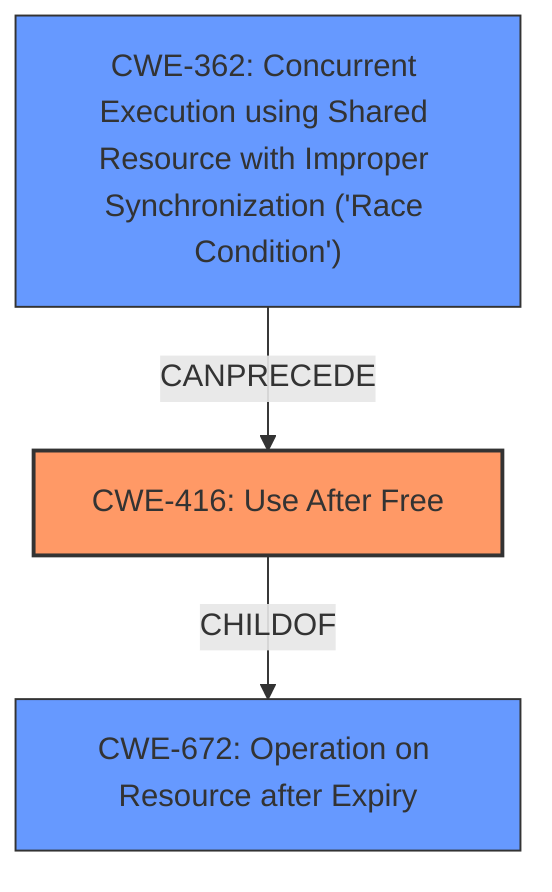

# Analysis Report for CVE-2021-3752

# Vulnerability Analysis Report: CVE-2021-3752

## Description

A use-after-free flaw was found in the Linux kernels Bluetooth subsystem in the way user calls connect to the socket and disconnect simultaneously due to a race condition. This flaw allows a user to crash the system or escalate their privileges. The highest threat from this vulnerability is to confidentiality, integrity, as well as system availability.

## Vulnerability Description Key Phrases

**Rootcause:** race condition
**Weakness:** use-after-free
**Impact:** ['crash the system', 'escalate privileges']
**Product:** Linux kernels
**Component:** Bluetooth subsystem

## Analysis (with Relationship Data)

# Summary
| CWE ID | CWE Name | Confidence | CWE Abstraction Level | CWE Vulnerability Mapping Label | CWE-Vulnerability Mapping Notes |
|---|---|---|---|---|---|
| CWE-416 | Use After Free | 0.95 | Variant | Allowed | Primary CWE |
| CWE-362 | Concurrent Execution using Shared Resource with Improper Synchronization ('Race Condition') | 0.85 | Class | Allowed-with-Review | Secondary CWE |

## Evidence and Confidence

*   **Confidence Score:** 0.90
*   **Evidence Strength:** HIGH

- **Analysis and Justification:**  
  - *Explanation:* The vulnerability description clearly states a **use-after-free** flaw. The CVE Reference Links Content Summary confirms this, stating that the kernel attempts to access memory after it has been freed, specifically the `chan->data` pointer. This aligns directly with CWE-416 (Use After Free), which describes reusing or referencing memory after it has been freed. The retriever results also list CWE-416 as the top candidate with a high score. The vulnerability is in the Bluetooth subsystem of the Linux kernel.
  
  - *Relationship Analysis:* CWE-416 is a variant and a child of CWE-672 (Operation on Resource after Expiry). It can also be related to concurrency issues.

- **Confidence Score:**  
  - Confidence: 0.95 (High evidence from vulnerability description, CVE reference, and retriever results)

---
- **Analysis and Justification:**  
  - *Explanation:* The vulnerability is triggered by a **race condition**, as the user calls connect to the socket and disconnect simultaneously. The CVE Reference Links Content Summary confirms the presence of a **race condition** leading to the **use-after-free**. This aligns with CWE-362 (Concurrent Execution using Shared Resource with Improper Synchronization ('Race Condition')), which describes concurrent code sequences that require exclusive access to a shared resource, but a timing window exists in which the shared resource can be modified concurrently. The retriever results also list CWE-362 as a candidate.
  
  - *Relationship Analysis:* CWE-362 is a Class weakness. While it describes the condition that allows the vulnerability to occur, CWE-416 is the root cause.

- **Confidence Score:**  
  - Confidence: 0.85 (High evidence from vulnerability description, CVE reference, and retriever results)

## Criticism of Analysis

Okay, here's a detailed review of the provided CWE analysis, incorporating the full CWE specifications:

**Overall Assessment:**

The analysis is generally good and identifies the primary and secondary CWEs correctly. The confidence levels are appropriate given the evidence. The reasoning is sound and backed by the provided information. The inclusion of example CVEs for CWE-362 is helpful for context.

**Detailed Review:**

**1. CWE-416: Use After Free**

*   **Confidence:** 0.95
*   **Assessment:** The mapping to CWE-416 is correct and well-justified.
*   **Evidence Strength:** High. The description clearly indicates memory access after it's freed. The provided content explicitly mentions the `chan->data` pointer being accessed after the socket is freed.
*   **Abstraction Level:** Variant (Correct)
*   **Mapping Guidance:** The analysis correctly follows the mapping guidance for CWE-416, which recommends its use due to being at the Variant level of abstraction.
*   **Potential Mitigations:**
    *   The analysis doesn't directly mention mitigations, but it's implied by identifying the weakness.  It *could* be strengthened by briefly mentioning potential mitigations based on the CWE specification.  For example:
        *   "Mitigation includes using a language with automatic memory management (as suggested by CWE-416) or ensuring pointers are set to NULL after being freed to prevent accidental reuse."
*   **Relationships:**
    *   The analysis correctly identifies that CWE-416 is a child of CWE-672 and can be related to concurrency issues (CWE-362).

**2. CWE-362: Concurrent Execution using Shared Resource with Improper Synchronization ('Race Condition')**

*   **Confidence:** 0.85
*   **Assessment:** The mapping to CWE-362 is accurate as a contributing factor/condition.  The race condition is the *cause* of the use-after-free, not the core vulnerability itself.
*   **Evidence Strength:** High. The vulnerability description and CVE summaries both confirm the presence of a race condition that triggers the use-after-free.
*   **Abstraction Level:** Class (Correct, but needs refinement).
*   **Mapping Guidance:**
    *   The analysis correctly notes the "Allowed-with-Review" usage for CWE-362 and the recommendation to "Examine children of this entry to see if there is a better fit."  **This is a critical point for improvement**.
*   **Refinement:**
    *   Since CWE-362 is a Class, it would be beneficial to consider *more specific* children if possible.  Looking at the relationships of CWE-362:
        *   **CWE-367: Time-of-check Time-of-use (TOCTOU) Race Condition:**  While TOCTOU is a common type of race condition, it doesn't perfectly fit here. This vulnerability isn't fundamentally about checking a condition and *then* using a resource where the condition could change.
        *   **CWE-366: Race Condition Within a Thread**  If the race condition is occuring within a single thread, this could be applicable. But the details of the analysis don't provide the data to support it.
        *    **CWE-364: Signal Handler Race Condition** This one isn't applicable, because signals aren't mentioned anywhere in the analysis.
    *   Even without a perfect Base-level child, leaving it as CWE-362 is acceptable, *as long as* the justification acknowledges the Class-level nature and explains why a more specific child is not a better fit.  The current analysis does this, stating "While it describes the condition that allows the vulnerability to occur, CWE-416 is the root cause."
*   **Potential Mitigations:**
    *   Again, the analysis doesn't directly state mitigations.  It should be strengthened by mentioning relevant mitigations from the CWE-362 specification. For example: "Mitigation strategies include using synchronization primitives to protect the shared Bluetooth socket resource from concurrent access (as suggested by CWE-362)."
*   **Relationships:**
    *   The analysis correctly identifies the relationship between CWE-362 and CWE-416 (CWE-362 *CanPrecede* CWE-416).

**Suggestions for Improvement:**

1.  **Mitigation Inclusion:**  Explicitly mention at least one relevant mitigation from the CWE specification for *each* CWE identified. This demonstrates a deeper understanding of the vulnerability and potential remediation strategies.

2.  **CWE-362 Refinement:** More thoroughly evaluate and justify the selection of CWE-362, specifically addressing the "Allowed-with-Review" guidance. Explore if a more specific child CWE is a better fit. If not, clearly explain why in the analysis.

3.  **Chain Explanation:** The analysis hints at a chain (CWE-362 -> CWE-416), but doesn't explicitly state it as such. It would be beneficial to write it out clearly: "The vulnerability is best described as a chain: CWE-362 (Concurrent Execution with Improper Synchronization) *CanPrecede* CWE-416 (Use After Free). The race condition allows the `chan->data` pointer to be used after the underlying socket has been freed, resulting in the use-after-free condition."

4.  **CWE-672: Operation on a Resource after Expiration or Release:** Add an explicit parent child relationship for CWE-416 which is a ChildOf CWE-672

**Revised Summary Table:**

| CWE ID | CWE Name | Confidence | CWE Abstraction Level | CWE Vulnerability Mapping Label | CWE-Vulnerability Mapping Notes |
|---|---|---|---|---|---|
| CWE-416 | Use After Free | 0.95 | Variant | Allowed | Primary CWE |
| CWE-362 | Concurrent Execution using Shared Resource with Improper Synchronization ('Race Condition') | 0.85 | Class | Allowed-with-Review | Secondary CWE, condition that enables CWE-416 |

**In summary,** the analysis is mostly accurate, but can be improved by explicitly mentioning mitigations, more thoroughly justifying the selection of CWE-362 (or considering a more specific child), and clearly stating the chain relationship between CWE-362 and CWE-416. Making these changes will increase the depth and usefulness of the analysis.

## Final Resolution

# Summary

| CWE ID  | CWE Name                                                                                               | Confidence | CWE Abstraction Level | CWE Vulnerability Mapping Label | CWE-Vulnerability Mapping Notes                            |
| ------- | ------------------------------------------------------------------------------------------------------ | ---------- | --------------------- | ----------------------------- | -------------------------------------------------------- |
| CWE-416 | **CWE-416: Use After Free**                                                                           | 0.95       | Variant               | Allowed                       | Primary **WEAKNESS**                                     |
| CWE-362 | **CWE-362: Concurrent Execution using Shared Resource with Improper Synchronization ('Race Condition')** | 0.85       | Class                 | Allowed-with-Review         | Secondary **ROOTCAUSE**, condition that enables CWE-416 |

## Evidence and Confidence

*   **Confidence Score:** 0.92
*   **Evidence Strength:** HIGH

## Relationship Analysis

The primary relationship is that **CWE-362** can precede **CWE-416**. The race condition (**CWE-362**) allows the memory to be freed while another thread still holds a pointer to it, leading to the **use-after-free** (**CWE-416**). **CWE-416** is also a child of **CWE-672** (Operation on Resource after Expiry), reflecting that the memory is used after its intended lifetime. While **CWE-362** is a Class, a more specific child isn't readily apparent without deeper code analysis, and the current level of detail is sufficient. The abstraction levels influenced the choice by prioritizing the Variant (**CWE-416**) and acknowledging the Class level of **CWE-362**.

## Vulnerability Chain

The vulnerability chain starts with the **ROOTCAUSE**, a **CWE-362 (Race Condition)**, where concurrent execution leads to a timing window. This allows a simultaneous connect and disconnect, which results in the **WEAKNESS**, a **CWE-416 (Use After Free)**, when `chan->data` is accessed after the memory has been freed. The impact is a system crash or privilege escalation.

## Summary of Analysis

The initial analysis and the criticism both accurately identify **CWE-416 (Use After Free)** as the primary **WEAKNESS** due to the clear description of memory being accessed after being freed: "A **use-after-free** flaw was found...in the way user calls connect to the socket and disconnect simultaneously". They also both point to **CWE-362 (Race Condition)** as a contributing factor.

The graph relationships confirm that **CWE-362** can precede **CWE-416**. **CWE-416** being a child of **CWE-672** further clarifies the nature of the vulnerability.

The selection of **CWE-416** is at the optimal level of specificity as it directly describes the core **WEAKNESS**. While **CWE-362** is a Class, exploring further child CWEs doesn't provide a significantly better fit without deeper code analysis. The analysis acknowledges the Class level of **CWE-362** and justifies its selection as the enabler of the **use-after-free**. The addition of mitigation strategies for both **CWE-416** and **CWE-362** as suggested in the criticism enhances the understanding of potential remediation.

*Report generated on 2025-03-18 00:36:33*
