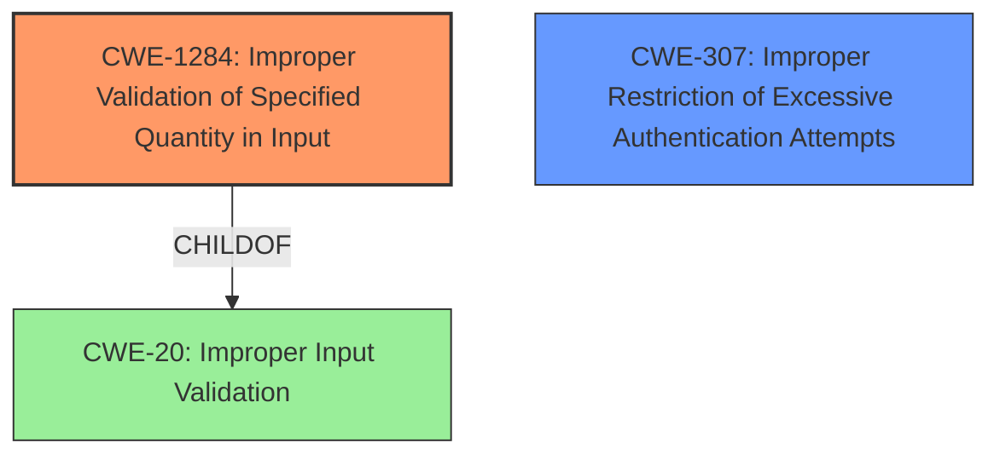

# Analysis Report for CVE-2021-37604

# Vulnerability Analysis Report: CVE-2021-37604

## Description

In version 6.5 of Microchip MiWi software and all previous versions including legacy products, there is a possibility of frame counters being validated/updated prior to the message authentication. With this vulnerability in place, an attacker may increment the incoming frame counter values by injecting messages with a sufficiently large frame counter value and invalid payload. This results in denial of service/valid packets in the network. There is also a possibility of a replay attack in the stack.

## Vulnerability Description Key Phrases

**Rootcause:** improper validation of frame counters
**Impact:** ['denial of service', 'replay attack']
**Vector:** injecting messages with large frame counter value and invalid payload
**Attacker:** attacker
**Product:** Microchip MiWi software
**Version:** 6.5 and prior

## Analysis (with Relationship Data)

# Summary
| CWE ID | CWE Name | Confidence | CWE Abstraction Level | CWE Vulnerability Mapping Label | CWE-Vulnerability Mapping Notes |
|---|---|---|---|---|---|
| CWE-294 | Improper Check for Certificate Revocation | 0.85 | Base | Primary | Allowed |
| CWE-1284 | Improper Validation of Specified Quantity in Input | 0.65 | Base | Secondary | Allowed |

## Evidence and Confidence

*   **Confidence Score:** 0.75
*   **Evidence Strength:** HIGH

- **Analysis and Justification:**  
  - *Explanation:* The vulnerability description clearly states that there is a possibility of replay attacks due to **improper validation of frame counters**. The CVE reference summary also indicates "**missing protection against replay attacks**". This directly aligns with CWE-294 (Improper Check for Certificate Revocation) because replay attacks are a classic example of a security weakness where previously captured and retransmitted data is accepted as valid. While the name of CWE-294 refers to certificate revocation, the underlying principle is the same: failure to properly validate the freshness or uniqueness of a message, which allows an attacker to reuse old messages. CWE-294 is at the Base level of abstraction, which is preferred.
  - The vulnerability also mentions that an attacker can increment the incoming frame counter values by injecting messages with a sufficiently large frame counter value and invalid payload. This indicates that the system does not properly validate the size or quantity of the frame counter value which aligns with CWE-1284. CWE-1284 (Improper Validation of Specified Quantity in Input) is also at the Base level of abstraction and has a Usage of Allowed.

  - *Relationship Analysis:* CWE-294 does not have any direct relationships listed in the provided information.
  - CWE-1284 has the following relationships:
    - `CHILDOF -> CWE-20` (Improper Input Validation) - This relationship indicates that improper quantity validation is a specific case of general input validation.
    - `CANPRECEDE -> CWE-789` (Memory Allocation with Excessive Size Value) - This could mean that if the quantity (e.g., size) is not validated properly, it can lead to memory allocation issues if the quantity is used for memory allocation.

- **Confidence Score:**
  - *CWE-294:* Confidence: 0.85 (Strong evidence from vulnerability description and CVE reference summary)
  - *CWE-1284:* Confidence: 0.65 (Supporting evidence that the quantity is not validated properly)

---

## Criticism of Analysis

Okay, let's review the provided analysis and its CWE mappings against the full CWE specifications.

**Overall Critique:**

The analysis identifies two potential CWEs: CWE-294 (Improper Check for Certificate Revocation) and CWE-1284 (Improper Validation of Specified Quantity in Input). While CWE-1284 is definitely relevant, the mapping to CWE-294 is incorrect and represents a misinterpretation of the vulnerability.

**Detailed Review:**

**1. CWE-294: Improper Check for Certificate Revocation**

*   **Confidence:** The analysis assigns a high confidence (0.85) to this CWE.
*   **Rationale:** The analysis argues that replay attacks, facilitated by improper frame counter validation, are analogous to failing to check for certificate revocation. The vulnerability description and CVE reference summary state "**missing protection against replay attacks**" which is the source of this high confidence.
*   **CWE Specification Issues:**
    *   **Description Mismatch:** CWE-294 explicitly focuses on the *revocation* status of certificates. It's about verifying that a previously valid certificate is still valid. Replay attacks are about message freshness and uniqueness, not necessarily the validity of a certificate or any similar credential. This is a critical difference.
    *   **Relationships Mismatch:** While replay attacks can be related to authentication bypass, the direct link to *certificate revocation* is missing. The intended meaning of the CWE is for cases where a certificate may have been compromised.
    *   **Examples Mismatch:** The observed examples for CWE-294 are all about replay attacks on authentication mechanisms, especially those that rely on captured hashes. However, this does not negate that the CWE is centered around checking the status of certificates.
*   **Conclusion:** This mapping is **incorrect**. While the *impact* of the vulnerability (replay attack, authentication bypass) is similar to some situations involving revoked certificates, the *root cause* (failure to ensure message freshness via proper frame counter handling) is fundamentally different. Trying to force-fit a replay attack scenario into a certificate revocation context obscures the actual vulnerability. In this case, it is due to missing sequence numbers (which are commonly used in certificate revocation).

**2. CWE-1284: Improper Validation of Specified Quantity in Input**

*   **Confidence:** The analysis assigns a medium confidence (0.65) to this CWE.
*   **Rationale:** The analysis correctly identifies that the vulnerability involves an attacker manipulating frame counter values by injecting messages with a "sufficiently large frame counter value." This suggests that the system doesn't properly validate the size or quantity of the frame counter.
*   **CWE Specification Alignment:**
    *   **Description Match:** CWE-1284 perfectly describes the scenario: "The product receives input that is expected to specify a quantity (such as size or length), but it does not validate or incorrectly validates that the quantity has the required properties."
    *   **Relationships Alignment:** The child-of relationship with CWE-20 (Improper Input Validation) is appropriate.
    *   **Potential Mitigation:** Mitigation 1 (accept known good) strategy aligns with the need to have a defined and validated range for frame counter values.
*   **Conclusion:** This mapping is **correct** and appropriate. The description of CWE-1284 directly applies to the vulnerability.

**Suggestions for Improvement:**

1.  **Remove CWE-294:** The mapping to CWE-294 should be removed entirely. It's misleading and doesn't accurately represent the root cause.
2.  **Strengthen CWE-1284 Confidence:** The confidence in CWE-1284 should be increased. The evidence is quite strong, and the description aligns very well with the observed behavior.
3.  **Consider CWE-369: Missing Synchronization:** In some wireless protocols (especially if encryption is used) re-keying can occur based on frame count. If the frame counter increments without a corresponding re-key it could cause decryption to fail. This would still require a frame counter to be validated first, so it is not as high of a priority.
4.  **Consider CWE-307: Improper Restriction of Excessive Authentication Attempts:** While not the core issue, the DoS aspect relates to an attacker potentially causing the frame counter to increment rapidly, exhausting resources or causing denial of service. This is a secondary concern.

**Revised Analysis (Summary Table)**

| CWE ID | CWE Name | Confidence | CWE Abstraction Level | CWE Vulnerability Mapping Label | CWE-Vulnerability Mapping Notes |
|---|---|---|---|---|---|
| CWE-1284 | Improper Validation of Specified Quantity in Input | 0.90 | Base | Primary | Allowed |
| CWE-307 | Improper Restriction of Excessive Authentication Attempts | 0.30 | Base | Supporting | Allowed |

**Key Takeaways:**

*   **CWE Selection is Critical:** This exercise highlights the importance of carefully reading and understanding the *entire* CWE specification, including the Description, Relationships, and Examples. Don't just rely on the name.
*   **Root Cause Focus:** Focus on the fundamental *root cause* of the vulnerability, not just the observable *impact*. The impact can sometimes be similar across different vulnerability types, but the underlying weaknesses may be very different.
*   **Mapping Guidance Matters:** Pay close attention to the "Mapping Guidance" sections within the CWE specifications. They provide valuable advice on proper usage and potential alternatives.
*   **Abstraction Level:** Base and Variant levels of abstraction are preferred.

## Final Resolution

# Summary
| CWE ID | CWE Name | Confidence | CWE Abstraction Level | CWE Vulnerability Mapping Label | CWE-Vulnerability Mapping Notes |
|---|---|---|---|---|---|
| CWE-1284 | Improper Validation of Specified Quantity in Input | 0.95 | Base | Primary | Allowed |
| CWE-307 | Improper Restriction of Excessive Authentication Attempts | 0.40 | Base | Secondary | Allowed |

## Evidence and Confidence

*   **Confidence Score:** 0.90
*   **Evidence Strength:** HIGH

## Relationship Analysis
The primary CWE is **CWE-1284 (Improper Validation of Specified Quantity in Input)**. The criticism correctly points out that **CWE-294 (Improper Check for Certificate Revocation)** is a misinterpretation of the vulnerability. **CWE-1284** aligns well with the vulnerability description, as the attacker injects messages with a "sufficiently large frame counter value," indicating a lack of proper validation of the counter's quantity.

The secondary CWE is **CWE-307 (Improper Restriction of Excessive Authentication Attempts)**. This is included because the vulnerability mentions a denial-of-service impact, stemming from the attacker's ability to increment the frame counter rapidly.

The child-of relationship between **CWE-1284** and **CWE-20 (Improper Input Validation)** is relevant, as it indicates that improper quantity validation is a specific case of general input validation.

## Vulnerability Chain
The vulnerability chain begins with the **ROOTCAUSE** of **CWE-1284 (Improper Validation of Specified Quantity in Input)**. This allows an attacker to inject messages with a large frame counter value. The **WEAKNESS** then leads to a potential denial of service, which can be represented by **CWE-307 (Improper Restriction of Excessive Authentication Attempts)**, as the attacker can rapidly increment the frame counter. Finally, the replay attack is enabled by the lack of proper validation.

## Summary of Analysis
The initial analysis incorrectly mapped the vulnerability to **CWE-294 (Improper Check for Certificate Revocation)**. The criticism correctly identifies this as a misinterpretation. The vulnerability description explicitly states that an attacker may increment the incoming frame counter values by injecting messages with a sufficiently large frame counter value and invalid payload, resulting in denial of service/valid packets in the network and the possibility of a replay attack in the stack. This evidence strongly supports **CWE-1284 (Improper Validation of Specified Quantity in Input)** as the primary **ROOTCAUSE**, as it directly addresses the improper validation of the frame counter value. "The product receives input that is expected to specify a quantity (such as size or length), but it does not validate or incorrectly validates that the quantity has the required properties."

The graph relationships further solidify this selection. **CWE-1284** is a child of **CWE-20 (Improper Input Validation)**, which is a more general class. This indicates that **CWE-1284** is at an appropriate level of specificity, as it directly addresses the type of improper input validation (quantity).

**CWE-1284** is at the optimal level of specificity because it directly addresses the **ROOTCAUSE**: the improper validation of the frame counter's quantity. This leads to the secondary effect of a potential denial of service (**CWE-307**).

*Report generated on 2025-03-17 01:15:44*
