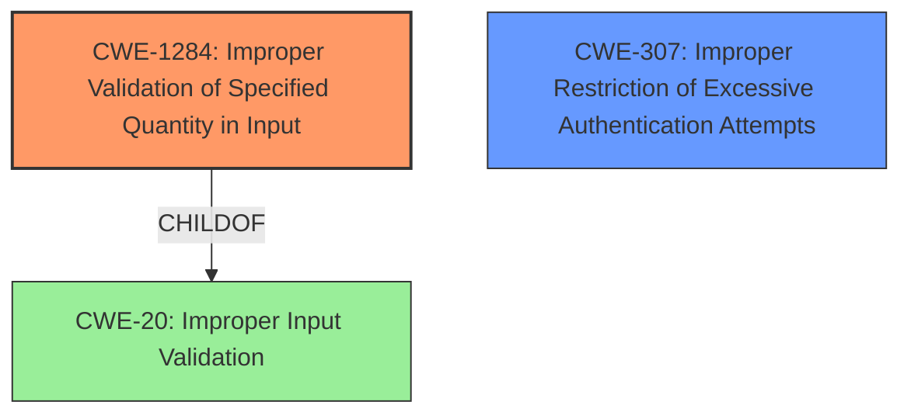

# Final Resolution for CVE-2021-37604

# Summary
| CWE ID | CWE Name | Confidence | CWE Abstraction Level | CWE Vulnerability Mapping Label | CWE-Vulnerability Mapping Notes |
|---|---|---|---|---|---|
| CWE-1284 | Improper Validation of Specified Quantity in Input | 0.95 | Base | Primary | Allowed |
| CWE-307 | Improper Restriction of Excessive Authentication Attempts | 0.40 | Base | Secondary | Allowed |

## Evidence and Confidence

*   **Confidence Score:** 0.90
*   **Evidence Strength:** HIGH

## Relationship Analysis
The primary CWE is **CWE-1284 (Improper Validation of Specified Quantity in Input)**. The criticism correctly points out that **CWE-294 (Improper Check for Certificate Revocation)** is a misinterpretation of the vulnerability. **CWE-1284** aligns well with the vulnerability description, as the attacker injects messages with a "sufficiently large frame counter value," indicating a lack of proper validation of the counter's quantity.

The secondary CWE is **CWE-307 (Improper Restriction of Excessive Authentication Attempts)**. This is included because the vulnerability mentions a denial-of-service impact, stemming from the attacker's ability to increment the frame counter rapidly.

The child-of relationship between **CWE-1284** and **CWE-20 (Improper Input Validation)** is relevant, as it indicates that improper quantity validation is a specific case of general input validation.

## Vulnerability Chain
The vulnerability chain begins with the **ROOTCAUSE** of **CWE-1284 (Improper Validation of Specified Quantity in Input)**. This allows an attacker to inject messages with a large frame counter value. The **WEAKNESS** then leads to a potential denial of service, which can be represented by **CWE-307 (Improper Restriction of Excessive Authentication Attempts)**, as the attacker can rapidly increment the frame counter. Finally, the replay attack is enabled by the lack of proper validation.

## Summary of Analysis
The initial analysis incorrectly mapped the vulnerability to **CWE-294 (Improper Check for Certificate Revocation)**. The criticism correctly identifies this as a misinterpretation. The vulnerability description explicitly states that an attacker may increment the incoming frame counter values by injecting messages with a sufficiently large frame counter value and invalid payload, resulting in denial of service/valid packets in the network and the possibility of a replay attack in the stack. This evidence strongly supports **CWE-1284 (Improper Validation of Specified Quantity in Input)** as the primary **ROOTCAUSE**, as it directly addresses the improper validation of the frame counter value. "The product receives input that is expected to specify a quantity (such as size or length), but it does not validate or incorrectly validates that the quantity has the required properties."

The graph relationships further solidify this selection. **CWE-1284** is a child of **CWE-20 (Improper Input Validation)**, which is a more general class. This indicates that **CWE-1284** is at an appropriate level of specificity, as it directly addresses the type of improper input validation (quantity).

**CWE-1284** is at the optimal level of specificity because it directly addresses the **ROOTCAUSE**: the improper validation of the frame counter's quantity. This leads to the secondary effect of a potential denial of service (**CWE-307**).