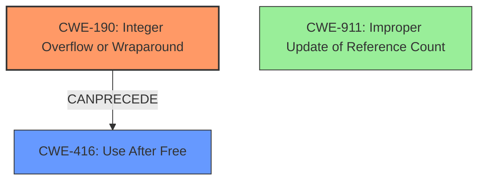

# Final Resolution for CVE-2021-3782

# Summary
| CWE ID | CWE Name | Confidence | CWE Abstraction Level | CWE Vulnerability Mapping Label | CWE-Vulnerability Mapping Notes |
|---|---|---|---|---|---|
| CWE-190 | Integer Overflow or Wraparound | 0.95 | Base | Allowed | Primary CWE |
| CWE-416 | Use After Free | 0.75 | Variant | Allowed | Secondary Candidate |

## Evidence and Confidence

*   **Confidence Score:** 0.90
*   **Evidence Strength:** HIGH

## Relationship Analysis
The primary relationship is that **CWE-190** (Integer Overflow or Wraparound) *CanPrecede* **CWE-416** (Use After Free). The integer overflow leads to incorrect memory management and the subsequent use-after-free condition. Other CWEs like **CWE-770** (Allocation of Resources Without Limits or Throttling) and **CWE-789** (Memory Allocation with Excessive Size Value) were considered, but they are less direct mappings as they depend on the attacker's ability to *cause* the large number of allocations, rather than the overflow itself being the direct cause. **CWE-911** (Improper Update of Reference Count) is also related but less precise than **CWE-190**, as the overflow is the immediate cause.

## Vulnerability Chain
The vulnerability chain starts with an **CWE-190** (Integer Overflow or Wraparound) in the reference count. This overflow causes a discrepancy in the memory management, leading to a **CWE-416** (Use After Free) condition on the `wl_shm_pool` structure. This allows for potential memory corruption and information leakage.

## Summary of Analysis
The initial analysis correctly identifies **CWE-190** (Integer Overflow or Wraparound) as the primary **ROOTCAUSE**, supported by the vulnerability description stating a "reference count overflow" and the CVE reference confirming an integer overflow. This is further supported by the Retriever Results which lists CWE-190 as the top match. The analysis also correctly identifies **CWE-416** (Use After Free) as a secondary consequence of the overflow.

The decision is strongly based on evidence from the provided description, which clearly points to the integer overflow as the direct **WEAKNESS** that triggers the subsequent use-after-free. The graph relationships reinforce this by showing how the overflow *CanPrecede* the use-after-free.

The selected CWEs are at the optimal level of specificity. **CWE-190** is a Base-level CWE, which is preferred for root causes. **CWE-416** is a Variant, representing the specific type of memory corruption that results from the overflow. The other candidate CWEs were less direct and did not accurately capture the primary **WEAKNESS**.