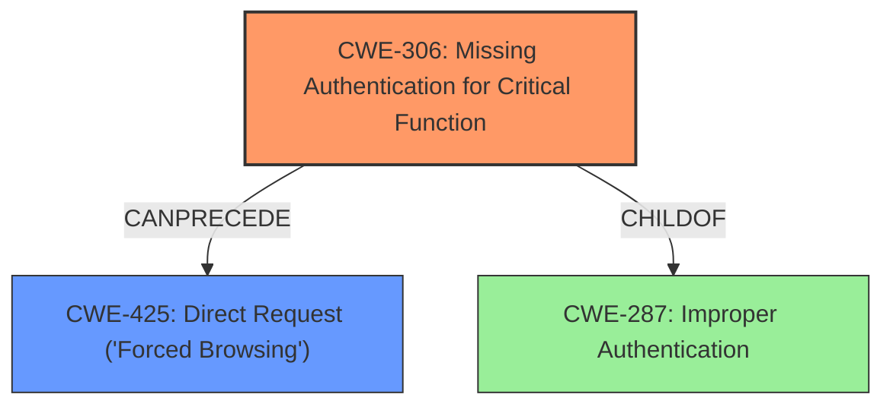

# Final Resolution for CVE-2021-3793

# Summary
| CWE ID | CWE Name | Confidence | CWE Abstraction Level | CWE Vulnerability Mapping Label | CWE-Vulnerability Mapping Notes |
|---|---|---|---|---|---|
| CWE-306 | Missing Authentication for Critical Function | 0.9 | Base | Primary | The device does not require authentication to access critical administrative functions, allowing unauthorized access. Mitigation: Implement proper authentication for these pages. |
| CWE-425 | Direct Request ('Forced Browsing') | 0.6 | Base | Secondary | An attacker can directly request administrative pages without proper authorization checks. This is a consequence of the missing authentication (CWE-306). Mitigation: Implement authorization checks on all restricted URLs. |

## Evidence and Confidence

*   **Confidence Score:** 0.85
*   **Evidence Strength:** HIGH

## Relationship Analysis
The primary relationship influencing the decision is that CWE-425 is a consequence of CWE-306. Without proper authentication (CWE-306), an attacker can directly request restricted URLs (CWE-425). While CWE-287 (Improper Authentication) is a parent Class of CWE-306, CWE-306 is more specific because it highlights the absence of authentication for critical functions, and CWE-287 is discouraged.

## Vulnerability Chain
The vulnerability chain starts with the **ROOTCAUSE** of **CWE-306 (Missing Authentication for Critical Function)**, which allows an attacker to perform **CWE-425 (Direct Request ('Forced Browsing'))** to access administrative pages without proper authorization. This leads to information disclosure or device firmware update with unverified firmware as an impact.

## Summary of Analysis
The initial analysis correctly identified CWE-306 as the primary **WEAKNESS**. The vulnerability description explicitly mentions the lack of authentication for critical functions, which aligns perfectly with the definition of CWE-306. The criticism also correctly pointed out that CWE-425 is a consequence of missing authentication.

The decision is strongly based on the evidence: "An improper access control vulnerability was reported in some Motorola-branded Binatone Hubble Cameras which could allow an unauthenticated attacker on the same network as the device to access administrative pages that could result in information disclosure or device firmware update with verified firmware."

The graph relationships confirm that CWE-306 is the **ROOTCAUSE**, and CWE-425 is a secondary effect. CWE-306 is a base-level CWE, providing the appropriate level of specificity.
CWE-425 is included to highlight the manifestation of the missing authentication. The suggested alternative of considering CWE-288 (Authentication Bypass Using an Alternate Path or Channel) was considered, but the description does not provide enough information to suggest it is more relevant than CWE-425. Therefore, it was decided to keep CWE-425 as a secondary **WEAKNESS** to the **ROOTCAUSE** of CWE-306.
The CWE-798, CWE-259, and CWE-321 retrievers are not related to the description of the vulnerability in the Motorola-branded Binatone Hubble Cameras and are not included.