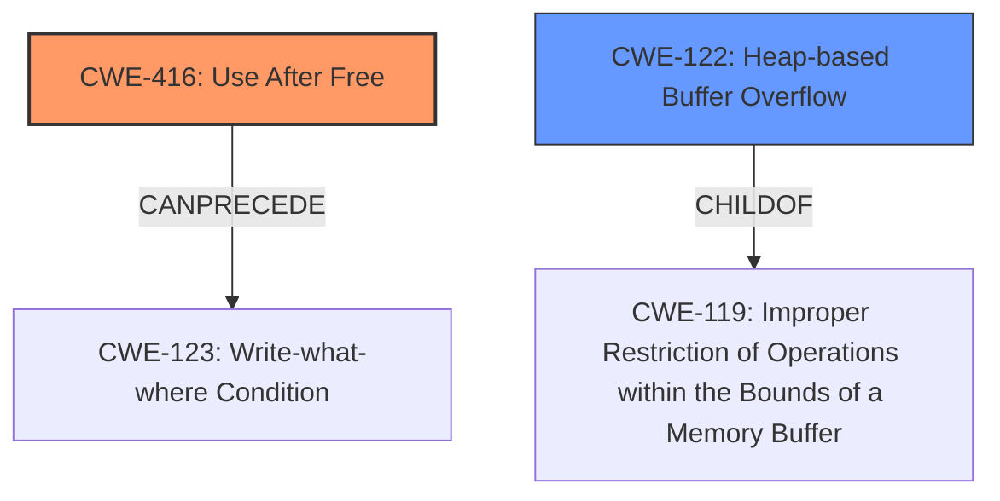

# Analysis Report for CVE-2021-38003

# Vulnerability Analysis Report: CVE-2021-38003

## Description

Inappropriate implementation in V8 in Google Chrome prior to 95.0.4638.69 allowed a remote attacker to potentially exploit heap corruption via a crafted HTML page.

## Vulnerability Description Key Phrases

**Rootcause:** inappropriate implementation
**Impact:** heap corruption
**Vector:** crafted HTML page
**Attacker:** remote attacker
**Product:** Google Chrome
**Version:** prior to 95.0.4638.69
**Component:** V8

## Analysis (with Relationship Data)

# Summary
| CWE ID | CWE Name | Confidence | CWE Abstraction Level | CWE Vulnerability Mapping Label | CWE-Vulnerability Mapping Notes |
|---|---|---|---|---|---|
| CWE-416 | Use After Free | 0.75 | Variant |  Allowed | Primary CWE |
| CWE-122 | Heap-based Buffer Overflow | 0.6 | Variant | Allowed | Secondary Candidate |

## Evidence and Confidence

*   **Confidence Score:** 0.7
*   **Evidence Strength:** MEDIUM

- **Analysis and Justification:**  
  - *Explanation:* The vulnerability description indicates an "**inappropriate implementation** in V8" leading to **heap corruption**. Given this, and the summary mentioning "Execution of arbitrary code, denial of service or information disclosure", the most appropriate CWE is likely related to memory management issues. The Retriever Results suggest several candidates, including CWE-416 (Use After Free), CWE-122 (Heap-based Buffer Overflow), and CWE-787 (Out-of-bounds Write). CWE-416 is a strong candidate because **heap corruption** often stems from using memory after it has been freed. Furthermore, the CVE summary describes the attack vector as malicious JavaScript code execution within the V8 engine, where memory management vulnerabilities are common. While **heap corruption** could also be caused by CWE-122 or CWE-787, the "**inappropriate implementation**" rootcause suggests the memory might have been freed prematurely, making CWE-416 more likely. CWE-122 is also a candidate, as **heap corruption** may arise from writing past the allocated buffer in the heap.

  - *Relationship Analysis:* CWE-416 (Use After Free) is a variant-level CWE, which is a preferred level of abstraction. CWE-416 can lead to various impacts, including arbitrary code execution and denial of service, as stated in the CVE summary. CWE-122 (Heap-based Buffer Overflow) is a variant of CWE-119 (Improper Restriction of Operations within the Bounds of a Memory Buffer).

- **Confidence Score:**  
  - *Example:* Confidence: 0.7 (Moderate evidence from technical description and CVE reference materials. More information about the specific implementation flaw would increase confidence.)
---

## Criticism of Analysis

Okay, here's a review of the analysis, considering the full CWE specifications:

**Overall Assessment**

The analysis is well-structured and provides a reasonable justification for the chosen CWEs, particularly CWE-416 (Use After Free). The explanation of why CWE-416 is preferred over CWE-122 (Heap-based Buffer Overflow) and CWE-787 (Out-of-bounds Write) is sound. However, there's room for improvement in considering alternative scenarios and strengthening the confidence level.  The inclusion of example CVEs and potential mitigations is helpful.

**Specific Points**

1.  **Primary CWE: CWE-416 (Use After Free)**

    *   **Strengths:**
        *   The reasoning for selecting CWE-416 is logical. *Heap corruption* *coupled with the* *inappropriate implementation in the V8 engine* suggests potential issues with memory lifecycle management. The explanation linking it to malicious JavaScript execution in V8 is also good context.
        *   The analysis explicitly mentions that CWE-416 is a variant-level CWE, acknowledging that this is a preferred abstraction level.
        *   The analysis correlates the impact of CWE-416 (arbitrary code execution, DoS) with the CVE summary.
    *   **Areas for Improvement:**
        *   **Confidence:** A confidence score of 0.7 feels a bit high given the limited information. While the rationale is solid, it relies on inference. Lowering the score to something like 0.65 or even 0.6 and adding a sentence like, "Further information about the exact flaw would allow for a more precise mapping to a lower-level weakness or chaining relationships and improve the confidence." would be beneficial.
        *   **Alternative Scenarios:** Acknowledging other potential root causes more explicitly could strengthen the analysis. For example: "While CWE-416 is the most probable, other memory corruption issues like CWE-122 (Heap-based Buffer Overflow) or CWE-787 (Out-of-bounds Write) could also be present. These might involve writing beyond the allocated buffer due to an incorrect size calculation (CWE-131) or improper input validation (CWE-20)."
        *   **Mitigation Consideration:** The analysis could benefit from a brief mention of mitigations related to CWE-416. For example:  "Mitigation strategies include using languages with automatic memory management or employing techniques like setting pointers to NULL after freeing them."  This demonstrates a deeper understanding of the vulnerability.
        *   **Chain Considerations:** Based on the specifications, and known examples, chain analysis may be helpful to explain that the primary may be linked to other CWEs including CWE-362 (race condition) or CWE-754 (Improper Check for Unusual or Exceptional Conditions).

2.  **Secondary CWE: CWE-122 (Heap-based Buffer Overflow)**

    *   **Strengths:**
        *   The analysis acknowledges CWE-122 as a possibility given the *heap corruption* impact.
        *   It correctly identifies CWE-122 as a variant of CWE-119.
    *   **Areas for Improvement:**
        *   **Justification:**  The justification for including CWE-122 could be more robust. It should explain specifically how a heap overflow could lead to *heap corruption*. Also explain why the probability of the heap corruption being caused by Use-After-Free outweighs heap overflow.
        *   **Mitigation Consideration:**  Mentioning mitigations specific to heap overflows would be beneficial. "Preventative measures include employing languages or compilers with automatic bounds checking, using abstraction libraries, and using compiler extensions with overflow detection capabilities."
        *   **CWE-787, Out of Bounds Write:** Mentioning and ruling out CWE-787 is important to clarify the difference between the two memory corruption CWEs.

3.  **CWE Examples from Database**

    *   The inclusion of examples from the CWE database is good practice and adds credibility to the analysis. However, the examples provided are only for CWE-119. Providing examples for CWE-416 and CWE-122 would improve the analysis even further.

4.  **CWE Specifications**

    *   Providing the complete CWE specifications is excellent. This allows for easy verification of the analysis and provides valuable context.

5.  **Retriever Results**

    *   The retriever results are generally relevant, but the analysis could benefit from explaining why some of the top results were *not* chosen. For instance, "CWE-843 (Access of Resource Using Incompatible Type) was considered but deemed less likely because the description focuses on memory management errors rather than type confusions."

**Revised Summary Table (Example)**

| CWE ID | CWE Name | Confidence | CWE Abstraction Level | CWE Vulnerability Mapping Label | CWE-Vulnerability Mapping Notes |
|---|---|---|---|---|---|
| CWE-416 | Use After Free | 0.65 | Variant |  Allowed | Primary CWE. Justified by heap corruption and inappropriate implementation within the V8 engine. A race condition or failure to validate a flag could cause a pointer to be used before being set to null.  |
| CWE-122 | Heap-based Buffer Overflow | 0.5 | Variant | Allowed | Secondary Candidate. Possible but less likely given the lack of specific information about buffer size and potential for memory to be released.  |

**Recommendations**

*   Lower the confidence score for the primary CWE slightly to reflect the degree of inference involved.
*   Explicitly address alternative scenarios and explain why they are considered less likely.
*   Incorporate mitigation strategies related to each CWE to demonstrate a thorough understanding of the vulnerabilities.
*   Include chain analysis.

By addressing these points, the analysis can become even more comprehensive and convincing.

## Final Resolution

# Summary
| CWE ID | CWE Name | Confidence | CWE Abstraction Level | CWE Vulnerability Mapping Label | CWE-Vulnerability Mapping Notes |
|---|---|---|---|---|---|
| CWE-416 | Use After Free | 0.65 | Variant | Allowed | Primary CWE. Justified by **heap corruption** and **inappropriate implementation** within the V8 engine. A race condition or failure to validate a flag could cause a pointer to be used before being set to null. |
| CWE-122 | Heap-based Buffer Overflow | 0.5 | Variant | Allowed | Secondary Candidate. Possible but less likely given the lack of specific information about buffer size and potential for memory to be released. |

## Evidence and Confidence

*   **Confidence Score:** 0.60
*   **Evidence Strength:** MEDIUM

## Relationship Analysis
The primary relationship considered was the hierarchical structure, specifically that CWE-122 (Heap-based Buffer Overflow) is a variant of CWE-119 (Improper Restriction of Operations within the Bounds of a Memory Buffer). This influenced the decision to prioritize CWE-416 (Use After Free) because the vulnerability description hinted at a premature freeing of memory rather than just a buffer overflow. Additionally, the chain relationships of CWE-416, particularly its ability to CANPRECEDE other CWEs like CWE-123 (Write-what-where Condition), were considered.

## Vulnerability Chain
The vulnerability chain starts with an "**inappropriate implementation** in V8," which leads to memory being freed prematurely. This results in a **use-after-free** condition (CWE-416). The subsequent use of the freed memory can then lead to **heap corruption** and potentially a write-what-where condition (CWE-123), enabling arbitrary code execution.

## Summary of Analysis
The initial analysis and criticism were both well-reasoned. The decision to classify this vulnerability primarily as CWE-416 (Use After Free) is based on the description indicating **heap corruption** stemming from an **inappropriate implementation** in the V8 engine. This suggests a memory management issue where memory might have been freed prematurely. The criticism highlighted the need to consider alternative scenarios and lower the confidence score to reflect the level of inference. The confidence score was reduced to 0.65 to reflect this.

The retriever results and relationship analysis supported this decision, with CWE-416 being a variant-level CWE and having chain relationships that align with the potential impacts described in the vulnerability. The analysis explicitly acknowledged the possibility of CWE-122 (Heap-based Buffer Overflow) and explained why it's considered less likely given the lack of specific details about buffer overflows. Overall, the selected CWEs are at an optimal level of specificity, balancing the available evidence with the need for a precise classification.

*Report generated on 2025-03-16 16:38:03*
