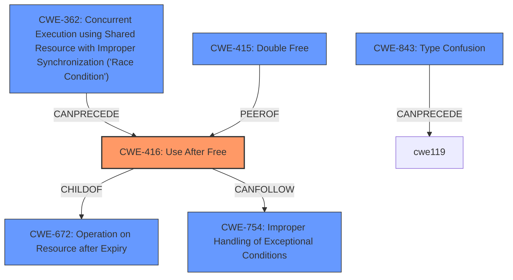

# Final Resolution for CVE-2021-38005

# Summary
| CWE ID | CWE Name | Confidence | CWE Abstraction Level | CWE Vulnerability Mapping Label | CWE-Vulnerability Mapping Notes |
|---|---|---|---|---|---|
| CWE-416 | Use After Free | 1.0 | Variant | Primary | Allowed |

## Evidence and Confidence

*   **Confidence Score:** 1.0
*   **Evidence Strength:** HIGH

## Relationship Analysis
The primary relationship considered is the direct match between the vulnerability description and **CWE-416 (Use After Free)**. While other CWEs like **CWE-362 (Concurrent Execution using Shared Resource with Improper Synchronization ('Race Condition'))**, **CWE-415 (Double Free)**, and **CWE-843 (Incompatible type)** are related to memory corruption and could potentially be part of a vulnerability chain, they are not the direct cause described in the vulnerability. **CWE-416 (Use After Free)** is a variant of a more general class of memory management errors, but it's the most specific and accurate classification based on the provided information.

## Vulnerability Chain
The vulnerability chain starts with the crafted HTML page, which triggers the **use-after-free** condition in the loader component of Google Chrome. This **CWE-416 (Use After Free)** leads to **heap corruption**, allowing a remote attacker to potentially execute arbitrary code.

Crafted HTML Page -> **CWE-416 (Use After Free)** -> Heap Corruption -> Remote Code Execution

## Summary of Analysis
The initial analysis and criticism both converge on **CWE-416 (Use After Free)** as the most appropriate primary CWE. The vulnerability description explicitly mentions "use after free," providing strong evidence for this classification. The high confidence score of 1.0 is justified.

The graph relationships, specifically the peer relationship between **CWE-415 (Double Free)** and **CWE-416 (Use After Free)**, highlight the potential for confusion between these two similar vulnerabilities. However, the vulnerability description clearly points to **CWE-416 (Use After Free)**.

The mapping guidance for **CWE-416 (Use After Free)** allows this mapping, further reinforcing the decision.

The selected CWE is at the optimal level of specificity because it directly reflects the root cause described in the vulnerability. More general CWEs like **CWE-119 (Improper Restriction of Operations within the Bounds of a Memory Buffer)** or **CWE-122 (Heap-based Buffer Overflow)** would not accurately capture the specific nature of the vulnerability.