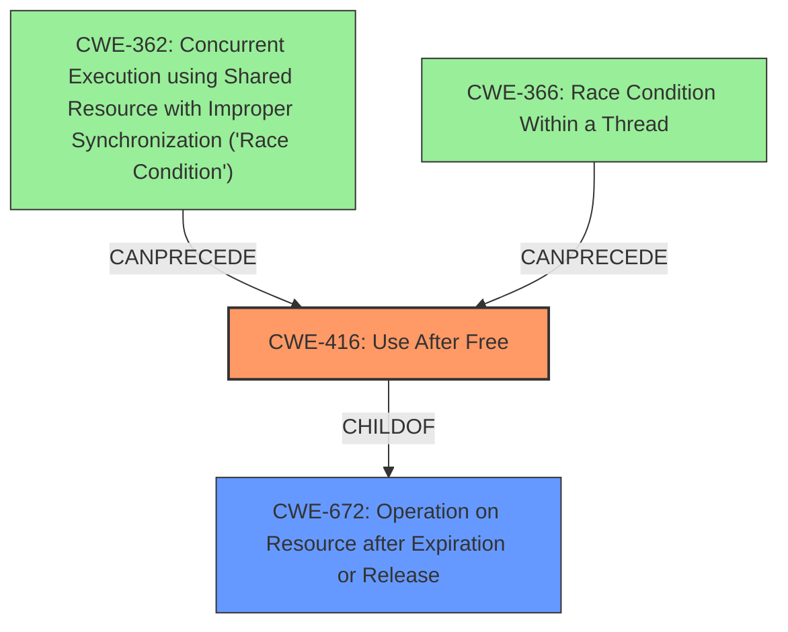

# Final Resolution for CVE-2021-38006

# Summary
| CWE ID | CWE Name | Confidence | CWE Abstraction Level | CWE Vulnerability Mapping Label | CWE-Vulnerability Mapping Notes |
|---|---|---|---|---|---|
| CWE-416 | Use After Free | 1.0 | Variant | Primary CWE | Allowed; May be preceded by concurrency issues (CWE-362/366). Crafted HTML page triggers premature memory freeing. |

## Evidence and Confidence

*   **Confidence Score:** 1.0
*   **Evidence Strength:** HIGH

## Relationship Analysis
The primary relationship influencing the decision is the parent-child relationship where CWE-416 (Use After Free) is a variant of CWE-672 (Operation on Resource after Expiration or Release). This hierarchical relationship supports the selection of CWE-416 as it provides a more specific classification. Additionally, the "CanPrecede" and "CanFollow" relationships involving concurrency-related CWEs (e.g., CWE-362, CWE-366) were considered, suggesting potential contributing factors, but not as the primary root cause. The Variant abstraction level of CWE-416 is preferred for mapping.

## Vulnerability Chain
The vulnerability chain starts with a crafted HTML page that triggers premature memory freeing in the storage foundation component of Google Chrome. This leads to a **use-after-free condition (CWE-416)**, where the freed memory is later accessed. The use of freed memory can overwrite other parts of the heap, leading to heap corruption. If concurrency is involved, a **race condition (CWE-362 or CWE-366)** might precede the **use-after-free**, exacerbating the vulnerability.

## Summary of Analysis
The analysis accurately identifies **CWE-416 (Use After Free)** as the primary weakness. This is based on the explicit mention of "**use after free**" in the vulnerability description, which is strong evidence: "Use after free in storage foundation in Google Chrome prior to 96.0.4664.45 allowed a remote attacker to potentially exploit heap corruption via a crafted HTML page." The relationship analysis supports this, considering the parent-child relationship with CWE-672, ensuring specificity. The potential for concurrency issues (CWE-362/366) is acknowledged as a possible contributing factor but not the primary root cause. The mapping guidance indicates that using CWE-416 is ALLOWED. The analysis correctly places CWE-416 at the Variant level of abstraction, which is a preferred level. The selected CWE is at the optimal level of specificity, directly representing the "**use-after-free**" condition.