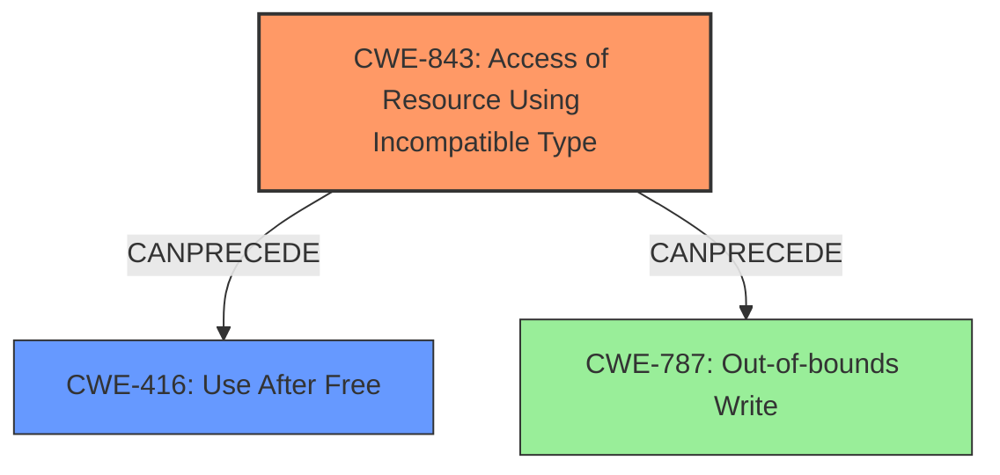

# Final Resolution for CVE-2021-38007

# Summary
| CWE ID | CWE Name | Confidence | CWE Abstraction Level | CWE Vulnerability Mapping Label | CWE-Vulnerability Mapping Notes |
|---|---|---|---|---|---|
| CWE-843 | Access of Resource Using Incompatible Type (**Type Confusion**) | 1.0 | Base | Allowed | Primary CWE |
| CWE-416 | Use After Free | 0.6 | Variant | Allowed | Secondary Candidate |

## Evidence and Confidence

*   **Confidence Score:** 0.9
*   **Evidence Strength:** HIGH

## Relationship Analysis
The primary relationship considered is the potential chain from **CWE-843** (Access of Resource Using Incompatible Type) leading to **CWE-416** (Use After Free). **CWE-843** represents the **root cause**, while **CWE-416** is a possible consequence. Although **CWE-787** (Out-of-bounds Write) is also a possible consequence of type confusion, the initial description highlights memory corruption.

## Vulnerability Chain
The vulnerability chain starts with **CWE-843**, the **root cause** of **type confusion** within the V8 JavaScript engine. This **type confusion** can then lead to memory corruption vulnerabilities, such as **CWE-416** (Use After Free), ultimately allowing a remote attacker to exploit the system via a crafted HTML page. The vulnerability description identifies the **type confusion** as leading to **heap corruption**, making **CWE-843** a strong primary classification.

## Summary of Analysis
The initial analysis and the provided criticism both strongly support the classification of **CWE-843** (Access of Resource Using Incompatible Type) as the primary **weakness**. The vulnerability description explicitly states "**type confusion in V8**," providing direct evidence for this classification. The criticism suggests acknowledging that **type confusion** could lead to other memory corruption issues like **CWE-787**, which is a valid point. However, the description notes **heap corruption** which supports the inclusion of **CWE-416** as a secondary candidate.

The graph relationships confirm the potential chain from **CWE-843** to **CWE-416**. The abstraction levels of both CWEs (Base and Variant, respectively) are appropriate for mapping the **root cause** and a potential consequence.

The decision to prioritize **CWE-843** is based on the direct evidence from the vulnerability description and the high confidence score assigned due to the explicit mention of **type confusion**. The inclusion of **CWE-416** is justified by the potential for **type confusion** to lead to memory corruption, specifically **use-after-free**. The evidence supports these classifications at the optimal level of specificity.