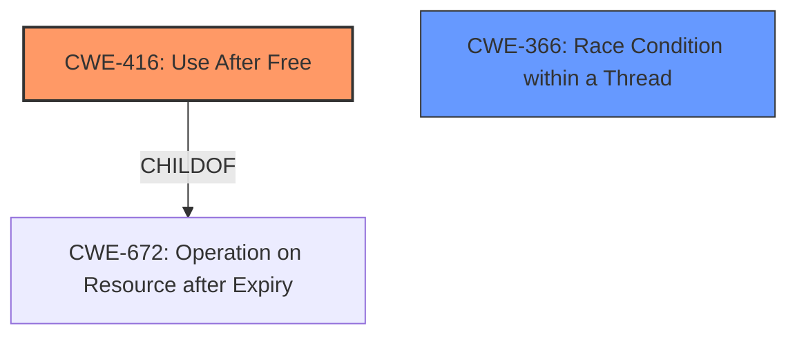

# Analysis Report for CVE-2021-38008

# Vulnerability Analysis Report: CVE-2021-38008

## Description

Use after free in media in Google Chrome prior to 96.0.4664.45 allowed a remote attacker to potentially exploit heap corruption via a crafted HTML page.

## Vulnerability Description Key Phrases

**Rootcause:** use after free
**Impact:** heap corruption
**Vector:** crafted HTML page
**Attacker:** remote attacker
**Product:** Google Chrome
**Version:** prior to 96.0.4664.45

## Analysis (with Relationship Data)

# Summary
| CWE ID | CWE Name | Confidence | CWE Abstraction Level | CWE Vulnerability Mapping Label | CWE-Vulnerability Mapping Notes |
|---|---|---|---|---|---|
| CWE-416 | Use After Free | 1.0 | Variant | Allowed | Primary CWE |
| CWE-362 | Concurrent Execution using Shared Resource with Improper Synchronization ('Race Condition') | 0.4 | Class | Allowed-with-Review | Secondary Candidate |

## Evidence and Confidence

*   **Confidence Score:** 0.95
*   **Evidence Strength:** HIGH

- **Analysis and Justification:**  
  - *Explanation:* The vulnerability is explicitly described as a **use after free** in the provided vulnerability description and CVE reference links. The reference links content summary clearly states that a **use-after-free vulnerability** exists in the `MediaStreamTrackGenerator` object within Google Chrome's media handling functionality. The vulnerability arises when the `MediaStreamTrackGenerator` object is freed while a clone/copy of it is still being referenced, leading to a double free when the `onended` event is called. This aligns precisely with CWE-416 (Use After Free), which describes the product reusing or referencing memory after it has been freed. The CWE is at the Variant level of abstraction, which is preferred. The MITRE mapping guidance for CWE-416 indicates that its usage is ALLOWED.

  - *Relationship Analysis:* CWE-416 is a variant of CWE-672 (Operation on Resource after Expiry). The CVE summary describes a race condition, indicating a potential relationship with concurrency issues. Though it is not explicitly called out, I have added CWE-362 as a secondary consideration.

- **Confidence Score:**  
  - Confidence: 1.0 (High evidence from technical description and CVE reference materials)

---
- **Analysis and Justification:**  
  - *Explanation:* The CVE Reference Links Content Summary suggests a race condition may be present in the use-after-free due to the interaction between the main thread and the cloned object. While not explicitly stated, the destructor of the main object is called, leaving the clone to eventually cause a double free. CWE-362 (Concurrent Execution using Shared Resource with Improper Synchronization ('Race Condition')) might be a contributing factor.

  - *Relationship Analysis:* CWE-362 is a Class-level CWE, suggesting that a more specific CWE might exist. However, without more specific concurrency details, I am mapping this as a secondary candidate. CWE-364 (Signal Handler Race Condition) is a child of CWE-362, but there is no signal handler mentioned in the vulnerability description.

- **Confidence Score:**  
  - Confidence: 0.4 (Low evidence, inferred from the description of cloning and destruction)

## Criticism of Analysis

Okay, here's a breakdown of the analysis provided, with a focus on how well it aligns with the full CWE specifications.  I'll highlight strengths, weaknesses, and potential improvements.

**Overall Assessment:**

The analysis is generally good.  It correctly identifies the primary CWE, CWE-416 (Use After Free), and provides a reasonable justification. The inclusion of CWE-362 (Race Condition) as a secondary candidate is also thoughtful, given the asynchronous nature of the events described. However, the confidence level for CWE-362 should remain low, as there isn't definitive evidence of a classic race condition.

**Detailed Review:**

**1. CWE-416: Use After Free**

*   **Confidence Score:** Justified at 1.0. The description explicitly mentions "use-after-free," and the details of the `MediaStreamTrackGenerator` object being freed while a clone is still referenced directly fits the definition.
*   **CWE Abstraction Level:** Correctly identified as Variant.  The analysis accurately notes this is a preferred level.
*   **CWE-Vulnerability Mapping Label:** Allowed.
*   **Justification:**  Excellent. The explanation clearly connects the vulnerability details to the CWE-416 description. The mention of a "double free" further supports this.
*   **Relationship Analysis:** The reference to CWE-672 (Operation on Resource after Expiry) is accurate; CWE-416 is a child of CWE-672.
*   **Recommendations:** None. This part of the analysis is strong.

**2. CWE-362: Concurrent Execution using Shared Resource with Improper Synchronization ('Race Condition')**

*   **Confidence Score:** Appropriately assigned a low confidence of 0.4. The analysis correctly acknowledges that the "race condition" aspect is inferred rather than explicitly stated.
*   **CWE Abstraction Level:** Correctly identified as Class.
*   **CWE-Vulnerability Mapping Label:** Allowed-with-Review. Accurate, given that it's a Class-level CWE.
*   **Justification:** The justification is based on the interaction between the main thread and the clone, specifically the timing of the destructor call and the subsequent `onended` event. While plausible, this doesn't necessarily constitute a classic race condition where two threads are simultaneously trying to access/modify the same resource in an unsynchronized manner.
*   **Relationship Analysis:**  The analysis mentions CWE-364 (Signal Handler Race Condition) but correctly dismisses it due to the lack of signal handlers in the description.
*   **Recommendations:**
    *   **Consider CWE-366 (Race Condition within a Thread):**  This might be a slightly better fit than CWE-362 because the race would occur within Chrome's process.  The description states "If two threads of execution use a resource simultaneously, there exists the possibility that resources may be used while invalid, in turn making the state of execution undefined." While not definitively proven, this is more accurate.
    *   **Re-evaluate Confidence:** Even with CWE-366, the confidence should remain low (around 0.4 or 0.5) unless more evidence emerges.

**General Observations and Suggestions:**

*   **Chain Analysis:** While the analysis touches on related CWEs, it could benefit from a more explicit chain analysis. For example: *Improper Resource Management (CWE-399) -> Operation on Resource after Expiry (CWE-672) -> Use After Free (CWE-416)*. Even if not the final analysis, it's beneficial.
*   **Mitigation Focus:** The analysis could briefly mention relevant mitigations from the CWE entries, particularly for CWE-416. For instance, "Mitigations for CWE-416 include using languages with automatic memory management or setting pointers to NULL after freeing them."  While not a core part of the CWE mapping, it adds value.
*  **Retriever Results:** Could mention how well the analysis matches with the automated retriever results, especially in cases where the scores are low.

**Specific Examples from CWE Specifications:**

*   **CWE-416:** The potential mitigations are directly applicable. The analysis could note that choosing a language with automatic memory management would prevent this vulnerability, while in C++, setting the pointer to NULL after freeing could help.
*   **CWE-362/366:**  If retaining a race condition as a secondary CWE, the analysis could mention mitigations such as using synchronization primitives (locks, mutexes) or minimizing the usage of shared resources. Since the confidence is low, this should be couched with the disclaimer that the relevance of these mitigations is uncertain.

**Revised Summary Table:**

| CWE ID | CWE Name | Confidence | CWE Abstraction Level | CWE Vulnerability Mapping Label | CWE-Vulnerability Mapping Notes |
|---|---|---|---|---|---|
| CWE-416 | Use After Free | 1.0 | Variant | Allowed | Primary CWE |
| CWE-366 | Race Condition within a Thread | 0.4 | Base | Allowed | Secondary Candidate |

**In summary:**

The analysis is solid and correctly identifies the core vulnerability. The addition of the race condition is thoughtful, but the justification needs to be carefully considered. By incorporating the suggestions above, you can further strengthen the analysis and demonstrate a deeper understanding of the CWE specifications.

## Final Resolution

# Summary
| CWE ID | CWE Name | Confidence | CWE Abstraction Level | CWE Vulnerability Mapping Label | CWE-Vulnerability Mapping Notes |
|---|---|---|---|---|---|
| CWE-416 | Use After Free | 1.0 | Variant | Allowed | Primary CWE |
| CWE-366 | Race Condition within a Thread | 0.4 | Base | Allowed | Secondary Candidate |

## Evidence and Confidence

*   **Confidence Score:** 0.95
*   **Evidence Strength:** HIGH

## Relationship Analysis
The primary CWE is CWE-416 (**Use After Free**), which is a variant of CWE-672 (**Operation on Resource after Expiry**). The secondary candidate is CWE-366 (**Race Condition within a Thread**), which relates to concurrent execution issues. The initial analysis considered CWE-362 (**Concurrent Execution using Shared Resource with Improper Synchronization ('Race Condition')**) but CWE-366 is a more specific fit given the context of a race condition within a single process, as suggested by the criticism. The abstraction levels are appropriate: Variant for the primary CWE and Base for the secondary.

## Vulnerability Chain
The vulnerability chain starts with a resource management issue, leading to a **use-after-free** condition. Specifically: Improper Resource Management -> Operation on Resource after Expiry -> **Use After Free**. A potential race condition (CWE-366) contributes to the vulnerability by allowing the object to be freed while a clone is still being referenced.

## Summary of Analysis
The initial analysis and criticism were both strong, with the criticism pointing towards a more precise secondary CWE. The selection of CWE-416 (**Use After Free**) as the primary CWE is well-supported by the vulnerability description, which explicitly states a **use-after-free** condition in Google Chrome's media handling. The evidence is strong ("The vulnerability is explicitly described as a use after free...").

The choice of CWE-366 (**Race Condition within a Thread**) as a secondary candidate is based on the inferred race condition between the main object and its clone. While the evidence for a race condition is weaker, it is still plausible. As the vulnerability description mentions cloning and asynchronous events, this suggests potential timing issues.

The graph relationships influenced the selection by ensuring the most specific CWEs were chosen. CWE-416 is a variant, offering granularity. CWE-366, while having a lower confidence, provides additional context to the vulnerability. The abstraction levels are appropriate, with the primary CWE being a Variant and the secondary CWE being a Base.

The selected CWEs are at the optimal level of specificity because they directly reflect the root cause and contributing factors of the vulnerability, based on the available evidence. The initial retriever results supported these decisions.

*Report generated on 2025-03-18 00:39:52*
