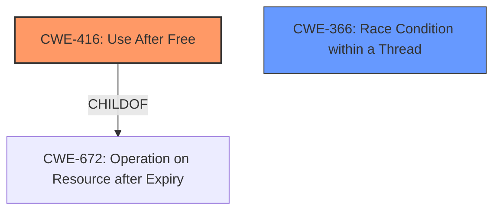

# Final Resolution for CVE-2021-38008

# Summary
| CWE ID | CWE Name | Confidence | CWE Abstraction Level | CWE Vulnerability Mapping Label | CWE-Vulnerability Mapping Notes |
|---|---|---|---|---|---|
| CWE-416 | Use After Free | 1.0 | Variant | Allowed | Primary CWE |
| CWE-366 | Race Condition within a Thread | 0.4 | Base | Allowed | Secondary Candidate |

## Evidence and Confidence

*   **Confidence Score:** 0.95
*   **Evidence Strength:** HIGH

## Relationship Analysis
The primary CWE is CWE-416 (**Use After Free**), which is a variant of CWE-672 (**Operation on Resource after Expiry**). The secondary candidate is CWE-366 (**Race Condition within a Thread**), which relates to concurrent execution issues. The initial analysis considered CWE-362 (**Concurrent Execution using Shared Resource with Improper Synchronization ('Race Condition')**) but CWE-366 is a more specific fit given the context of a race condition within a single process, as suggested by the criticism. The abstraction levels are appropriate: Variant for the primary CWE and Base for the secondary.

## Vulnerability Chain
The vulnerability chain starts with a resource management issue, leading to a **use-after-free** condition. Specifically: Improper Resource Management -> Operation on Resource after Expiry -> **Use After Free**. A potential race condition (CWE-366) contributes to the vulnerability by allowing the object to be freed while a clone is still being referenced.

## Summary of Analysis
The initial analysis and criticism were both strong, with the criticism pointing towards a more precise secondary CWE. The selection of CWE-416 (**Use After Free**) as the primary CWE is well-supported by the vulnerability description, which explicitly states a **use-after-free** condition in Google Chrome's media handling. The evidence is strong ("The vulnerability is explicitly described as a use after free...").

The choice of CWE-366 (**Race Condition within a Thread**) as a secondary candidate is based on the inferred race condition between the main object and its clone. While the evidence for a race condition is weaker, it is still plausible. As the vulnerability description mentions cloning and asynchronous events, this suggests potential timing issues.

The graph relationships influenced the selection by ensuring the most specific CWEs were chosen. CWE-416 is a variant, offering granularity. CWE-366, while having a lower confidence, provides additional context to the vulnerability. The abstraction levels are appropriate, with the primary CWE being a Variant and the secondary CWE being a Base.

The selected CWEs are at the optimal level of specificity because they directly reflect the root cause and contributing factors of the vulnerability, based on the available evidence. The initial retriever results supported these decisions.