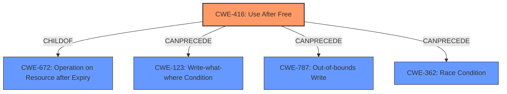

# Final Resolution for CVE-2021-38011

# Summary
| CWE ID | CWE Name | Confidence | CWE Abstraction Level | CWE Vulnerability Mapping Label | CWE-Vulnerability Mapping Notes |
|---|---|---|---|---|---|
| CWE-416 | Use After Free | 1.0 | Variant | Allowed | The vulnerability is a **use-after-free**, which directly corresponds to this CWE. |
  - The Primary CWE should be first and noted as the Primary CWEs
  - The secondary candidate CWEs should be next and noted as secondary candidates.
  - The confidence is a confidence score 0 to 1 to rate your confidence in your assessment for that CWE.
  - The CWE Abstraction Level as one of these values: Base, Variant, Pillar, Class, Compound
  - The Mapping Notes Usage as one of these values: Allowed, Allowed-with-Review, Prohibited, Discouraged

## Evidence and Confidence

*   **Confidence Score:** 1.0
*   **Evidence Strength:** HIGH

## Relationship Analysis
The primary relationship that impacts this decision is the direct mapping of the vulnerability description to CWE-416 (Use After Free). While CWE-416 has hierarchical relationships (e.g., child of CWE-672 (Operation on Resource after Expiry)) and chain relationships (e.g., can precede CWE-123 (Write-what-where Condition)), the focus remains on the direct identification of the **root cause**. The abstraction level of CWE-416 (Variant) is appropriate for this case.

## Vulnerability Chain
The vulnerability chain starts with the **root cause**, a **use-after-free (CWE-416)**. This leads to potential heap corruption. An attacker can exploit this by crafting a malicious HTML page. The consequence is the potential for arbitrary code execution or data corruption.

## Summary of Analysis
The initial analysis and criticism both agree that CWE-416 (Use After Free) is the correct classification. The vulnerability description explicitly states "**use after free**," providing direct evidence. The high confidence score of 1.0 is justified by this clear evidence. The graph relationships reinforce the understanding of how CWE-416 fits within broader memory management issues. The selection of CWE-416 is at the optimal level of specificity, as it directly describes the **root cause** of the vulnerability.