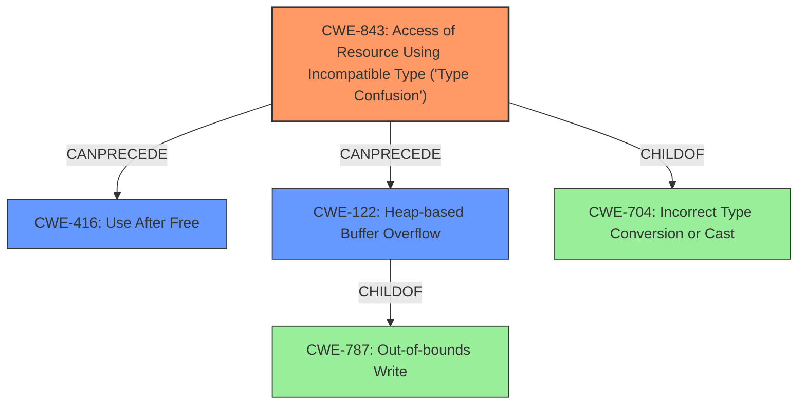

# Final Resolution for CVE-2021-38012

# Summary
| CWE ID | CWE Name | Confidence | CWE Abstraction Level | CWE Vulnerability Mapping Label | CWE-Vulnerability Mapping Notes |
|---|---|---|---|---|---|
| CWE-843 | Access of Resource Using Incompatible Type ('Type Confusion') | 0.95 | Base | Allowed | Primary CWE |
| CWE-416 | Use After Free | 0.60 | Variant | Allowed | Secondary Candidate |
| CWE-122 | Heap-based Buffer Overflow | 0.50 | Variant | Allowed | Secondary Candidate |

## Evidence and Confidence

*   **Confidence Score:** 0.85
*   **Evidence Strength:** HIGH

## Relationship Analysis
The primary relationship is that **CWE-843** (**Type Confusion**) can *potentially* lead to **CWE-416** (**Use After Free**) or **CWE-122** (**Heap-based Buffer Overflow**). **CWE-122** is a variant of **CWE-787** (**Out-of-bounds Write**), meaning that heap overflows are a specific type of out-of-bounds write. The abstraction levels influenced the decision to choose **CWE-843** as the primary because it is a Base level CWE and more specific than its parent, **CWE-704** (**Incorrect Type Conversion or Cast**), which is a Class.

## Vulnerability Chain
The vulnerability chain starts with **CWE-843** (**Type Confusion**) in the V8 JavaScript engine. This **type confusion** allows a remote attacker to potentially trigger **heap corruption**. The **heap corruption** *could* manifest as **CWE-416** (**Use After Free**) or **CWE-122** (**Heap-based Buffer Overflow**), both of which could allow arbitrary code execution.

## Summary of Analysis
The initial analysis and the criticism are both well-reasoned. The primary **WEAKNESS**, **CWE-843** (**Type Confusion**), is strongly supported by the vulnerability description: "Type confusion in V8...allowed a remote attacker to potentially exploit heap corruption." The secondary candidates, **CWE-416** and **CWE-122**, are plausible given the impact of "**heap corruption**," but the connection is less direct.

The decision to classify **CWE-843** as the primary **ROOTCAUSE** is based on the clear statement of "**type confusion**" in the vulnerability description and CVE summary. The criticism's suggestion to explicitly address why **CWE-122** was chosen over **CWE-787** (Out-of-bounds Write) is valid. The analysis is choosing a more specific variant where the heap is involved.

The selected CWEs are at the optimal level of specificity. **CWE-843** is a Base level CWE, which is preferred for root cause analysis. While **CWE-704** (**Incorrect Type Conversion or Cast**) is a parent of **CWE-843**, **CWE-843** is more specific to the "**type confusion**" vulnerability described. The secondary candidates, **CWE-416** and **CWE-122**, are chosen as plausible consequences of the **heap corruption** resulting from the **type confusion**. The confidence levels reflect the directness of the evidence supporting each mapping.