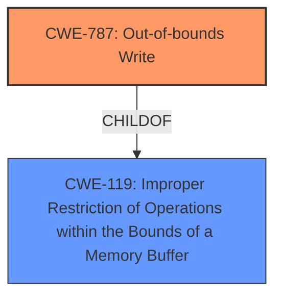

# Analysis Report for CVE-2021-38014

# Vulnerability Analysis Report: CVE-2021-38014

## Description

Out of bounds write in Swiftshader in Google Chrome prior to 96.0.4664.45 allowed a remote attacker to potentially exploit heap corruption via a crafted HTML page.

## Vulnerability Description Key Phrases

**Rootcause:** out of bounds write
**Impact:** heap corruption
**Vector:** crafted HTML page
**Attacker:** remote attacker
**Product:** Google Chrome
**Version:** prior to 96.0.4664.45
**Component:** Swiftshader

## Analysis (with Relationship Data)

# Summary
| CWE ID | CWE Name | Confidence | CWE Abstraction Level | CWE Vulnerability Mapping Label | CWE-Vulnerability Mapping Notes |
|---|---|---|---|---|---|
| CWE-787 | Out-of-bounds Write | 1.0 | Base | Primary | Allowed |

## Evidence and Confidence

*   **Confidence Score:** 1.0
*   **Evidence Strength:** HIGH

- **Analysis and Justification:**
  - *Explanation:* The vulnerability description explicitly states an "**out of bounds write**" in Swiftshader within Google Chrome. This directly aligns with CWE-787 (Out-of-bounds Write), which describes a condition where a product writes data past the end or before the beginning of the intended buffer. The impact, heap corruption, further supports this classification. The CVE Reference Links Content Summary confirms the "**Out of bounds write**" as the root cause.
  - *Relationship Analysis:* CWE-787 is a base-level CWE, providing a specific description of the **out-of-bounds write** vulnerability. While CWE-119 (Improper Restriction of Operations within the Bounds of a Memory Buffer) is a parent class, CWE-787 is more precise and directly reflects the reported weakness.

- **Confidence Score:**
  - Confidence: 1.0 (Direct match between the vulnerability description and CWE definition, supported by CVE reference materials.)

## Criticism of Analysis

## Critique of the Analysis

The analysis correctly identifies CWE-787 (Out-of-bounds Write) as the primary weakness. The justification is sound, the confidence score is appropriate, and the relationship analysis is accurate. However, let's review it in more detail.

**Strengths:**

*   **Clear and Concise Justification:** The explanation directly connects the vulnerability description "out of bounds write" to the CWE-787 definition.
*   **High Confidence Score:** A score of 1.0 is justified given the explicit mention of "out of bounds write" and the supporting details about heap corruption.
*   **Accurate Relationship Analysis:** The analysis correctly notes that CWE-787 is a more precise mapping than its parent, CWE-119.
*   **Incorporation of CVE Reference Links:** The content summary of the CVE Reference Links solidifies the assessment.

**Areas for Improvement:**

1.  **Consideration of CWE-119 (Improper Restriction of Operations within the Bounds of a Memory Buffer):** While the analysis correctly prefers CWE-787, it would benefit from a more detailed discussion of why CWE-119 is *not* the best fit. Although CWE-119 is discouraged for general use, it is a *parent* of CWE-787, and a brief explanation as to why the higher-level CWE is avoided here is helpful. This would also showcase the understanding of the relationship between the two CWEs.

2.  **Discussion of Potential Chains (CWE-20):** In real-world vulnerabilities, an out-of-bounds write often stems from other underlying causes. While the vulnerability description focuses on the symptom (the write itself), exploring potential root causes would improve the analysis. Consider including a discussion of CWE-20 (Improper Input Validation) and how a lack of proper input validation could lead to the out-of-bounds write.  The "Observed Examples" of CWE-787 contain chains including CWE-20.

3.  **Addressing the Retriever Results:** The Retriever Results highlight other potential CWEs, specifically CWE-843 (Type Confusion), CWE-823 (Out-of-Range Pointer Offset), and CWE-366 (Race Condition). A brief discussion of why these are *not* the primary CWE (or even secondary CWEs in a chain) is warranted. For example:
    *   **CWE-843:** While type confusion can sometimes lead to out-of-bounds writes, the primary description doesn't suggest a type mismatch is the *cause* of the write. Without further information, it's less likely than CWE-787.
    *   **CWE-823:** Similar to type confusion, the current description doesn't highlight pointer arithmetic errors.
    *   **CWE-366:** Race conditions are possible in Swiftshader (given its likely multithreaded nature), but there is no mention of concurrency issues in the provided vulnerability description.

4. **Mitigation Strategies:** The analysis would be enhanced by mentioning specific mitigation strategies relevant to Swiftshader and the context of Chrome's rendering engine.  For example, enabling AddressSanitizer (ASan) or MemorySanitizer (MSan) during development and testing can help detect out-of-bounds writes.  Another mitigation strategy would be to utilize memory-safe languages or libraries for memory management within Swiftshader. Discussion of these more targeted mitigations, especially in the context of the "Potential Mitigations" section of the CWE specifications, would demonstrate deeper understanding.

**Revised/Enhanced Analysis Example (incorporating the points above):**

# Summary
| CWE ID | CWE Name | Confidence | CWE Abstraction Level | CWE Vulnerability Mapping Label | CWE-Vulnerability Mapping Notes |
|---|---|---|---|---|---|
| CWE-787 | Out-of-bounds Write | 1.0 | Base | Primary | Allowed |

## Evidence and Confidence

*   **Confidence Score:** 1.0
*   **Evidence Strength:** HIGH

- **Analysis and Justification:**
  - *Explanation:* The vulnerability description explicitly states an "**out of bounds write**" in Swiftshader within Google Chrome. This directly aligns with CWE-787 (Out-of-bounds Write), which describes a condition where a product writes data past the end or before the beginning of the intended buffer. The impact, heap corruption, further supports this classification. The CVE Reference Links Content Summary confirms the "**Out of bounds write**" as the root cause. While the parent class CWE-119 (Improper Restriction of Operations within the Bounds of a Memory Buffer) generally covers buffer overflows, CWE-787 is more precise and accurately reflects the specific write operation.
  - *Relationship Analysis:* CWE-787 is a base-level CWE, providing a specific description of the out-of-bounds write vulnerability. It's important to consider that this vulnerability might stem from other root causes. For example, a lack of proper input validation (CWE-20) could allow an attacker to influence buffer sizes or offsets, leading to the out-of-bounds write. However, the provided information does not directly indicate any input validation issues, so this remains speculative. Similarly, while CWE-843 (Type Confusion) and CWE-823 (Out-of-Range Pointer Offset) were suggested by Retriever Results, these are not as directly supported by the provided description as CWE-787. The lack of mention of any concurrency also makes CWE-366 less likely.

- **Confidence Score:**
  - Confidence: 1.0 (Direct match between the vulnerability description and CWE definition, supported by CVE reference materials.)

## CWE Examples from Database

## Known Examples for CWE-119: Improper Restriction of Operations within the Bounds of a Memory Buffer
### Observed Examples
- **CVE-2021-22991** [https://www.cve.org/CVERecord?id=CVE-2021-22991](https://www.cve.org/CVERecord?id=CVE-2021-22991): Incorrect URI normalization in application traffic product leads to buffer overflow, as exploited in the wild per CISA KEV.
- **CVE-2020-29557** [https://www.cve.org/CVERecord?id=CVE-2020-29557](https://www.cve.org/CVERecord?id=CVE-2020-29557): Buffer overflow in Wi-Fi router web interface, as exploited in the wild per CISA KEV.
- **CVE-2009-2550** [https://www.cve.org/CVERecord?id=CVE-2009-2550](https://www.cve.org/CVERecord?id=CVE-2009-2550): Classic stack-based buffer overflow in media player using a long entry in a playlist
- **CVE-2009-2403** [https://www.cve.org/CVERecord?id=CVE-2009-2403](https://www.cve.org/CVERecord?id=CVE-2009-2403): Heap-based buffer overflow in media player using a long entry in a playlist
- **CVE-2009-0689** [https://www.cve.org/CVERecord?id=CVE-2009-0689](https://www.cve.org/CVERecord?id=CVE-2009-0689): large precision value in a format string triggers overflow
- **CVE-2009-0690** [https://www.cve.org/CVERecord?id=CVE-2009-0690](https://www.cve.org/CVERecord?id=CVE-2009-0690): negative offset value leads to out-of-bounds read
- **CVE-2009-1532** [https://www.cve.org/CVERecord?id=CVE-2009-1532](https://www.cve.org/CVERecord?id=CVE-2009-1532): malformed inputs cause accesses of uninitialized or previously-deleted objects, leading to memory corruption
- **CVE-2009-1528** [https://www.cve.org/CVERecord?id=CVE-2009-1528](https://www.cve.org/CVERecord?id=CVE-2009-1528): chain: lack of synchronization leads to memory corruption
- **CVE-2021-29529** [https://www.cve.org/CVERecord?id=CVE-2021-29529](https://www.cve.org/CVERecord?id=CVE-2021-29529): Chain: machine-learning product can have a heap-based buffer overflow (CWE-122

## Final Resolution

# Summary
| CWE ID | CWE Name | Confidence | CWE Abstraction Level | CWE Vulnerability Mapping Label | CWE-Vulnerability Mapping Notes |
|---|---|---|---|---|---|
| CWE-787 | Out-of-bounds Write | 1.0 | Base | Primary | Allowed |

## Evidence and Confidence

*   **Confidence Score:** 1.0
*   **Evidence Strength:** HIGH

## Relationship Analysis
The primary relationship impacting the decision is the parent-child relationship between CWE-119 (Improper Restriction of Operations within the Bounds of a Memory Buffer) and CWE-787 (Out-of-bounds Write). While CWE-119 is a parent, CWE-787 provides a more specific description of the vulnerability. There are no chain relationships explicitly indicated in the description, though potential chains are discussed.

## Vulnerability Chain
The vulnerability chain, based on the description, starts with the crafted HTML page leading to an **out-of-bounds write** in Swiftshader, ultimately resulting in heap corruption. A potential missing link could be the lack of input validation, which, if present, could be a root cause preceding the **out-of-bounds write**.

## Summary of Analysis
The initial analysis and its critique are both accurate and helpful. The vulnerability description explicitly states "**out of bounds write**", which directly maps to CWE-787 (Out-of-bounds Write). The critique correctly points out that while CWE-787 is the most accurate primary CWE, considering potential root causes like CWE-20 (Improper Input Validation) would improve the analysis. However, without explicit evidence of input validation issues in the provided description, it remains speculative. The Retriever Results suggest CWE-843 (Type Confusion), CWE-823 (Out-of-Range Pointer Offset), and CWE-366 (Race Condition), but these are not as directly supported by the provided description as CWE-787.

The selection of CWE-787 is at the optimal level of specificity because it directly reflects the described vulnerability. While CWE-119 is a parent, it's too broad. Including CWE-20 would require making assumptions beyond the information provided in the vulnerability description.

The decision is primarily based on the explicit mention of "**out of bounds write**" in the vulnerability description, supported by the resulting heap corruption and confirmed by the CVE Reference Links Content Summary.

*Report generated on 2025-03-18 00:42:47*
