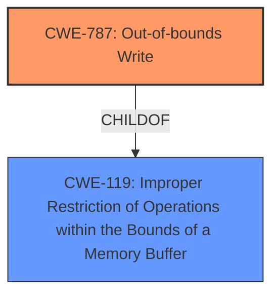

# Final Resolution for CVE-2021-38014

# Summary
| CWE ID | CWE Name | Confidence | CWE Abstraction Level | CWE Vulnerability Mapping Label | CWE-Vulnerability Mapping Notes |
|---|---|---|---|---|---|
| CWE-787 | Out-of-bounds Write | 1.0 | Base | Primary | Allowed |

## Evidence and Confidence

*   **Confidence Score:** 1.0
*   **Evidence Strength:** HIGH

## Relationship Analysis
The primary relationship impacting the decision is the parent-child relationship between CWE-119 (Improper Restriction of Operations within the Bounds of a Memory Buffer) and CWE-787 (Out-of-bounds Write). While CWE-119 is a parent, CWE-787 provides a more specific description of the vulnerability. There are no chain relationships explicitly indicated in the description, though potential chains are discussed.

## Vulnerability Chain
The vulnerability chain, based on the description, starts with the crafted HTML page leading to an **out-of-bounds write** in Swiftshader, ultimately resulting in heap corruption. A potential missing link could be the lack of input validation, which, if present, could be a root cause preceding the **out-of-bounds write**.

## Summary of Analysis
The initial analysis and its critique are both accurate and helpful. The vulnerability description explicitly states "**out of bounds write**", which directly maps to CWE-787 (Out-of-bounds Write). The critique correctly points out that while CWE-787 is the most accurate primary CWE, considering potential root causes like CWE-20 (Improper Input Validation) would improve the analysis. However, without explicit evidence of input validation issues in the provided description, it remains speculative. The Retriever Results suggest CWE-843 (Type Confusion), CWE-823 (Out-of-Range Pointer Offset), and CWE-366 (Race Condition), but these are not as directly supported by the provided description as CWE-787.

The selection of CWE-787 is at the optimal level of specificity because it directly reflects the described vulnerability. While CWE-119 is a parent, it's too broad. Including CWE-20 would require making assumptions beyond the information provided in the vulnerability description.

The decision is primarily based on the explicit mention of "**out of bounds write**" in the vulnerability description, supported by the resulting heap corruption and confirmed by the CVE Reference Links Content Summary.