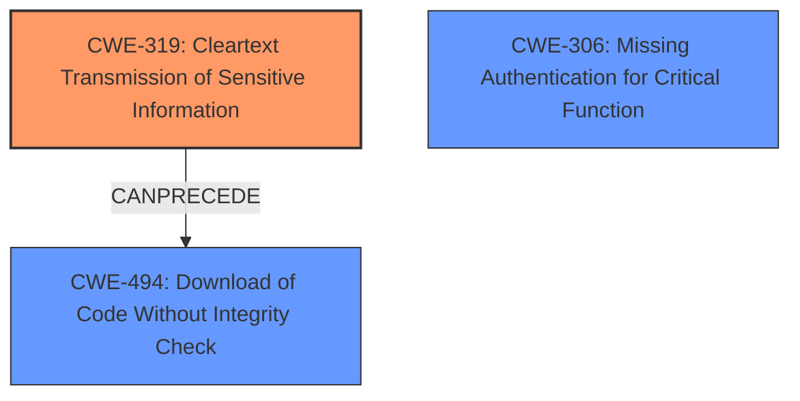

# Final Resolution for CVE-2021-38142

# Summary
| CWE ID | CWE Name | Confidence | CWE Abstraction Level | CWE Vulnerability Mapping Label | CWE-Vulnerability Mapping Notes |
|---|---|---|---|---|---|
| CWE-319 | Cleartext Transmission of Sensitive Information | 0.9 | Base | Allowed | Primary CWE: The vulnerability involves transmitting data in cleartext, making it susceptible to sniffing and modification. |
| CWE-494 | Download of Code Without Integrity Check | 0.7 | Base | Allowed | Secondary CWE: The vulnerability is exacerbated by a lack of integrity checks on the downloaded update, allowing for the installation of malicious code. |
| CWE-306 | Missing Authentication for Critical Function | 0.6 | Base | Allowed | Secondary CWE: The description implies a lack of authentication in the upgrade mechanism. Further investigation is needed to confirm. |

## Evidence and Confidence

*   **Confidence Score:** 0.8
*   **Evidence Strength:** MEDIUM

## Relationship Analysis
The primary relationship identified is that CWE-319 (Cleartext Transmission) **CANPRECEDE** CWE-494 (Download Without Integrity Check). The cleartext transmission makes it possible for an attacker to inject malicious code, while the lack of integrity check allows that code to be executed without verification. The relationship to CWE-306 is less clear, as it is based on an implication rather than explicit evidence. CWE-319 and CWE-494 are both base level CWEs.

## Vulnerability Chain
The vulnerability chain starts with the use of **cleartext HTTP (CWE-319)** for software updates. This allows an attacker to intercept the update. Because there is **no integrity check (CWE-494)**, the attacker can replace the legitimate update with a malicious one, leading to remote code execution. The potential **lack of authentication (CWE-306)** could also contribute, but this is less certain based on the provided information.

## Summary of Analysis
The initial analysis identified CWE-319 and CWE-306. The criticism suggested adding CWE-494 and increasing the confidence in CWE-319.

The vulnerability description explicitly states the use of **cleartext HTTP**, which directly corresponds to **CWE-319 (Cleartext Transmission of Sensitive Information)**. The description also states that the upgrade mechanism is "not secured" suggesting there could be a **CWE-306 (Missing Authentication for Critical Function)**. The criticism also suggested **CWE-494 (Download of Code Without Integrity Check)**, which would be related to the fact that the software is downloading the new software without checking the integrity of the code.

Based on the vulnerability description, the primary weakness is **CWE-319**. Without encryption, the download is susceptible to man-in-the-middle attacks. The secondary weakness is **CWE-494** which directly relates to the ability for the attacker to replace the software download with a malicious version. The final weakness is **CWE-306** because the description implies a lack of authentication in the upgrade mechanism; however, it is not explicitly stated.

The graph relationships influenced the decision by showing how the weaknesses could be chained together. **CWE-319** creates the opportunity, and **CWE-494** allows the exploitation.
The selected CWEs are at the optimal level of specificity because they are all base-level CWEs that directly map to the described weaknesses.