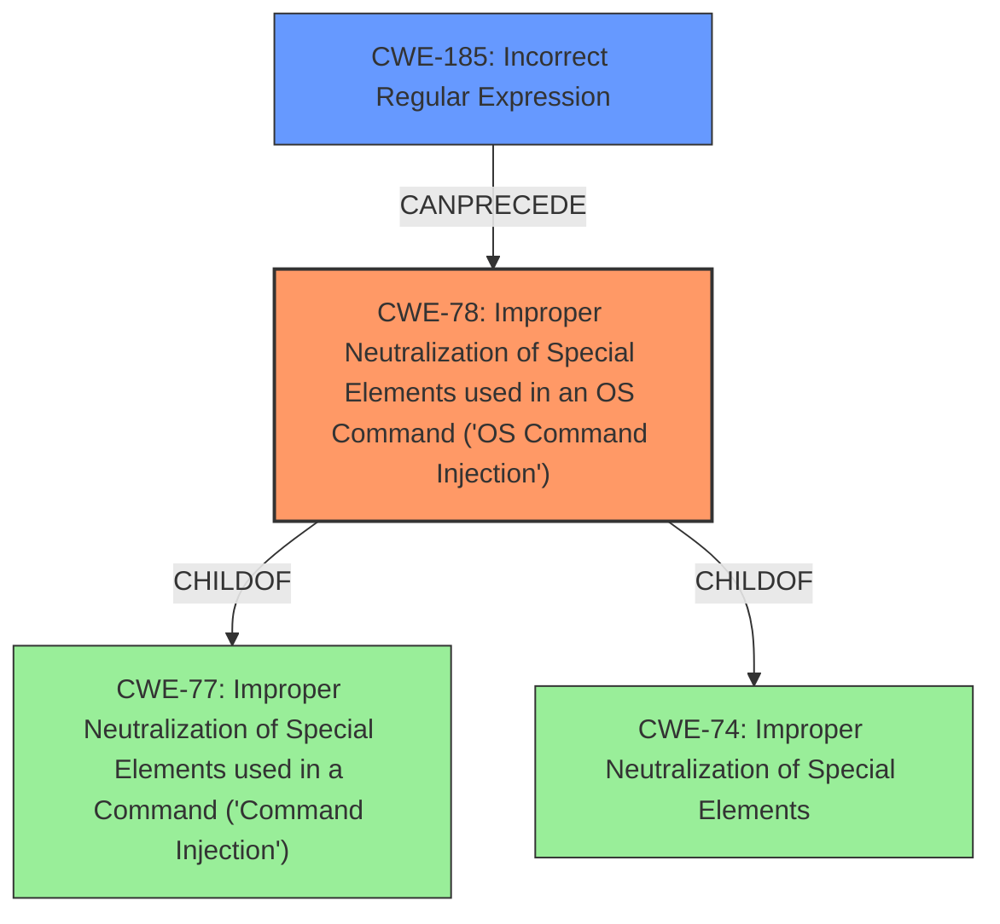

# Final Resolution for CVE-2021-38173

# Summary
| CWE ID | CWE Name | Confidence | CWE Abstraction Level | CWE Vulnerability Mapping Label | CWE-Vulnerability Mapping Notes |
|---|---|---|---|---|---|
| CWE-78 | Improper Neutralization of Special Elements used in an OS Command ('OS Command Injection') | 0.95 | Base | Allowed | Primary CWE |
| CWE-185 | Incorrect Regular Expression | 0.85 | Class | Allowed-with-Review | Secondary Candidate |

## Evidence and Confidence

*   **Confidence Score:** 0.90
*   **Evidence Strength:** HIGH

## Relationship Analysis
The primary relationship is that **CWE-185** (Incorrect Regular Expression) **CANPRECEDE** **CWE-78** (Improper Neutralization of Special Elements used in an OS Command). The flawed regex (CWE-185) allowed the attacker to bypass the intended filtering, leading directly to the OS command injection (CWE-78). While other options like CWE-791 (Incomplete Filtering) were considered, CWE-185 more accurately reflects the specific mechanism of failure: an error in the regular expression itself.

## Vulnerability Chain
The vulnerability chain starts with a flawed regular expression (**CWE-185**). This flawed regex is intended to filter out malicious commands, but due to the error, it fails to properly neutralize special elements. This failure leads directly to **CWE-78**, where an attacker can inject arbitrary OS commands. The chain is clear: Incorrect Regex -> Failed Neutralization -> OS Command Injection -> Arbitrary Command Execution.

## Summary of Analysis
I agree with the initial analysis that **CWE-78** is the primary **ROOTCAUSE**. The vulnerability description clearly states the **mishandling of remote hosts filtering SSH commands** leads to command execution. The CVE Reference Links Content Summary confirms that the `ssh_filter_btrbk.sh` script has a flawed regular expression for filtering commands, which allows attackers to bypass restrictions and execute arbitrary commands. This is direct evidence. As the initial analysis states, "This directly aligns with CWE-78 [Improper Neutralization of Special Elements used in an OS Command ('OS Command Injection')], a base-level CWE, because the root cause is the improper neutralization of special elements within an OS command."

However, I agree with the criticism that the initial secondary CWE, **CWE-116**, is a weaker justification. The focus should be on the *incorrect regex* rather than a general encoding/escaping issue. Therefore, I am replacing **CWE-116** with **CWE-185**, Incorrect Regular Expression. The **ROOTCAUSE** involves the **mishandling of remote hosts filtering SSH commands**, specifically the flawed regular expression in `ssh_filter_btrbk.sh`. The core problem is the incorrect regex that was intended to filter dangerous commands. This is at the optimal level of specificity.