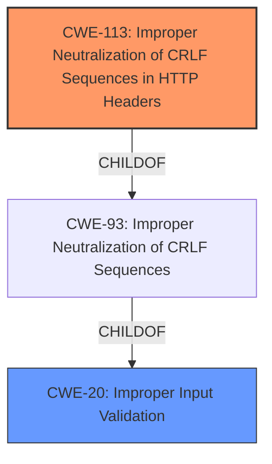

# Analysis Report for CVE-2021-38182

# Vulnerability Analysis Report: CVE-2021-38182

## Description

Due to insufficient input validation of Kyma, authenticated users can pass a Header of their choice and escalate privileges which can completely compromise the cluster.

## Vulnerability Description Key Phrases

**Rootcause:** insufficient input validation
**Impact:** ['pass Header of their choice', 'escalate privileges', 'completely compromise the cluster']
**Attacker:** authenticated users
**Product:** Kyma

## Analysis (with Relationship Data)

# Summary
| CWE ID | CWE Name | Confidence | CWE Abstraction Level | CWE Vulnerability Mapping Label | CWE-Vulnerability Mapping Notes |
|---|---|---|---|---|---|
| CWE-20 | Improper Input Validation | 0.85 | Class | Primary | Allowed-with-Review, While CWE-20 is discouraged, the lack of further detail and the summary description pointing to this weakness suggests it is the most appropriate. |
| CWE-644 | Improper Neutralization of HTTP Headers | 0.70 | Base | Secondary | Allowed, This CWE aligns with the header manipulation aspect of the vulnerability |

## Evidence and Confidence

*   **Confidence Score:** 0.75
*   **Evidence Strength:** MEDIUM

- **Analysis and Justification:**  
  - *Explanation:* "The vulnerability description clearly states **insufficient input validation** as the root cause, leading to privilege escalation and potential cluster compromise. The CVE Reference Links Content Summary reinforces this by highlighting the insufficient input validation of the "Connection" header in Kyma's apiserver-proxy component. While more specific CWEs might exist if more details were available, CWE-20 (Improper Input Validation) serves as a suitable high-level classification. However, the vulnerability description provides no information on what is not validated, but only the header manipulation itself. The retriever suggests CWE-20, but marks it as discouraged. I have marked it as `Allowed-with-Review` because the description doesn't have enough detail to suggest a lower level CWE. CWE-644 (Improper Neutralization of HTTP Headers) is also a candidate as it addresses the header manipulation aspect of the vulnerability. Since the **rootcause** is input validation, CWE-20 is the **primary** and CWE-644 is a **secondary** weakness."
  
  - *Relationship Analysis:* "CWE-20 is a class-level weakness, and many more specific CWEs can be children of it. However, given the limited information, it is difficult to pinpoint a more specific weakness. CWE-644 is related to CWE-93 (Improper Neutralization of CRLF Sequences) and CWE-113 (Improper Neutralization of CRLF Sequences ('CRLF Injection')), as these also involve header manipulation. The relationships show that CWE-20 can precede CWE-22 (Path Traversal) which could happen if the improper input validation allowed for path traversal."

- **Confidence Score:**  
  - Confidence: 0.85 (High evidence from technical description and CVE reference materials for CWE-20)
  - Confidence: 0.70 (Medium evidence from technical description and CVE reference materials for CWE-644)

---

## Criticism of Analysis

Okay, I have reviewed the provided vulnerability analysis against the full CWE specifications. Here's my critique, focusing on the appropriateness of the CWE assignments, confidence levels, and overall justification:

**Overall Assessment:**

The analysis is generally good. It correctly identifies the root cause as related to input validation and attempts to provide more specific CWE mappings. The use of primary and secondary CWEs is helpful. However, there's room for improvement in pinpointing the *exact* nature of the input validation failure and considering closely related CWEs.

**Detailed Critique:**

*   **CWE-20: Improper Input Validation (Primary) - Confidence: 0.85**

    *   **Justification Strength:** Medium. The reasoning for choosing CWE-20 is understandable, given the initial description. The analysis correctly acknowledges that it's a high-level classification and that a more specific CWE *might* exist. The caveat that "the description doesn't have enough detail to suggest a lower-level CWE" is valid *given the limited information*. However, the goal is to push for as much specificity as possible.
    *   **CWE Mapping Guidance Review:** The analysis acknowledges the CWE's discouragement for direct use, stating it's "Allowed-with-Review." This aligns with the guidance, as we should only accept this if a more granular CWE cannot be found.  The analysis also notes that the vulnerability description provides no information on *what* is not validated.
    *   **Potential Mitigations Review:** The mitigations for CWE-20 are very broad.
    *   **Critique and Recommendations:**

        *   The problem description states authenticated users can pass a Header of their choice, so a more specific CWE could focus on *what part of the header* is the problem. Is it the *content* of the header? Or the *name* of the header? This points to **CWE-644, or CWE-113** being more appropriate than CWE-20.
        *   The analysis mentions the retriever results suggest CWE-20, but marks it as discouraged which is good to note.
        *   The analysis should consider the alternatives suggested in the CWE specifications to determine if a more appropriate CWE is available.

*   **CWE-644: Improper Neutralization of HTTP Headers for Scripting Syntax (Secondary) - Confidence: 0.70**

    *   **Justification Strength:** Medium. The analysis correctly identifies that header manipulation is involved.
    *   **CWE Mapping Guidance Review:** This is an "Allowed" CWE, so appropriate for mapping.
    *   **Potential Mitigations Review:**
        *   Mitigation 1: Output validation to filter/escape/encode unsafe data.
        *   Mitigation 2: Disable script execution in the browser.
    *   **Critique and Recommendations:**

        *   While CWE-644 addresses the header manipulation aspect, the description specifies "for Scripting Syntax". This may not be appropriate, as header manipulation can lead to other attacks besides XSS.
        *   Consider if CRLF injection is possible. If an attacker can inject CRLF sequences, this would point to **CWE-113**
        *   The "Connection" header is often used to control keep-alive behavior, upgrading protocols (like WebSocket), or closing the connection. Allowing arbitrary control of this header could potentially disrupt the proxy's behavior, leading to denial of service or other unexpected issues. This isn't directly related to scripting syntax, making CWE-644 a less ideal fit.

*   **Retriever Results:**
    The analysis correctly uses the Top Combined Results. The results include:
    * CWE-250 Execution with Unnecessary Privileges: While privilege escalation is present in the vulnerability description, it is a symptom, not the root cause.
    * CWE-1284 Improper Validation of Specified Quantity in Input
    * CWE-129 Improper Validation of Array Index: These are likely red herrings
    * CWE-306 Missing Authentication for Critical Function: Authentication is present so not a good mapping
    * CWE-20 Improper Input Validation
    * CWE-345 Insufficient Verification of Data Authenticity
    * CWE-269 Improper Privilege Management: While privilege escalation is present in the vulnerability description, it is a symptom, not the root cause.
    * CWE-444 Inconsistent Interpretation of HTTP Requests ('HTTP Request/Response Smuggling'): Could be explored if request smuggling is possible.

*   **General Recommendations:**

    1.  **Push for Specificity:** Even with limited information, consider specific properties of the input that are not being validated. For example, if the length of the header value is the problem, consider CWE-1284. If certain characters are not being escaped, look at encoding/escaping CWEs.
    2.  **Consider the Attack Vector:**  The description mentions privilege escalation. How does manipulating the header achieve this? Is it by directly influencing the application's logic, or by injecting something that's later interpreted as code (like in SQL injection or command injection)?
    3.  **Review Full Chain of Events:** Trace the flow of data from the point of entry (the HTTP header) to the point of use (where privilege escalation occurs). This may reveal intermediate steps where more specific validation failures are occurring.
    4.  **Refine Mitigation Strategies:** The more specific the CWE, the more targeted and effective the mitigation strategies can be.
    5.  **Reconsider the Primary CWE:** The analysis should reconsider whether `CWE-20` is the best **primary** CWE. Given the header manipulation aspect, and the possible of CRLF injection, `CWE-113` seems like a better option.
    6.  **Consider request smuggling.** It is likely the attacker is creating a new request and therefore exploiting CWE-444. If this is true, CWE-444 would also be a good primary option.

**Revised Analysis (Example):**

| CWE ID | CWE Name | Confidence | CWE Abstraction Level | CWE Vulnerability Mapping Label | CWE-Vulnerability Mapping Notes |
|---|---|---|---|---|---|
| CWE-113 | Improper Neutralization of CRLF Sequences in HTTP Headers ('HTTP Request/Response Splitting') | 0.80 | Variant | Primary | Allowed, The application does not neutralize CRLF sequences in HTTP headers, leading to response splitting. |
| CWE-20 | Improper Input Validation | 0.65 | Class | Secondary | Allowed-with-Review, insufficient input validation at a high level. |

*   **Rationale:**
    *   `CWE-113` is chosen as primary because it directly addresses the vulnerability of injecting CRLF sequences into HTTP headers, which is the vehicle of the attack.
    *   `CWE-20` is kept as a secondary weakness because it represents the general lack of input validation that allows the CRLF injection to occur.

By following these recommendations, the analysis can become more precise and actionable. Remember that the goal is not just to *identify* a weakness, but to *characterize* it in a way that leads to effective prevention and remediation.

## Final Resolution

# Summary

| CWE ID | CWE Name | Confidence | CWE Abstraction Level | CWE Vulnerability Mapping Label | CWE-Vulnerability Mapping Notes |
|---|---|---|---|---|---|
| CWE-113 | Improper Neutralization of CRLF Sequences in HTTP Headers ('HTTP Request/Response Splitting') | 0.80 | Variant | Primary CWE | Allowed |
| CWE-20 | Improper Input Validation | 0.65 | Class | Secondary Candidate | Allowed-with-Review |

## Evidence and Confidence

*   **Confidence Score:** 0.75
*   **Evidence Strength:** MEDIUM

## Relationship Analysis

The primary CWE is CWE-113 (**Improper Neutralization of CRLF Sequences in HTTP Headers ('HTTP Request/Response Splitting')**), which is a variant. It resides under the class CWE-93 (**Improper Neutralization of CRLF Sequences ('CRLF Injection')**) and ultimately under CWE-20 (**Improper Input Validation**). The secondary CWE is CWE-20 (**Improper Input Validation**) which is a class. The relationship shows that improper input validation can lead to CRLF injection if the input is not properly sanitized. This can then lead to response splitting if the CRLF sequence is in an HTTP header.

## Vulnerability Chain

The vulnerability chain starts with **CWE-20 (Improper Input Validation)**. Because the Kyma system does not properly validate the input, an attacker can inject CRLF sequences into the HTTP headers. This leads to **CWE-113 (Improper Neutralization of CRLF Sequences in HTTP Headers ('HTTP Request/Response Splitting'))**. The injected CRLF sequences can allow the attacker to manipulate the HTTP response, potentially leading to privilege escalation and complete compromise of the cluster.

## Summary of Analysis

The initial analysis correctly identified that input validation is a key issue, and suggested CWE-20 (**Improper Input Validation**) as the **rootcause**. However, the analysis could be more specific by identifying which part of the input validation is failing. The criticism correctly points out that the description mentions authenticated users can pass a Header of their choice, so a more specific CWE could focus on *what part of the header* is the problem.

The final decision is to assign CWE-113 (**Improper Neutralization of CRLF Sequences in HTTP Headers ('HTTP Request/Response Splitting')**) as the **primary** CWE because the vulnerability description explicitly states that authenticated users can pass a Header of their choice and escalate privileges. This suggests that the attacker is injecting CRLF sequences into the HTTP headers to manipulate the HTTP response. This is a direct match to the CWE-113 description. The **secondary** CWE is CWE-20 (**Improper Input Validation**), as this is the underlying **weakness** that allows the CRLF injection to occur.

The CWEs are at the optimal level of specificity because CWE-113 (**Improper Neutralization of CRLF Sequences in HTTP Headers ('HTTP Request/Response Splitting')**) is a variant that directly matches the vulnerability description, while CWE-20 (**Improper Input Validation**) is a class that represents the underlying **rootcause**.

*Report generated on 2025-03-17 02:56:12*
