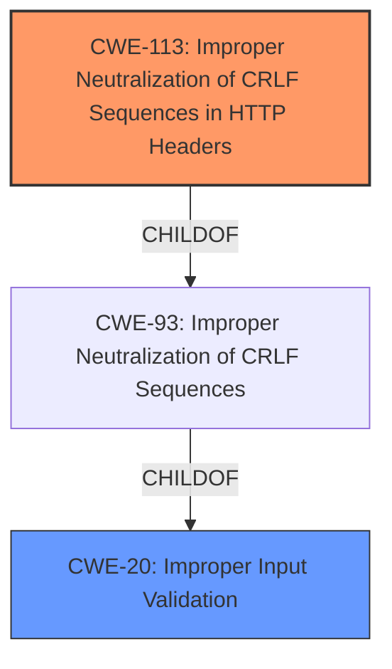

# Final Resolution for CVE-2021-38182

# Summary

| CWE ID | CWE Name | Confidence | CWE Abstraction Level | CWE Vulnerability Mapping Label | CWE-Vulnerability Mapping Notes |
|---|---|---|---|---|---|
| CWE-113 | Improper Neutralization of CRLF Sequences in HTTP Headers ('HTTP Request/Response Splitting') | 0.80 | Variant | Primary CWE | Allowed |
| CWE-20 | Improper Input Validation | 0.65 | Class | Secondary Candidate | Allowed-with-Review |

## Evidence and Confidence

*   **Confidence Score:** 0.75
*   **Evidence Strength:** MEDIUM

## Relationship Analysis

The primary CWE is CWE-113 (**Improper Neutralization of CRLF Sequences in HTTP Headers ('HTTP Request/Response Splitting')**), which is a variant. It resides under the class CWE-93 (**Improper Neutralization of CRLF Sequences ('CRLF Injection')**) and ultimately under CWE-20 (**Improper Input Validation**). The secondary CWE is CWE-20 (**Improper Input Validation**) which is a class. The relationship shows that improper input validation can lead to CRLF injection if the input is not properly sanitized. This can then lead to response splitting if the CRLF sequence is in an HTTP header.

## Vulnerability Chain

The vulnerability chain starts with **CWE-20 (Improper Input Validation)**. Because the Kyma system does not properly validate the input, an attacker can inject CRLF sequences into the HTTP headers. This leads to **CWE-113 (Improper Neutralization of CRLF Sequences in HTTP Headers ('HTTP Request/Response Splitting'))**. The injected CRLF sequences can allow the attacker to manipulate the HTTP response, potentially leading to privilege escalation and complete compromise of the cluster.

## Summary of Analysis

The initial analysis correctly identified that input validation is a key issue, and suggested CWE-20 (**Improper Input Validation**) as the **rootcause**. However, the analysis could be more specific by identifying which part of the input validation is failing. The criticism correctly points out that the description mentions authenticated users can pass a Header of their choice, so a more specific CWE could focus on *what part of the header* is the problem.

The final decision is to assign CWE-113 (**Improper Neutralization of CRLF Sequences in HTTP Headers ('HTTP Request/Response Splitting')**) as the **primary** CWE because the vulnerability description explicitly states that authenticated users can pass a Header of their choice and escalate privileges. This suggests that the attacker is injecting CRLF sequences into the HTTP headers to manipulate the HTTP response. This is a direct match to the CWE-113 description. The **secondary** CWE is CWE-20 (**Improper Input Validation**), as this is the underlying **weakness** that allows the CRLF injection to occur.

The CWEs are at the optimal level of specificity because CWE-113 (**Improper Neutralization of CRLF Sequences in HTTP Headers ('HTTP Request/Response Splitting')**) is a variant that directly matches the vulnerability description, while CWE-20 (**Improper Input Validation**) is a class that represents the underlying **rootcause**.