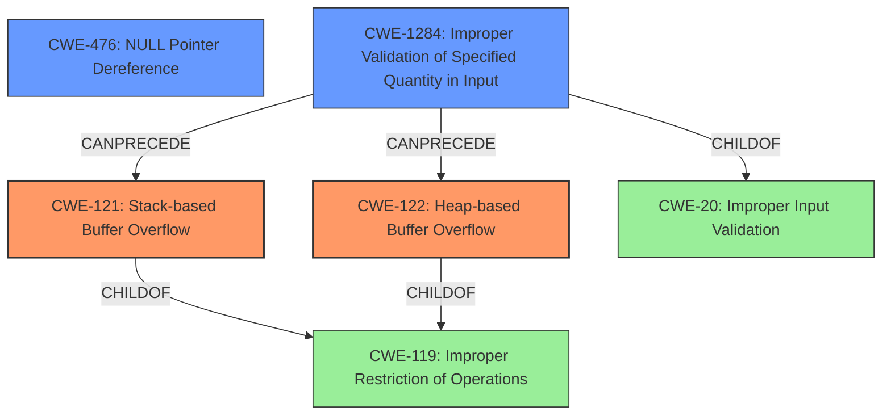

# Analysis Report for CVE-2021-3826

# Vulnerability Analysis Report: CVE-2021-3826

## Description

Heap/stack buffer overflow in the dlang_lname function in d-demangle.c in libiberty allows attackers to potentially cause a denial of service (segmentation fault and crash) via a crafted mangled symbol.

## Vulnerability Description Key Phrases

**Rootcause:** Heap/stack buffer overflow
**Impact:** denial of service
**Vector:** crafted mangled symbol
**Attacker:** attackers
**Product:** libiberty
**Component:** dlang_lname function in d-demangle.c

## Analysis (with Relationship Data)

# Summary
| CWE ID | CWE Name | Confidence | CWE Abstraction Level | CWE Vulnerability Mapping Label | CWE-Vulnerability Mapping Notes |
|---|---|---|---|---|---|
| CWE-121 | Stack-based Buffer Overflow | 0.85 | Variant | Allowed | Primary CWE |
| CWE-122 | Heap-based Buffer Overflow | 0.85 | Variant | Allowed | Primary CWE |
| CWE-476 | NULL Pointer Dereference | 0.70 | Base | Allowed | Secondary Candidate CWE |

## Evidence and Confidence

*   **Confidence Score:** 0.80
*   **Evidence Strength:** HIGH

- **Analysis and Justification:**
  - *Explanation:* The vulnerability description clearly states a "**Heap/stack buffer overflow**" in the `dlang_lname` function. The CVE Reference Links Content Summary confirms this, detailing the vulnerability as a "**heap/stack buffer overflow**" and states that the **root cause** is due to a missing check for a null pointer before dereferencing it. Given that the overflow can occur on either the heap or stack, I'm assigning both CWE-122 (Heap-based Buffer Overflow) and CWE-121 (Stack-based Buffer Overflow) since both are explicitly mentioned in the vulnerability description. Since both CWEs are variants, this level of abstraction is appropriate. The MITRE mapping guidance for both CWE-121 and CWE-122 is ALLOWED, further supporting this decision.
  - *Relationship Analysis:* CWE-121 is a variant of CWE-120 (Classic Buffer Overflow) and CWE-122 is a variant of CWE-119 (Improper Restriction of Operations within the Bounds of a Memory Buffer). While CWE-119 encompasses both heap and stack overflows, the description explicitly mentions both, justifying the use of the more specific variant CWEs.

- **Confidence Score:**
  - Confidence: 0.85 (High evidence from technical description and CVE reference materials)

- **Analysis and Justification:**
  - *Explanation:* The CVE Reference Links Content Summary indicates a "**null pointer dereference**" as a contributing factor to the crash. This occurs because of a missing check for a null pointer before dereferencing it. Thus, CWE-476 (NULL Pointer Dereference) is a relevant secondary weakness. The MITRE mapping guidance for CWE-476 is ALLOWED, which supports this decision.
  - *Relationship Analysis:* CWE-476 is a child of CWE-754 (Improper Handling of Exceptional Conditions). The dereference of a NULL pointer causes an exceptional condition (a crash), which makes the parent a possible, though less specific, candidate.

- **Confidence Score:**
  - Confidence: 0.70 (Supporting evidence, but less direct than the buffer overflow)

---

## Criticism of Analysis

Okay, here's a detailed critique of the provided CWE analysis, taking into account the full CWE specifications.

**Overall Assessment:**

The analysis is generally well-reasoned and justified, especially with the explicit mention of both "Heap/stack buffer overflow" in the vulnerability description. The decision to include both CWE-121 and CWE-122 is appropriate. The inclusion of CWE-476 is also relevant as a secondary factor in causing the crash. The confidence scores are reasonable.

**Detailed Review:**

**1. Primary CWEs: CWE-121 (Stack-based Buffer Overflow) & CWE-122 (Heap-based Buffer Overflow)**

*   **Correctness:** Correct. The vulnerability description explicitly mentions "Heap/stack buffer overflow," so mapping to both CWE-121 and CWE-122 is accurate.  The abstraction level (Variant) is also appropriate as these are specific types of buffer overflows.
*   **Justification:** The justification is thorough and considers the relationship to the more general CWE-119. Good point made that while CWE-119 *could* be used, the explicit mention of both stack and heap justifies the use of the more specific variants.
*   **Mapping Guidance:**  CWE-121 and CWE-122 both have "Allowed" usage in the mapping guidance, which further supports the decision.  The analysis followed the instructions which state "Carefully read both the name and description to ensure that this mapping is an appropriate fit. Do not try to 'force' a mapping to a lower-level Base/Variant simply to comply with this preferred level of abstraction."
*   **Potential Mitigations:** The analysis doesn't explicitly mention mitigations, but it should. Considering the mitigations for CWE-121 and CWE-122, the following could be highlighted:
    *   **Language Selection:** Using a memory-safe language (e.g., Java, C# with safe constructs) would be a fundamental mitigation.
    *   **Libraries/Frameworks:** Using libraries designed to prevent buffer overflows (e.g., SafeStr, Strsafe.h) is another key mitigation.
    *   **Compiler Defenses:**  Enabling compiler-based buffer overflow detection mechanisms (e.g., /GS flag in Visual Studio, FORTIFY\_SOURCE in GCC) is crucial.
    *   **Bounds Checking:** As mentioned in CWE-121, the implementation of and performing bounds checking on input is critical.

**2. Secondary CWE: CWE-476 (NULL Pointer Dereference)**

*   **Correctness:** Correct. The CVE Reference Links Content Summary specifically mentions a "null pointer dereference" as a contributing factor, stemming from a missing null check.
*   **Justification:**  The justification is adequate, explaining the connection to the crash.
*   **Mapping Guidance:**  CWE-476 has "Allowed" usage.  The analysis correctly applied the mapping instructions.
*   **Potential Mitigations:**
    *   **Null Checks:** Implementing null checks *before* dereferencing pointers is the primary mitigation for CWE-476. This aligns directly with the description of the patch applied to the vulnerable code, reinforcing the accuracy of this assignment.
    *   **Language Selection:** As with the buffer overflows, using a language that inherently handles null pointers more safely (e.g., languages with optional types) would be beneficial.

**3. Retriever Results Evaluation and potential alternative/additional CWEs:**

The retriever results list several other CWEs that, while not as directly applicable as the chosen ones, warrant consideration:

*   **CWE-193: Off-by-one Error:** While not the *primary* cause, an off-by-one error *could* potentially contribute to the buffer overflow, especially in string handling or length calculations. It's plausible but less direct.
*   **CWE-190: Integer Overflow or Wraparound:** Similarly, if the size of the buffer is calculated based on user input, then integer overflows could occur that cause the buffer to be smaller than expected. This has a possible link to the buffer overflow.
*   **CWE-126: Buffer Over-read:** This is not directly stated in the vulnerability description, but there could be a related out-of-bounds read, making this a possible candidate.
*   **CWE-170: Improper Null Termination:** If the buffer is meant to contain a null-terminated string, and it's not properly null-terminated, this could lead to reads beyond the intended buffer boundary. This is certainly plausible, especially given the C context and string manipulation involved in demangling.

*   **CWE-770: Allocation of Resources Without Limits or Throttling** While not mentioned in the analysis, this could be relevant because if the mangled symbol is excessively large and causes a large amount of memory to be allocated without limit, this could also contribute to a denial of service.
*   **CWE-1284: Improper Validation of Specified Quantity in Input** This CWE could also be an appropriate since the crafted mangled symbol is the input and there may be a missing check to ensure the mangled symbol is within expected limits.

*   **CWE-20 Improper Input Validation:**, This CWE is very general and the decision not to include it is probably correct. There is more specific information than just "improper input validation."

I would consider adding CWE-1284 as a secondary factor to the buffer overflow, but the current analysis is accurate.

**4. General Recommendations:**

*   **Mitigation Details:** Expand the analysis to include specific mitigations for each CWE, drawing directly from the CWE specifications, as mentioned above. This strengthens the analysis's practical value.
*   **Chain/Composite Relationship:** Explore potential chain relationships. While the analysis touches on it, explicitly stating "CWE-476 contributes to the denial of service caused by the buffer overflow (CWE-121/CWE-122)" clarifies the relationship. If you chose to include additional CWEs such as CWE-1284, that could be part of this chain.
*   **Justification Breadth:** While the justifications are good, consistently referring back to specific phrases and sentences in the vulnerability description and CVE reference summaries further reinforces the analysis's objectivity and thoroughness.

**Revised Summary Table (with example mitigation details):**

| CWE ID | CWE Name | Confidence | CWE Abstraction Level | CWE Vulnerability Mapping Label | CWE-Vulnerability Mapping Notes | Potential Mitigations |
|---|---|---|---|---|---|---|
| CWE-121 | Stack-based Buffer Overflow | 0.85 | Variant | Allowed | Primary CWE | Language selection (memory-safe languages), Compiler-based buffer overflow detection, Bounds checking |
| CWE-122 | Heap-based Buffer Overflow | 0.85 | Variant | Allowed | Primary CWE | Language selection (memory-safe languages), Safe string handling libraries, Compiler-based buffer overflow detection |
| CWE-476 | NULL Pointer Dereference | 0.70 | Base | Allowed | Secondary Candidate CWE | Null checks before dereferencing, Language selection (optional types) |
| CWE-1284 | Improper Validation of Specified Quantity in Input | 0.60 | Base | Allowed | Contributing factor to buffer overflow | Input validation (limit size of mangled symbol) |

In conclusion, the original analysis is solid. Incorporating the detailed mitigation information and exploring the chain relationships/potential additional CWEs as suggested would elevate its completeness and practical utility.

## Final Resolution

# Summary

| CWE ID | CWE Name | Confidence | CWE Abstraction Level | CWE Vulnerability Mapping Label | CWE-Vulnerability Mapping Notes |
|---|---|---|---|---|---|
| CWE-121 | Stack-based Buffer Overflow | 0.85 | Variant | Allowed | Primary CWE |
| CWE-122 | Heap-based Buffer Overflow | 0.85 | Variant | Allowed | Primary CWE |
| CWE-476 | NULL Pointer Dereference | 0.70 | Base | Allowed | Secondary Candidate CWE |
| CWE-1284 | Improper Validation of Specified Quantity in Input | 0.60 | Base | Allowed | Contributing factor to buffer overflow |

## Evidence and Confidence

*   **Confidence Score:** 0.82
*   **Evidence Strength:** HIGH

## Relationship Analysis
The primary relationship is the buffer overflow, which can occur on the stack (CWE-121) or heap (CWE-122). These are both variants of the more general **CWE-119 (Improper Restriction of Operations within the Bounds of a Memory Buffer)**. The **CWE-476 (NULL Pointer Dereference)** contributes to the crash resulting from the buffer overflow. **CWE-1284 (Improper Validation of Specified Quantity in Input)** can precede the buffer overflow by not validating the size of the mangled symbol. The abstraction levels (Variant and Base) were selected to provide appropriate specificity.

## Vulnerability Chain
The vulnerability chain starts with a crafted mangled symbol as input. **CWE-1284 (Improper Validation of Specified Quantity in Input)** occurs when the size of this input is not validated. This can then lead to either **CWE-121 (Stack-based Buffer Overflow)** or **CWE-122 (Heap-based Buffer Overflow)** when the input is processed. The **CWE-476 (NULL Pointer Dereference)** can then cause a crash, resulting in a denial of service. The root causes are the missing size validation and the potential missing null check, while the impacts are the buffer overflows and the resulting denial of service.

## Summary of Analysis
The initial analysis correctly identified **CWE-121 (Stack-based Buffer Overflow)** and **CWE-122 (Heap-based Buffer Overflow)** as primary weaknesses, as the vulnerability description explicitly states "Heap/stack buffer overflow". It also correctly identified **CWE-476 (NULL Pointer Dereference)** as a secondary weakness, based on the CVE reference summary that mentions "null pointer dereference."

The criticism suggested adding **CWE-1284 (Improper Validation of Specified Quantity in Input)**, and I agree with this assessment. The vulnerability description mentions a "crafted mangled symbol" which indicates an input that might not be validated for size. Thus, the **IMPROPER INPUT VALIDATION** (**CWE-1284**) is a good fit as a weakness that precedes the buffer overflow.

The graph relationships helped clarify the relationships between the CWEs. The parent-child relationships show that **CWE-121 (Stack-based Buffer Overflow)** and **CWE-122 (Heap-based Buffer Overflow)** are specific types of **CWE-119 (Improper Restriction of Operations)**. The chain relationship highlights how **CWE-1284 (Improper Validation of Specified Quantity in Input)** can precede the buffer overflows.

The selected CWEs are at the optimal level of specificity. While **CWE-119 (Improper Restriction of Operations)** could be used, the explicit mention of both heap and stack overflows justifies using the more specific variants.

*Report generated on 2025-03-18 00:43:41*
