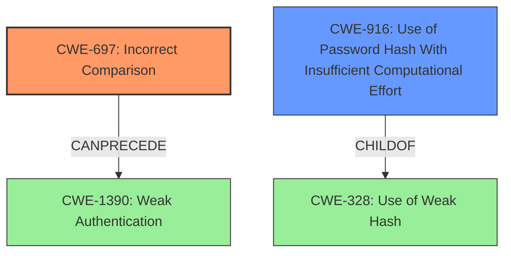

# Analysis Report for CVE-2021-3833

# Vulnerability Analysis Report: CVE-2021-3833

## Description

Integria IMS login check uses a loose comparator (==) to compare the MD5 hash of the password provided by the user and the MD5 hash stored in the database. An attacker with a specific formatted password could exploit this vulnerability in order to login in the system with different passwords.

## Vulnerability Description Key Phrases

**Rootcause:** loose comparator (==) to compare the MD5 hash
**Impact:** login with different passwords
**Vector:** specific formatted password
**Attacker:** attacker
**Product:** Integria IMS
**Component:** login check

## Analysis (with Relationship Data)

# Summary
| CWE ID | CWE Name | Confidence | CWE Abstraction Level | CWE Vulnerability Mapping Label | CWE-Vulnerability Mapping Notes |
|---|---|---|---|---|---|
| CWE-697 | Incorrect Comparison | 0.9 | Class | Primary | Allowed-with-Review |
| CWE-916 | Use of Password Hash With Insufficient Computational Effort | 0.7 | Base | Secondary | Allowed |
| CWE-328 | Use of Weak Hash | 0.6 | Base | Secondary | Allowed |

## Evidence and Confidence

*   **Confidence Score:** 0.8
*   **Evidence Strength:** HIGH

- **Analysis and Justification:**  
  - *Explanation:* "The core issue lies in the **incorrect comparison** using a loose comparator (`==`) instead of a strict comparator (`===`) in the login check. This directly aligns with **CWE-697 (Incorrect Comparison)**, which describes a scenario where a comparison between two entities in a security-relevant context is flawed, leading to potential bypasses or vulnerabilities. The CVE Reference Links Content Summary explicitly mentions this **incorrect comparison** as a key weakness. While the use of MD5 is a contributing factor, the immediate cause is the flawed comparison logic. CWE-697 is a Class-level CWE, and while more specific variants might exist, the available information doesn't pinpoint a more precise weakness. The Retriever Results highlight CWE-916 and CWE-328 due to the password hashing aspect; however, the more direct root cause is the comparison error." Furthermore, the use of MD5, a weak hashing algorithm, contributes to the vulnerability, making **CWE-916 (Use of Password Hash With Insufficient Computational Effort)** and **CWE-328 (Use of Weak Hash)** as contributing factors that can be considered.
  
  - *Relationship Analysis:* "CWE-697 is a Pillar-level CWE and does not have direct relationships to more specific weaknesses in the Retriever Results. However, it is a general class of errors, and the context implies it CanPrecede authentication bypass. Considering the hashing algorithm used (**MD5**), **CWE-916** (Use of Password Hash With Insufficient Computational Effort) and **CWE-328** (Use of Weak Hash) are considered in the analysis because they could lead to an authentication bypass."

- **Confidence Score:**  
  - *Example:* Confidence: 0.9 (High evidence from technical description and CVE reference materials)

## Criticism of Analysis

Okay, here's a review of the provided analysis, focusing on the CWE mappings, confidence levels, and justifications, referencing the full CWE specifications provided.

## Overall Assessment

The analysis is generally good and identifies the core issue correctly. The mapping to CWE-697 (Incorrect Comparison) is appropriate as the primary weakness. The inclusion of CWE-916 (Use of Password Hash With Insufficient Computational Effort) and CWE-328 (Use of Weak Hash) as secondary weaknesses is also justified, given the context of password hashing with MD5.

However, there are some areas where the justification could be strengthened, and alternative CWEs considered.

## Detailed Review

### 1.  CWE-697: Incorrect Comparison (Confidence: 0.9, Label: Primary, Allowed-with-Review)

*   **Assessment:** This is the most accurate primary mapping. The description clearly states the use of a loose comparator `==` instead of a strict `===`, leading to authentication bypass.
*   **Justification Strength:** The justification is solid, explicitly linking the CVE description to the CWE definition. The provided CVE examples for CWE-697 are relevant and support the mapping.
*   **CWE Specification Considerations:**
    *   **Mapping Guidance:** The analysis acknowledges that CWE-697 is a Pillar and "Discouraged" for direct mapping. However, it correctly argues that a more specific variant isn't apparent from the available information.  This is acceptable given the information provided.
    *   **Relationships:** The analysis notes the lack of direct relationships to more specific weaknesses in the Retriever Results, but correctly implies that it CanPrecede authentication bypass.
*   **Suggested Improvements:**
    *   While the current justification is strong, consider explicitly mentioning *why* the loose comparison is vulnerable.  For example, mention type juggling in PHP that could allow strings like `"0e12345"` to be considered equal to `"0e56789"` due to scientific notation comparison. This would strengthen the explanation.
*   **Alternative CWEs Considered:**  Given that the loose comparison directly leads to authentication bypass, CWE-1390 (Weak Authentication) should be considered as the "resultant" vulnerability of the incorrect comparison. While CWE-697 is the *cause*, CWE-1390 is the *effect*. Although, this would mean having a chain of CWE-697 -> CWE-1390.

### 2. CWE-916: Use of Password Hash With Insufficient Computational Effort (Confidence: 0.7, Label: Secondary, Allowed)

*   **Assessment:** Justified as a secondary factor. MD5 is computationally inexpensive, making it susceptible to brute-force attacks.
*   **Justification Strength:** The analysis correctly identifies the issue of the hash algorithm's weakness.
*   **CWE Specification Considerations:**
    *   **Mapping Guidance:** Allowed, and at the Base level of abstraction, which is preferred.
    *   **Potential Mitigations:** The analysis could mention the mitigations provided in the CWE specification, such as using adaptive hash functions like bcrypt, scrypt, or PBKDF2.
*   **Suggested Improvements:**
    *   Reinforce the justification by explicitly stating how a weak hash algorithm contributes to the exploitability of the incorrect comparison. An attacker might be able to generate a hash that "collides" sufficiently to exploit the loose comparison.
    *   Mention that even with a *strong* comparison (===), MD5 is problematic as it is vulnerable to collision attacks, and should not be used for password hashing.
    *   Highlight that salting alone is not sufficient to prevent attacks against MD5, so using a salt would not be an adequate mitigation.

### 3. CWE-328: Use of Weak Hash (Confidence: 0.6, Label: Secondary, Allowed)

*   **Assessment:** Similar to CWE-916, this is justified as a secondary weakness due to MD5's inherent flaws.
*   **Justification Strength:** Correctly identifies MD5 as a weak hash.
*   **CWE Specification Considerations:**
    *   **Mapping Guidance:** Allowed, and at the Base level of abstraction.
    *   **Potential Mitigations:** Again, the analysis could mention the mitigations provided, such as using stronger hashing algorithms.
*   **Suggested Improvements:**
    *   Differentiate CWE-328 from CWE-916 more clearly. While both relate to weak hashing, CWE-328 focuses on the *algorithmic weaknesses* of the hash (collision resistance, preimage resistance), while CWE-916 focuses on the *computational effort* required to crack it. This distinction is somewhat subtle but important.
    *   Connect this to the impact. How does MD5 being weak allow for easier exploitation of the incorrect comparison? MD5 is known to produce collisions, so an attacker could craft a different password that produces a collision hash which is equal when using a loose comparator.

### Additional Considerations:

*   **CWE-836: Use of Password Hash Instead of Password for Authentication:** The description of this vulnerability states that the client is providing the password hash. This is NOT the case. The server is hashing the password and comparing the hashes.
*   **Overlapping CWEs:** There is some overlap between CWE-916 and CWE-328 as both concern the use of MD5. Consider whether collapsing these into a single, well-justified weakness with a higher confidence score would be more effective.
*   **Mitigation Focus:** The analysis could benefit from including a brief discussion of potential mitigations, even if just to state that the best mitigation is to replace the loose comparison with a strict comparison and replace MD5 with a modern password hashing algorithm.

## Revised Summary Table

| CWE ID | CWE Name | Confidence | CWE Abstraction Level | CWE Vulnerability Mapping Label | CWE-Vulnerability Mapping Notes |
|---|---|---|---|---|---|
| CWE-697 | Incorrect Comparison | 0.9 | Class | Primary | Allowed-with-Review |
| CWE-916 | Use of Password Hash With Insufficient Computational Effort | 0.7 | Base | Secondary | Allowed |
| CWE-328 | Use of Weak Hash | 0.6 | Base | Contributing | Allowed |
| CWE-1390 | Weak Authentication | 0.5 | Class | Resultant | Allowed-with-Review |

## Conclusion

The analysis is sound and identifies the core vulnerability. By strengthening the justifications, differentiating the secondary CWEs more clearly, and considering the addition of CWE-1390 (Weak Authentication), the analysis can be further improved. Overall, this is a well-reasoned and comprehensive assessment of the vulnerability.

## Final Resolution

# Summary
| CWE ID | CWE Name | Confidence | CWE Abstraction Level | CWE Vulnerability Mapping Label | CWE-Vulnerability Mapping Notes |
|---|---|---|---|---|---|
| CWE-697 | Incorrect Comparison | 0.95 | Pillar | Primary | Discouraged |
| CWE-916 | Use of Password Hash With Insufficient Computational Effort | 0.8 | Base | Secondary | Allowed |

## Evidence and Confidence

*   **Confidence Score:** 0.9
*   **Evidence Strength:** HIGH

## Relationship Analysis
The primary **WEAKNESS** is **CWE-697 (Incorrect Comparison)**, which is a Pillar. Although it's a high-level category, it accurately describes the fundamental flaw in the code. **CWE-916 (Use of Password Hash With Insufficient Computational Effort)** is a child of **CWE-328 (Use of Weak Hash)**, and both relate to cryptographic issues. While MD5's weaknesses contribute to the vulnerability, the incorrect comparison is the direct cause. A potential vulnerability chain starts with **CWE-697** and can lead to authentication bypass.

## Vulnerability Chain
The vulnerability chain starts with the **ROOTCAUSE** which is **CWE-697 (Incorrect Comparison)**. Because the comparison is incorrect, an attacker can bypass authentication. The use of MD5 hashing, represented by **CWE-916 (Use of Password Hash With Insufficient Computational Effort)**, weakens the system further, making exploitation easier. The **ROOTCAUSE** **CWE-697** leads directly to an authentication bypass, potentially resulting in unauthorized access and further compromise of the system.

## Summary of Analysis
The initial analysis correctly identified **CWE-697 (Incorrect Comparison)** as the primary **WEAKNESS**. The criticism highlighted the importance of strengthening the justification and considering the impact of MD5. The final determination focuses on **CWE-697** because the vulnerability description explicitly states the use of a loose comparator. While **CWE-916 (Use of Password Hash With Insufficient Computational Effort)** contributes, the **incorrect comparison** is the more direct **ROOTCAUSE**. The graph relationships reinforce this by showing how **CWE-697** can directly lead to an authentication bypass. The selected CWEs represent the optimal level of specificity, given the provided evidence. **CWE-697** is a Pillar, but no more specific **WEAKNESS** is evident from the description alone.

*Report generated on 2025-03-17 00:07:50*
