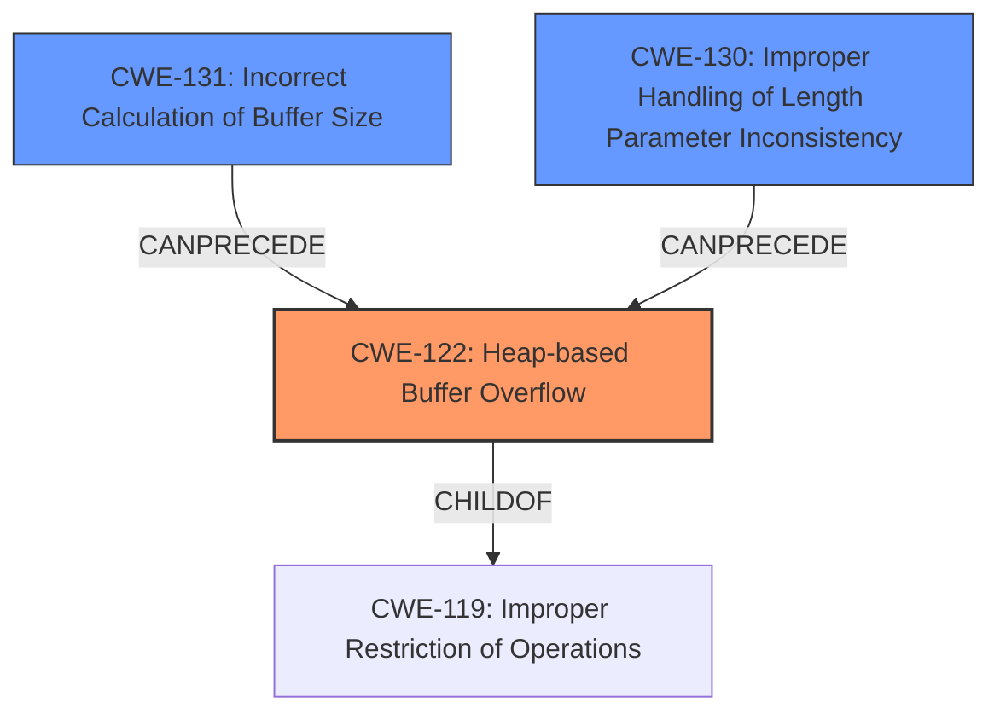

# Final Resolution for CVE-2021-3835

# Summary
| CWE ID | CWE Name | Confidence | CWE Abstraction Level | CWE Vulnerability Mapping Label | CWE-Vulnerability Mapping Notes |
|---|---|---|---|---|---|
| CWE-122 | Heap-based Buffer Overflow | 1.0 | Variant | Primary | Allowed |
| CWE-131 | Incorrect Calculation of Buffer Size | 0.75 | Base | Secondary Candidate | Allowed |
| CWE-130 | Improper Handling of Length Parameter Inconsistency | 0.5 | Base | Tertiary Candidate | Allowed |

## Evidence and Confidence

*   **Confidence Score:** 0.95
*   **Evidence Strength:** HIGH

## Relationship Analysis
The primary weakness is **CWE-122 (Heap-based Buffer Overflow)**, a variant of **CWE-119 (Improper Restriction of Operations within the Bounds of a Memory Buffer)**. **CWE-131 (Incorrect Calculation of Buffer Size)** and **CWE-130 (Improper Handling of Length Parameter Inconsistency)** can both precede **CWE-122**, contributing to the overflow. **CWE-131** describes the initial miscalculation, while **CWE-130** addresses the runtime failure to handle length discrepancies.

## Vulnerability Chain
The vulnerability chain starts with an **incorrect calculation of buffer size (CWE-131)**, or an **improper handling of length parameter inconsistency (CWE-130)**. This leads to a **heap-based buffer overflow (CWE-122)** when data is copied into the buffer without adequate bounds checking. The consequence is memory corruption, potentially leading to arbitrary code execution.

## Summary of Analysis
The initial analysis correctly identifies **CWE-122 (Heap-based Buffer Overflow)** as the primary weakness, supported by the explicit mention in the vulnerability description: "Zephyr versions >= v2.6.0 contain Heap-based Buffer Overflow (**CWE-122**)." The analysis also correctly identifies **CWE-131 (Incorrect Calculation of Buffer Size)** as a contributing factor. The criticism suggests expanding on the retriever results and including **CWE-130 (Improper Handling of Length Parameter Inconsistency)**, which I agree with. The final determination includes **CWE-122** as the primary **WEAKNESS**, with **CWE-131** and **CWE-130** as secondary **WEAKNESSES**. These CWEs are at the optimal level of specificity, providing a clear picture of the **ROOTCAUSE** and its consequences. The selection is based on the vulnerability description, relationship analysis, and mapping guidance. The high confidence is due to the explicit mention of **CWE-122** and the clear evidence supporting **CWE-131** and **CWE-130** as contributing factors.