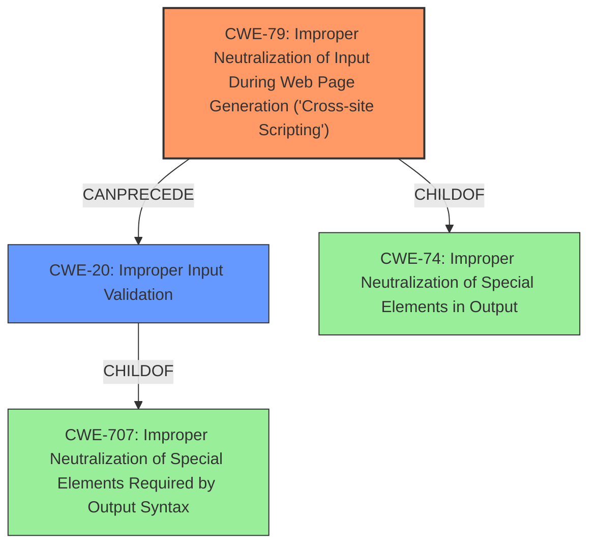

# Analysis Report for CVE-2021-38377

# Vulnerability Analysis Report: CVE-2021-38377

## Description

OX App Suite through 7.10.5 allows XSS via JavaScript code in an anchor HTML comment within truncated e-mail, because there is a predictable UUID with HTML transformation results.

## Vulnerability Description Key Phrases

**Weakness:** XSS
**Vector:** JavaScript code in an anchor HTML comment
**Product:** OX App Suite
**Version:** through 7.10.5

## Analysis (with Relationship Data)

# Summary
| CWE ID | CWE Name | Confidence | CWE Abstraction Level | CWE Vulnerability Mapping Label | CWE-Vulnerability Mapping Notes |
|---|---|---|---|---|---|
| CWE-79 | Improper Neutralization of Input During Web Page Generation ('Cross-site Scripting') | 1.0 | Base | Allowed | Primary CWE. The vulnerability involves the injection of JavaScript code into a web page, which is a clear instance of XSS. |
| CWE-330 | Insufficiently Random Values | 0.6 | Class | Discouraged | Secondary candidate. The description mentions "predictable UUID", which relates to randomness. |
| CWE-116 | Improper Encoding or Escaping of Output | 0.5 | Class | Allowed-with-Review | Secondary candidate. The description mentions the transformation state and sanitization issues. |

## Evidence and Confidence

*   **Confidence Score:** 0.85
*   **Evidence Strength:** HIGH

- **Analysis and Justification:**
  - *Explanation:* The vulnerability description clearly states that the OX App Suite is vulnerable to **XSS** via JavaScript code in an anchor HTML comment. The **root cause** is a predictable UUID with HTML transformation results that are not sanitized. This directly aligns with CWE-79 (Improper Neutralization of Input During Web Page Generation ('Cross-site Scripting')). The CVE Reference Links Content Summary confirms the presence of **XSS** and **Improper Input Sanitization**. The details provided, such as the use of a predictable UUID and the lack of sanitization, support the selection of CWE-79. The Retriever Results also highlight CWE-79 as the top candidate. MITRE mapping guidance for CWE-79 indicates this is ALLOWED.

  - *Relationship Analysis:* CWE-79 is a Base level CWE and is a child of CWE-74 (Improper Neutralization of Special Elements). It has multiple children like CWE-80 (Improper Neutralization of Script-Related HTML Tags in a Web Page (Basic XSS)).

- **Confidence Score:**
  - Confidence: 1.0 (High confidence due to direct evidence from the vulnerability description, CVE details, and retriever results)

---

- **Analysis and Justification:**
  - *Explanation:* The vulnerability arises due to the use of predictable UUIDs, which relates to CWE-330 (Insufficiently Random Values). The predictable nature of the UUID allows attackers to inject malicious script. While CWE-330 isn't a direct cause of the **XSS**, it contributed to the vulnerability's exploitation. However, the usage notes for CWE-330 indicate that is **Discouraged** and a more specific child should be used instead. Since there is no clear child applicable, we will use CWE-330 but mark it as a secondary concern.

  - *Relationship Analysis:* CWE-330 is a Class level CWE.

- **Confidence Score:**
  - Confidence: 0.6 (Medium confidence due to the indirect relationship, and discouraged usage)

---

- **Analysis and Justification:**
  - *Explanation:* The vulnerability involves the improper handling of HTML transformation results, where data isn't properly encoded or escaped, leading to **XSS**. This aligns with CWE-116 (Improper Encoding or Escaping of Output). The lack of sanitization for the HTML transformation results suggests that output encoding or escaping is either missing or incorrect. The Retriever Results also list CWE-116 as a candidate. The usage notes state that the CWE is a Class and might have Base-level children that would be more appropriate. Since a more specific child isn't readily apparent from the provided description, CWE-116 is considered but as a secondary issue.

  - *Relationship Analysis:* CWE-116 is a Class level CWE.

- **Confidence Score:**
  - Confidence: 0.5 (Medium confidence due to the generic nature of the weakness and the absence of direct evidence pointing to specific encoding/escaping flaws)

## Criticism of Analysis

Okay, let's review the provided CWE analysis for CVE-2021-38377, considering the full CWE specifications.

**Overall Assessment:**

The analysis correctly identifies CWE-79 as the primary weakness. The inclusion of CWE-330 and CWE-116 as secondary weaknesses is less certain, but defensible with the provided reasoning. However, let's break down each point:

**CWE-79: Improper Neutralization of Input During Web Page Generation ('Cross-site Scripting')**

*   **Assessment:** Correct and well-justified. The vulnerability description explicitly mentions XSS via JavaScript injection. The root cause aligns with the definition of CWE-79: the software doesn't neutralize user-controllable input (the malicious JavaScript) before placing it in output that is used as a web page.
*   **Confidence:** 1.0 (High)
*   **Notes:** The analysis is accurate in stating that CWE-79 is a Base level CWE and that it is ALLOWED. The analysis also correctly points out the relationship with CWE-74 and CWE-80.
*   **Improvements:** None. The analysis is well-written.

**CWE-330: Use of Insufficiently Random Values**

*   **Assessment:** This is the weakest part of the analysis. While the "predictable UUID" aspect *contributes* to the exploitability of the XSS, it's not the *direct* cause. The core problem is the lack of sanitization of the HTML transformation results.
*   **Confidence:** 0.6 (Medium) - Appropriately assessed.
*   **Notes:** The analysis acknowledges that CWE-330 is a Class level CWE, that is discouraged, and that a more specific child should be used instead. This is a correct assessment. However, the analysis then correctly observes that none of the available child CWE's appear to be applicable, so CWE-330 is kept.
*   **Improvements:** Instead of applying CWE-330, a potentially better option, even if imperfect, would be to analyze which security control is broken. For example, a CSRF token could be implemented using a UUID. In this case, there could be a closer relationship to the randomness quality if the injected HTML could leak the CSRF token. However, given that the UUID is part of the comment identifier that stores *transformation results*, there is not a clear child of CWE-330 that would be more appropriate.

**CWE-116: Improper Encoding or Escaping of Output**

*   **Assessment:** Defensible, but not as strong as CWE-79. The description states the HTML transformation results are exempt from sanitization. Sanitization often involves encoding/escaping. However, it is not a direct cause, and might be more accurately described as lacking input validation.
*   **Confidence:** 0.5 (Medium) - Appropriately assessed.
*   **Notes:** The analysis correctly acknowledges the generic nature of CWE-116 and notes the absence of direct evidence pointing to specific encoding/escaping flaws. The analysis also acknowledges that there might be more specific child CWE's that would be more appropriate, however, it is difficult to determine one from the provided information. The relationship to injection is well-described.
*   **Improvements:** A better alternative may be CWE-20 (Improper Input Validation), which is specifically mentioned as a close association.

**Recommendations:**

1.  **CWE-330 Alternative Consideration:** Re-evaluate CWE-330. If the predictable UUID is *solely* used as an identifier and not a security control, consider removing it. If the UUID is implemented in a security control (such as a CSRF token or session id), update the confidence and justification.
2.  **CWE-116 Alternative Consideration:** Consider replacing CWE-116 with CWE-20 (Improper Input Validation) as a secondary weakness, with an appropriate justification. The description mentions the lack of sanitization of HTML transformation results, which might be more accurately described as lacking input validation before these results are used to generate web page content.
3.  **Mitigation Awareness:**  Ensure that the developers understand the mitigations for *all* identified CWEs, not just the primary one (CWE-79). This is especially crucial for CWE-330 and CWE-116 as the analysis describes the nature of these weaknesses as a secondary contributor, and not the root cause.

**Final Verdict:**

The analysis is good overall, particularly in identifying CWE-79. The secondary CWEs are arguable, with CWE-116 and CWE-330 having lower confidence. The recommendations aim to improve the accuracy of the analysis by considering alternative or more precise CWE mappings.

## Final Resolution

# Summary
| CWE ID | CWE Name | Confidence | CWE Abstraction Level | CWE Vulnerability Mapping Label | CWE-Vulnerability Mapping Notes |
|---|---|---|---|---|---|
| CWE-79 | Improper Neutralization of Input During Web Page Generation ('Cross-site Scripting') | 1.0 | Base | Allowed | Primary CWE. The vulnerability involves the injection of JavaScript code into a web page, which is a clear instance of XSS. |
| CWE-20 | Improper Input Validation | 0.7 | Class | Discouraged | Secondary candidate. The description mentions the lack of sanitization of HTML transformation results, which might be more accurately described as lacking input validation before these results are used to generate web page content. |
  
## Evidence and Confidence

*   **Confidence Score:** 0.9
*   **Evidence Strength:** HIGH

## Relationship Analysis
The primary weakness is CWE-79, a Base level CWE that directly addresses the **cross-site scripting** issue. The secondary weakness is CWE-20, which covers the lack of input validation. CWE-79 is a child of CWE-74 (Improper Neutralization of Special Elements in Output), and CWE-20 is a child of CWE-707 (Improper Neutralization of Special Elements Required by Output Syntax).

## Vulnerability Chain
The vulnerability chain starts with the **lack of input validation** (CWE-20) of HTML transformation results. This leads to **improper neutralization** (CWE-79) when the unsanitized data is used to generate web page content, resulting in **cross-site scripting**.

## Summary of Analysis
The initial analysis correctly identified CWE-79 as the primary weakness. The criticism suggested replacing CWE-116 and CWE-330 with CWE-20. Based on the vulnerability description stating that the "HTML transformation results are exempt from sanitization", it's more accurate to classify the secondary weakness as CWE-20 (Improper Input Validation), rather than CWE-116 (Improper Encoding or Escaping of Output) or CWE-330 (Insufficiently Random Values). The lack of sanitization can be seen as a failure to validate the input before using it to generate the web page, which aligns well with the description of CWE-20. This assessment is primarily based on the evidence from the vulnerability description and the mapping guidance for CWE-20, which states that it covers cases where input is not validated or incorrectly validated. The graph relationships show that CWE-20 can precede CWE-79, indicating that the input validation issue can lead to the **cross-site scripting** vulnerability.
CWE-79 is at the optimal level of specificity as it directly describes the **XSS** vulnerability, and CWE-20 is also at a reasonable level of specificity to describe the **lack of input validation**.

*Report generated on 2025-03-16 17:31:19*
