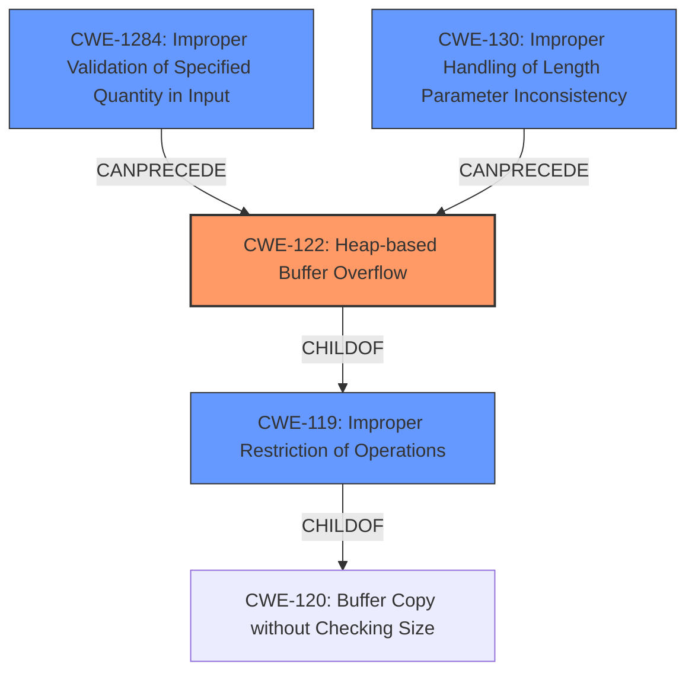

# Final Resolution for CVE-2021-3861

# Summary
| CWE ID | CWE Name | Confidence | CWE Abstraction Level | CWE Vulnerability Mapping Label | CWE-Vulnerability Mapping Notes |
|---|---|---|---|---|---|
| CWE-122 | Heap-based Buffer Overflow | 1.0 | Variant | Primary | Allowed |
| CWE-1284 | Improper Validation of Specified Quantity in Input | 0.7 | Base | Secondary Candidate | Allowed, Contributing factor |
| CWE-130 | Improper Handling of Length Parameter Inconsistency | 0.4 | Base | Additional Candidate | Allowed, related to the lack of checking length parameter, could contribute the exploit |

## Evidence and Confidence

*   **Confidence Score:** 0.9
*   **Evidence Strength:** HIGH

## Relationship Analysis
The primary weakness is CWE-122 [Heap-based Buffer Overflow], a *Variant* of CWE-119 [Buffer Copy without Checking Size of Input ('Classic Buffer Overflow')] which is a child of CWE-120 [Buffer Copy without Checking Size of Input ('Classic Buffer Overflow')]. CWE-122 is the most specific choice because the description explicitly mentions it is heap-based. CWE-1284 [Improper Validation of Specified Quantity in Input] is a *Base* level CWE and contributes to the vulnerability by not validating the input size. CWE-130 [Improper Handling of Length Parameter Inconsistency] is also a *Base* level CWE that is related to the lack of checking length parameter.

## Vulnerability Chain
The chain of weaknesses starts with CWE-1284 [Improper Validation of Specified Quantity in Input] and CWE-130 [Improper Handling of Length Parameter Inconsistency], which lead to CWE-122 [Heap-based Buffer Overflow]. The initial flaws are the lack of input validation and improper handling of the length parameter, which then result in a heap-based buffer overflow.

## Summary of Analysis
The initial analysis and criticism were well-justified. The vulnerability description explicitly states "Heap-based **Buffer Overflow** (CWE-122)". The "CVE Reference Links Content Summary" describes a scenario where user-provided data is copied into a fixed-size RNDIS command buffer without proper bounds checking, leading to a **buffer overflow**. The `memcpy` operation does not validate the size of the provided data (`len`) against the buffer's capacity. This aligns directly with the characteristics of CWE-122 [Heap-based Buffer Overflow], which is a buffer overflow where the buffer is allocated on the heap. The inclusion of CWE-1284 [Improper Validation of Specified Quantity in Input] is also justified because the size of the provided data, indicated by `len`, is not checked against the buffer's capacity. The addition of CWE-130 [Improper Handling of Length Parameter Inconsistency] is also reasonable because the vulnerability stems from a mismatch between the expected length of the command and the buffer size. These CWEs are at the optimal level of specificity.