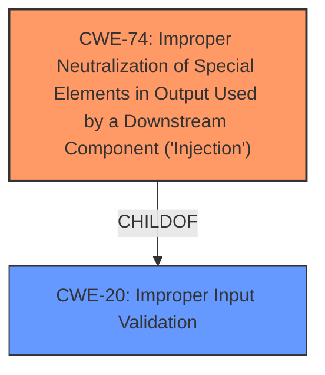

# Final Resolution for CVE-2021-38646

# Summary
| CWE ID | CWE Name | Confidence | CWE Abstraction Level | CWE Vulnerability Mapping Label | CWE-Vulnerability Mapping Notes |
|---|---|---|---|---|---|
| CWE-74 | Improper Neutralization of Special Elements in Output Used by a Downstream Component ('Injection') | 0.70 | Class | Primary | Discouraged, but used due to the likelihood of an injection vulnerability given the "remote code execution" and need for further specificity. |
| CWE-20 | Improper Input Validation | 0.60 | Class | Secondary Candidate | Discouraged, but represents the general class of **weakness**. |

## Evidence and Confidence

*   **Confidence Score:** 0.70
*   **Evidence Strength:** MEDIUM

## Relationship Analysis
The initial analysis correctly identified **CWE-20 (Improper Input Validation)** as a potential **root cause**, but it is too general. Given the "remote code execution" portion of the vulnerability description, it is highly likely that this is some type of injection vulnerability. **CWE-74 (Improper Neutralization of Special Elements in Output Used by a Downstream Component ('Injection'))** is a Class that can represent this type of **weakness**. **CWE-74** is a child of the **CWE-20 (Improper Input Validation)**. Further investigation is needed to determine which specific injection vulnerability is present.

## Vulnerability Chain
The vulnerability chain starts with **CWE-20 (Improper Input Validation)**, where the application fails to properly validate input. Because there is remote code execution, this likely leads to **CWE-74 (Improper Neutralization of Special Elements in Output Used by a Downstream Component ('Injection'))**, where the **unvalidated input** is used to construct a command or data structure, allowing an attacker to inject malicious code and achieve remote code execution. More information is needed to determine the exact injection type (SQL, OS Command, etc.).

## Summary of Analysis
The initial analysis identified **CWE-20 (Improper Input Validation)**. The criticism correctly points out that **CWE-20** is too general and that given the "remote code execution" portion of the vulnerability description, it is highly likely that this is some type of injection vulnerability. **CWE-74 (Improper Neutralization of Special Elements in Output Used by a Downstream Component ('Injection'))** is a Class that can represent this type of **weakness**. **CWE-74** is a child of **CWE-20 (Improper Input Validation)**. Further investigation is needed to determine which specific injection vulnerability is present. This assessment is based primarily on the vulnerability description provided: "Microsoft Office Access Connectivity Engine Remote Code Execution Vulnerability". The phrase "remote code execution" strongly suggests an injection-based vulnerability. The graph relationships influenced the decision to select **CWE-74**, which is a child of **CWE-20** and more specific to the likely vulnerability type.