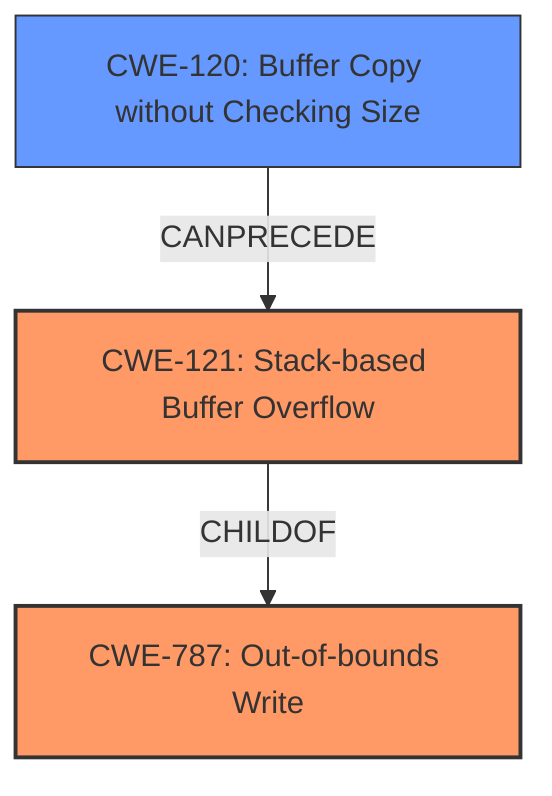

# Final Resolution for CVE-2021-38682

# Summary
| CWE ID | CWE Name | Confidence | CWE Abstraction Level | CWE Vulnerability Mapping Label | CWE-Vulnerability Mapping Notes |
|---|---|---|---|---|---|
| CWE-787 | Out-of-bounds Write | 0.95 | Base | Allowed | Parent CWE |
| CWE-121 | Stack-based Buffer Overflow | 0.95 | Variant | Allowed | Primary CWE |
| CWE-120 | Buffer Copy without Checking Size of Input ('Classic Buffer Overflow') | 0.70 | Base | Allowed-with-Review | Secondary Candidate |

## Evidence and Confidence

*   **Confidence Score:** 0.95
*   **Evidence Strength:** HIGH

## Relationship Analysis
The analysis focuses on hierarchical relationships to ensure specificity. CWE-121 (Stack-based Buffer Overflow) is a variant of CWE-787 (**Out-of-bounds Write**) and is also related to CWE-120 (Buffer Copy without Checking Size of Input). The decision to include CWE-787 as a parent CWE enhances the understanding of the **root cause** which is an out-of-bounds write, while CWE-121 specifies the location on the stack. CWE-120 describes a potential mechanism leading to the overflow, strengthening the chain.

## Vulnerability Chain
The vulnerability chain begins with a buffer copy operation (CWE-120) that lacks proper size checking. This leads to an **out-of-bounds write** (CWE-787) specifically on the stack (CWE-121), resulting in the ability to execute arbitrary code. The initial flaw is the unchecked buffer copy, and the ultimate impact is code execution.

## Summary of Analysis
The initial analysis and criticism both converge on the conclusion that CWE-121 (Stack-based Buffer Overflow) is the most appropriate primary CWE due to the explicit mention of "stack buffer overflow" in the vulnerability description. The inclusion of CWE-787 as a parent is beneficial. The relationship analysis confirms that CWE-121 is a variant of CWE-787, providing a more complete picture of the vulnerability's cause and location. The evidence provided is strong: "A stack buffer overflow vulnerability has been reported... If exploited, this vulnerability allows attackers to execute arbitrary code." This directly supports the selection of CWE-121 and the resulting impact. CWE-121 is at the optimal level of specificity, providing more detail than the more general CWE-119 while accurately reflecting the nature of the vulnerability. The addition of CWE-787 as parent allows for a clearer understanding of the cause of the vulnerability.