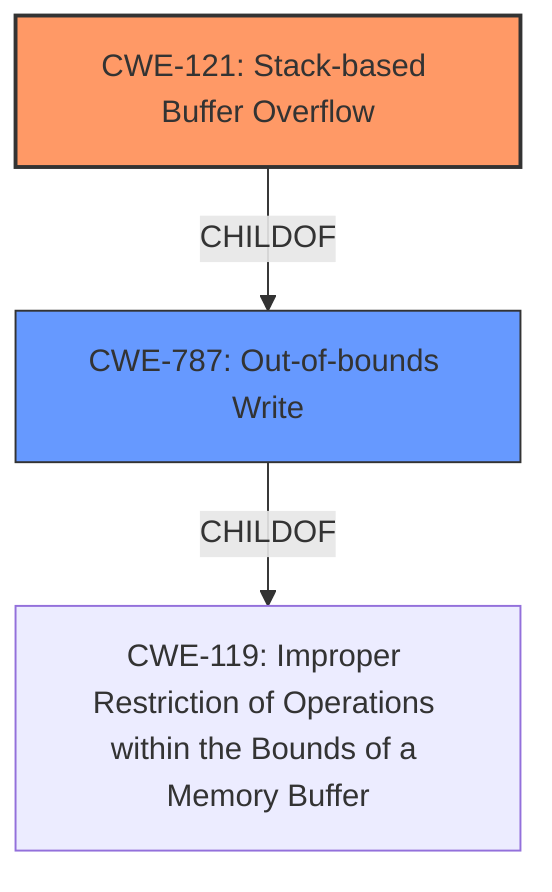

# Final Resolution for CVE-2021-38689

# Summary
| CWE ID | CWE Name | Confidence | CWE Abstraction Level | CWE Vulnerability Mapping Label | CWE-Vulnerability Mapping Notes |
|---|---|---|---|---|---|
| CWE-121 | Stack-based Buffer Overflow | 1.0 | Variant | Allowed | Primary CWE |
| CWE-787 | Out-of-bounds Write | 0.7 | Base | Allowed | Secondary Candidate |

## Evidence and Confidence

*   **Confidence Score:** 0.95
*   **Evidence Strength:** HIGH

## Relationship Analysis
The primary weakness is CWE-121 (**CWE-121: Stack-based Buffer Overflow**) which is a variant of CWE-119 (**CWE-119: Improper Restriction of Operations within the Bounds of a Memory Buffer**) and a child of CWE-787 (**CWE-787: Out-of-bounds Write**). CWE-121 is chosen as the primary due to the explicit mention of "stack buffer overflow" in the vulnerability description. CWE-787 is included as a secondary candidate because it represents the **WEAKNESS** of writing outside the intended buffer, and is a parent of CWE-121.

## Vulnerability Chain
The vulnerability chain starts with a **ROOTCAUSE** of inadequate bounds checking when writing to a stack-allocated buffer (CWE-121). An attacker can provide input that exceeds the buffer's capacity. This leads to an out-of-bounds write (CWE-787) on the stack, overwriting adjacent memory locations. The consequence of this is arbitrary code execution.

## Summary of Analysis
The initial analysis correctly identified CWE-121 (**CWE-121: Stack-based Buffer Overflow**) as the primary **WEAKNESS**. The vulnerability description explicitly mentions "stack buffer overflow," providing strong evidence for this classification.

The criticism provided helpful suggestions, including:
* Explicitly ruling out irrelevant CWEs such as CWE-23 (**CWE-23: Relative Path Traversal**), CWE-78 (**CWE-78: Improper Neutralization of Special Elements used in a Command**), and CWE-122 (**CWE-122: Heap-based Buffer Overflow**). These are not applicable because the description does not indicate command injection, path traversal, or heap allocation.
* Considering CWE-787 (**CWE-787: Out-of-bounds Write**) as an alternative parent CWE, which is now included as a secondary candidate.
* Enhancing justification with mitigation examples, such as using compiler extensions like /GS or implementing bounds checking.
* Emphasizing the discouraged usage of CWE-119 (**CWE-119: Improper Restriction of Operations within the Bounds of a Memory Buffer**) when more specific weaknesses are known.

The final decision is to classify this as CWE-121 (**CWE-121: Stack-based Buffer Overflow**) as the primary **WEAKNESS** because the vulnerability description explicitly states a "stack buffer overflow". CWE-787 (**CWE-787: Out-of-bounds Write**) is added as a secondary candidate because it is a parent of CWE-121 and describes the **WEAKNESS** of writing beyond the buffer boundary. The classification reflects the optimal level of specificity based on available evidence. The confidence score is high (0.95) due to the direct match with the vulnerability description.