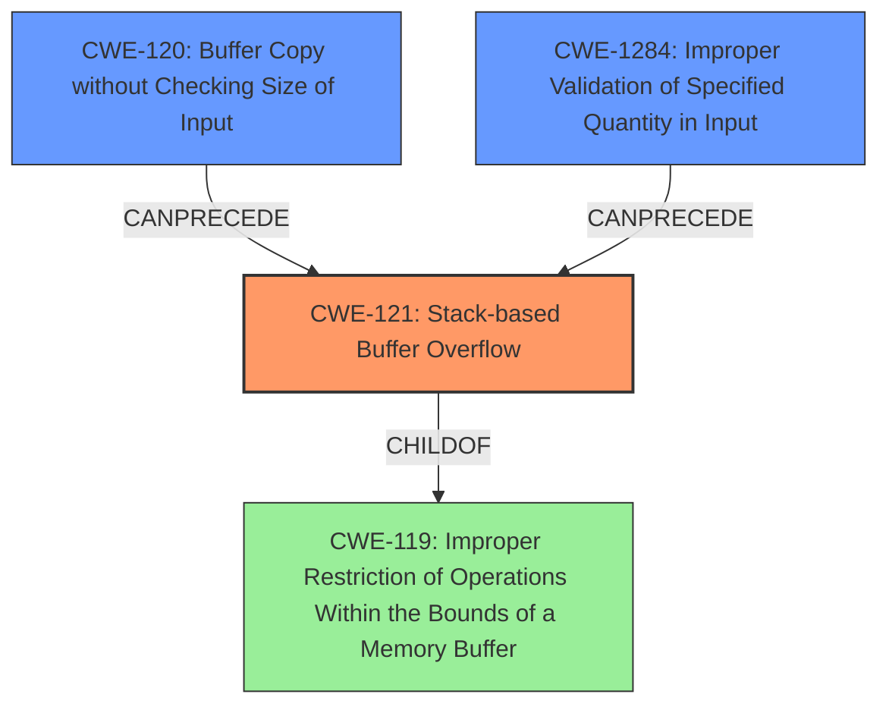

# Analysis Report for CVE-2021-38690

# Vulnerability Analysis Report: CVE-2021-38690

## Description

A stack buffer overflow vulnerability has been reported to affect QNAP device running QVR Elite, QVR Pro, QVR Guard. If exploited, this vulnerability allows attackers to execute arbitrary code. We have already fixed this vulnerability in the following versions of QVR Elite, QVR Pro, QVR Guard QuTS hero h5.0.0 QVR Elite 2.1.4.0 (2021/12/06) and later QuTS hero h4.5.4 QVR Elite 2.1.4.0 (2021/12/06) and later QTS 5.0.0 QVR Elite 2.1.4.0 (2021/12/06) and later QTS 4.5.4 QVR Elite 2.1.4.0 (2021/12/06) and later QTS 4.5.4 QVR Pro 2.1.3.0 (2021/12/06) and later QTS 5.0.0 QVR Pro 2.1.3.0 (2021/12/06) and later QTS 4.5.4 QVR Guard 2.1.3.0 (2021/12/06) and later QTS 5.0.0 QVR Guard 2.1.3.0 (2021/12/06) and later

## Vulnerability Description Key Phrases

**Weakness:** stack buffer overflow
**Impact:** execute arbitrary code
**Product:** QNAP device
**Component:** ['QVR Elite', 'QVR Pro', 'QVR Guard']

## Analysis (with Relationship Data)

# Summary
| CWE ID | CWE Name | Confidence | CWE Abstraction Level | CWE Vulnerability Mapping Label | CWE-Vulnerability Mapping Notes |
|---|---|---|---|---|---|
| CWE-121 | Stack-based Buffer Overflow | 0.95 | Variant | Allowed | Primary CWE |
| CWE-120 | Buffer Copy without Checking Size of Input ('Classic Buffer Overflow') | 0.75 | Base | Allowed-with-Review | Secondary Candidate |
| CWE-787 | Out-of-bounds Write | 0.60 | Base | Allowed | Secondary Candidate |

## Evidence and Confidence

*   **Confidence Score:** 0.90
*   **Evidence Strength:** HIGH

- **Analysis and Justification:**  
  - *Explanation:* "The vulnerability description explicitly states a **stack buffer overflow** in QNAP devices. The root cause from the CVE reference links confirms this is a **stack buffer overflow** vulnerability. CWE-121 (Stack-based Buffer Overflow) directly addresses this weakness, making it the most appropriate primary mapping. It is a Variant level CWE, the preferred abstraction level. The MITRE mapping guidance allows its usage. While CWE-120 (Buffer Copy without Checking Size of Input) is also a candidate given the description of a buffer overflow, the explicit mention of "stack" makes CWE-121 a better fit."
  
  - *Relationship Analysis:* "CWE-121 is a variant of the broader CWE-119 (Improper Restriction of Operations within the Bounds of a Memory Buffer). The description does not provide enough information to determine any CAN_PRECEDE or CAN_FOLLOW relationships."

- **Confidence Score:**  
  - *Example:* Confidence: 0.95 (High evidence due to direct mention of stack buffer overflow).

---
- **Analysis and Justification:**  
  - *Explanation:* "CWE-120 (Buffer Copy without Checking Size of Input ('Classic Buffer Overflow')) is considered as a secondary candidate because the description mentions a **buffer overflow**, which could potentially involve copying data without proper size validation. However, the explicit "stack" context favors CWE-121. The MITRE mapping guidance marks CWE-120 as "Allowed-with-Review" due to frequent misuse, but it could be applicable if the root cause involves a buffer copy operation."
  
  - *Relationship Analysis:* "CWE-120 is a base level CWE and is a specific type of CWE-119. There is no specific information about how the buffer overflow is caused. Therefore we can't assert any CAN_PRECEDE or CAN_FOLLOW relationships."

- **Confidence Score:**  
  - *Example:* Confidence: 0.75 (Medium evidence due to the general nature of buffer overflows).

---
- **Analysis and Justification:**  
  - *Explanation:* "CWE-787 (Out-of-bounds Write) is a possible secondary candidate as a **buffer overflow** inherently involves writing beyond the intended boundaries of a memory buffer. However, since the overflow is explicitly identified as stack-based, CWE-121 provides a more precise characterization of the vulnerability. The use of CWE-787 is ALLOWED according to MITRE guidance."
  
  - *Relationship Analysis:* "CWE-787 is a child of the class CWE-119. There is no specific information about how the out-of-bounds write is caused. Therefore we can't assert any CAN_PRECEDE or CAN_FOLLOW relationships."

- **Confidence Score:**  
  - *Example:* Confidence: 0.60 (Lower confidence due to the lack of explicit details beyond the stack buffer overflow).

## Criticism of Analysis

Okay, I've reviewed the provided analysis against the full CWE specifications. Here's a breakdown of my critique:

**Overall Assessment:**

The analysis is generally good and well-reasoned, especially in its selection of CWE-121 as the primary mapping. The justifications are clear and take into account the specific details of the vulnerability description. The consideration of secondary CWEs also demonstrates a thorough understanding of potential related weaknesses. However, there are minor points where the analysis could be strengthened or clarified.

**Specific Feedback:**

1.  **CWE-121 (Stack-based Buffer Overflow) - Primary CWE:**

    *   **Good:** The reasoning for selecting CWE-121 is strong. The direct mention of "stack buffer overflow" makes this the most precise and appropriate choice. The analysis correctly identifies that CWE-121 is a Variant level CWE, which is a preferred level of abstraction.
    *   **Good:** The analysis correctly points out that mitigation like stack canaries is an approach to solve this issue.
    *   **Suggestion:**  While the analysis mentions the relationship to CWE-119, it could benefit from briefly discussing *how* the stack overflow is occurring. Is it due to unchecked string copy, insufficient bounds checking on input, or some other cause? Knowing this would further solidify the understanding of the vulnerability. While this information is not always available it is a good practice to try and determine the root cause.

2.  **CWE-120 (Buffer Copy without Checking Size of Input ('Classic Buffer Overflow')) - Secondary Candidate:**

    *   **Good:** The rationale for considering CWE-120 as a secondary candidate is valid.  The description mentioning "buffer overflow" suggests a potential lack of size validation during a copy operation.
    *   **Suggestion:** Emphasize why it is *not* the primary. While the analysis states this, more direct clarification could strengthen it. For example, "While CWE-120 *could* apply if the root cause involved a buffer copy operation without checking the input size, the explicit mention of 'stack' makes CWE-121 a more *specific* and accurate mapping."
    *   **Mitigation Note:**  The mitigations listed are appropriate, but it's worth noting that, as the CWE specification states, the "Allowed-with-Review" usage is due to frequent misuse. The analysis should consider whether the root cause might point to something even more specific, like `CWE-131: Incorrect Calculation of Buffer Size` if the size of the buffer was miscalculated before the copy.
    *  **Suggest alternate CWE:**  Review whether `CWE-131: Incorrect Calculation of Buffer Size` is a good secondary candidate. If the program miscalculates the size of the stack buffer, this could lead to an out-of-bounds write when copying data into the buffer.
    *  **Suggest alternate CWE:** Review whether `CWE-1284: Improper Validation of Specified Quantity in Input` is a good secondary candidate. If the program doesn't properly validate the size of data being copied into the stack buffer, then this could also lead to the stack buffer overflow.

3.  **CWE-787 (Out-of-bounds Write) - Secondary Candidate:**

    *   **Good:** It's correct to consider CWE-787, since a buffer overflow inherently involves writing out of bounds.
    *   **Clarification Needed:** The analysis needs to be more precise in its explanation. The phrase "lack of explicit details beyond the stack buffer overflow" needs to be clarified. What *specific* details are missing that would make CWE-787 a stronger contender? Is it the method of allocation that prevents it from being the primary?
    *   **Deeper Analysis:** Why is the write out of bounds. Is it because of a failure to check the size of the input, an incorrect calculation of the required buffer size, or some other error. Specifying the root cause will be helpful.
    *   **Mitigation Note:** Again, the analysis can mention that while use of `CWE-787` is ALLOWED, the explicit mention of the Stack buffer means `CWE-121` is more specific.
    *   **Suggest alternate CWE:** Consider whether `CWE-128: Wrap-around Error` is a good candidate. An integer wrap-around error could result in an out-of-bounds write if an improper length is passed to a buffer-copying function.

4.  **Relationship Analysis:**

    *   The relationships between CWEs (CAN_PRECEDE, CAN_FOLLOW) are generally well-considered, given the limited information. It's correct to state that there isn't enough information to determine many specific relationships. However, it's worth mentioning that a common CAN_PRECEDE relationship is `CWE-20 -> CWE-121` if the overflow is triggered by malformed user input that isn't properly validated.

5.  **General Suggestions:**

    *   **Attack Vector:** The analysis notes that the advisory doesn't specify the attack vector. It would be beneficial to speculate *possible* attack vectors based on the nature of the applications (QVR Elite, Pro, Guard). For example, could it be triggered via network protocols, file uploads, web interface input, etc.? Even hypothetical attack vectors can aid in understanding the potential impact.
    *   **Context is Important:** The "product" is listed as "QNAP device," but the analysis doesn't leverage any context about the device or its typical usage. What kind of device is it? What is it primarily used for? This context could inform the analysis and help to narrow down possible attack vectors or contributing factors.
    *   **Consider the "Why":** In several places, the analysis stops at "due to the lack of explicit details." While this is sometimes unavoidable, try to push the analysis to consider *why* those details are missing. Is it a limitation of the report, or a fundamental uncertainty about the vulnerability itself? This deeper thinking can uncover more potential weaknesses.

**Revised Summary Table:**

| CWE ID | CWE Name | Confidence | CWE Abstraction Level | CWE Vulnerability Mapping Label | CWE-Vulnerability Mapping Notes |
|---|---|---|---|---|---|
| CWE-121 | Stack-based Buffer Overflow | 0.95 | Variant | Allowed | Primary CWE.  The vulnerability description explicitly states a stack buffer overflow, making this the most accurate mapping. |
| CWE-120 | Buffer Copy without Checking Size of Input ('Classic Buffer Overflow') | 0.70 | Base | Allowed-with-Review | Secondary Candidate. Could be applicable if the stack overflow is a direct result of `memcpy` without size checks, but less specific than CWE-121. |
| CWE-787 | Out-of-bounds Write | 0.60 | Base | Allowed | Secondary Candidate. A valid consideration as buffer overflows involve writing outside of boundaries, but less specific since the stack location is identified. |
| CWE-1284 | Improper Validation of Specified Quantity in Input | 0.40 | Base | Allowed | Tertiary Candidate. If the size of data being copied is not validated. Could lead to Stack Buffer Overflow.
| CWE-131 | Incorrect Calculation of Buffer Size | 0.40 | Base | Allowed | Tertiary Candidate. If the size of the stack buffer is miscalculated before the copy.

**In summary:**

The analysis is a solid starting point. By incorporating the suggestions above, it can be made more comprehensive and insightful, demonstrating a deeper understanding of the vulnerability and potential root causes.

## Final Resolution

# Summary
| CWE ID | CWE Name | Confidence | CWE Abstraction Level | CWE Vulnerability Mapping Label | CWE-Vulnerability Mapping Notes |
|---|---|---|---|---|---|
| CWE-121 | Stack-based Buffer Overflow | 0.95 | Variant | Allowed | Primary CWE. The vulnerability description explicitly states a **stack buffer overflow**, making this the most accurate mapping. |
| CWE-120 | Buffer Copy without Checking Size of Input ('Classic Buffer Overflow') | 0.70 | Base | Allowed-with-Review | Secondary Candidate. Could be applicable if the **stack overflow** is a direct result of `memcpy` without size checks, but less specific than CWE-121. |
| CWE-1284 | Improper Validation of Specified Quantity in Input | 0.60 | Base | Allowed | Secondary Candidate. If the size of data being copied is not validated, this could lead to a **stack buffer overflow**. |

## Evidence and Confidence

*   **Confidence Score:** 0.90
*   **Evidence Strength:** HIGH

## Relationship Analysis
The primary weakness is CWE-121 (**Stack-based Buffer Overflow**), a variant of CWE-119 (**Improper Restriction of Operations within the Bounds of a Memory Buffer**). CWE-120 (**Buffer Copy without Checking Size of Input**) and CWE-1284 (**Improper Validation of Specified Quantity in Input**) can precede CWE-121. CWE-120 describes a potential cause (copying without checking size) while CWE-1284 highlights a failure to validate input size, both potentially leading to the overflow. The Variant level of CWE-121 offers a more specific characterization than its Class parent.

## Vulnerability Chain
The vulnerability chain starts with a failure to validate input size (CWE-1284) or a buffer copy without checking the size of input (CWE-120). This leads to a **stack-based buffer overflow** (CWE-121), allowing attackers to execute arbitrary code. The root cause is the lack of proper input validation or size checking.

## Summary of Analysis
The initial analysis correctly identified CWE-121 as the primary weakness due to the explicit mention of a **stack buffer overflow** in the vulnerability description: "A **stack buffer overflow vulnerability** has been reported... If exploited, this vulnerability allows attackers to execute arbitrary code." The criticism suggested considering CWE-1284 (Improper Validation of Specified Quantity in Input), which I agree with as a potential secondary CWE, especially if the **stack overflow** is caused by an improperly validated size parameter. CWE-120 is a reasonable secondary consideration since a buffer copy without checking size is a common cause of buffer overflows.

The relationships between these CWEs support the chosen classification. CWE-121 is a specific type of buffer overflow, making it more precise than the generic CWE-119. CWE-120 and CWE-1284 can both lead to CWE-121. The selection of CWE-121 at the Variant level of abstraction provides the optimal level of specificity given the available evidence.

*Report generated on 2025-03-18 00:58:18*
