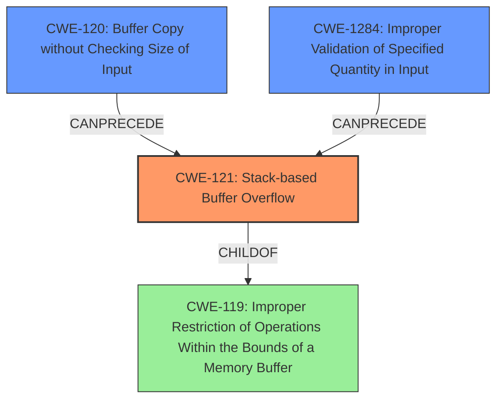

# Final Resolution for CVE-2021-38690

# Summary
| CWE ID | CWE Name | Confidence | CWE Abstraction Level | CWE Vulnerability Mapping Label | CWE-Vulnerability Mapping Notes |
|---|---|---|---|---|---|
| CWE-121 | Stack-based Buffer Overflow | 0.95 | Variant | Allowed | Primary CWE. The vulnerability description explicitly states a **stack buffer overflow**, making this the most accurate mapping. |
| CWE-120 | Buffer Copy without Checking Size of Input ('Classic Buffer Overflow') | 0.70 | Base | Allowed-with-Review | Secondary Candidate. Could be applicable if the **stack overflow** is a direct result of `memcpy` without size checks, but less specific than CWE-121. |
| CWE-1284 | Improper Validation of Specified Quantity in Input | 0.60 | Base | Allowed | Secondary Candidate. If the size of data being copied is not validated, this could lead to a **stack buffer overflow**. |

## Evidence and Confidence

*   **Confidence Score:** 0.90
*   **Evidence Strength:** HIGH

## Relationship Analysis
The primary weakness is CWE-121 (**Stack-based Buffer Overflow**), a variant of CWE-119 (**Improper Restriction of Operations within the Bounds of a Memory Buffer**). CWE-120 (**Buffer Copy without Checking Size of Input**) and CWE-1284 (**Improper Validation of Specified Quantity in Input**) can precede CWE-121. CWE-120 describes a potential cause (copying without checking size) while CWE-1284 highlights a failure to validate input size, both potentially leading to the overflow. The Variant level of CWE-121 offers a more specific characterization than its Class parent.

## Vulnerability Chain
The vulnerability chain starts with a failure to validate input size (CWE-1284) or a buffer copy without checking the size of input (CWE-120). This leads to a **stack-based buffer overflow** (CWE-121), allowing attackers to execute arbitrary code. The root cause is the lack of proper input validation or size checking.

## Summary of Analysis
The initial analysis correctly identified CWE-121 as the primary weakness due to the explicit mention of a **stack buffer overflow** in the vulnerability description: "A **stack buffer overflow vulnerability** has been reported... If exploited, this vulnerability allows attackers to execute arbitrary code." The criticism suggested considering CWE-1284 (Improper Validation of Specified Quantity in Input), which I agree with as a potential secondary CWE, especially if the **stack overflow** is caused by an improperly validated size parameter. CWE-120 is a reasonable secondary consideration since a buffer copy without checking size is a common cause of buffer overflows.

The relationships between these CWEs support the chosen classification. CWE-121 is a specific type of buffer overflow, making it more precise than the generic CWE-119. CWE-120 and CWE-1284 can both lead to CWE-121. The selection of CWE-121 at the Variant level of abstraction provides the optimal level of specificity given the available evidence.