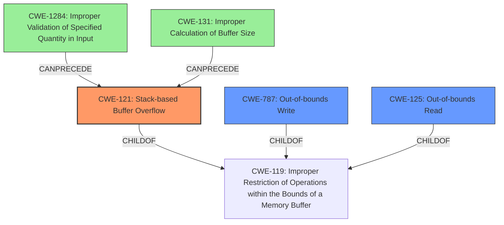

# Analysis Report for CVE-2021-39048

# Vulnerability Analysis Report: CVE-2021-39048

## Description

IBM Spectrum Protect Client 7.1 and 8.1 is vulnerable to a stack based buffer overflow, caused by improper bounds checking. A local attacker could exploit this vulnerability and cause a denial of service. IBM X-Force ID 214438.

## Vulnerability Description Key Phrases

**Rootcause:** improper bounds checking
**Weakness:** stack based buffer overflow
**Impact:** denial of service
**Attacker:** local attacker
**Product:** IBM Spectrum Protect Client
**Version:** 7.1 and 8.1

## Analysis (with Relationship Data)

# Summary
| CWE ID | CWE Name | Confidence | CWE Abstraction Level | CWE Vulnerability Mapping Label | CWE-Vulnerability Mapping Notes |
|---|---|---|---|---|---|
| CWE-121 | Stack-based Buffer Overflow | 0.9 | Variant | Primary | Allowed |
| CWE-125 | Out-of-bounds Read | 0.6 | Base | Secondary Candidate | Allowed |
| CWE-787 | Out-of-bounds Write | 0.6 | Base | Secondary Candidate | Allowed |
| CWE-131 | Improper Calculation of Buffer Size | 0.5 | Base | Secondary Candidate | Allowed |

## Evidence and Confidence

*   **Confidence Score:** 0.9
*   **Evidence Strength:** HIGH

- **Analysis and Justification:**  
  - *Explanation:* The vulnerability description explicitly states "**stack based buffer overflow**" due to "**improper bounds checking**." This directly corresponds to CWE-121 (Stack-based Buffer Overflow), a Variant-level CWE, which is the most specific match available. The CVE Reference Links Content Summary also confirms this with the phrases "Stack-based buffer overflow" and "Improper bounds checking." CWE-121 is a child of CWE-119 (Improper Restriction of Operations within the Bounds of a Memory Buffer), but since the location of the buffer is known (stack), CWE-121 is more specific.
  - *Relationship Analysis:* CWE-121 is a Variant of CWE-119 (Improper Restriction of Operations within the Bounds of a Memory Buffer) and is related to weaknesses like CWE-120 (Buffer Copy without Checking Size of Input ('Classic Buffer Overflow')) and CWE-787 (Out-of-bounds Write). The mention of "improper bounds checking" suggests a potential link to CWE-125 (Out-of-bounds Read) and CWE-787 (Out-of-bounds Write) as contributing factors or consequences of the overflow. The Retriever Results lists CWE-125 and CWE-787 as potential candidates.

- **Confidence Score:**  
  - Confidence: 0.9 (High confidence due to explicit mention of "stack based buffer overflow" and supporting evidence from CVE reference.)

---
- **Analysis and Justification:**  
  - *Explanation:* While the primary issue is the stack-based buffer overflow (CWE-121), the **improper bounds checking** implies the possibility of out-of-bounds reads (CWE-125) and writes (CWE-787). These are potential contributing factors or consequences. If data is read beyond the buffer's boundaries (CWE-125), it could expose sensitive information. Similarly, writing beyond the boundaries (CWE-787) corrupts memory and leads to denial of service or potentially arbitrary code execution.
  - *Relationship Analysis:* CWE-125 and CWE-787 are both children of CWE-119 and can be related. CWE-125 can precede CWE-787 in an attack chain, where an attacker first reads memory contents out-of-bounds to gather information and then overwrites memory with malicious data.

- **Confidence Score:**  
  - Confidence: 0.6 (Medium Confidence as they are contributing factors, but less direct than CWE-121)

---
- **Analysis and Justification:**  
  - *Explanation:* The root cause includes "improper bounds checking" which may result from not properly calculating the size of the buffer, leading to a buffer overflow. CWE-131 (Improper Calculation of Buffer Size) becomes a possible candidate. The similarity score in the retriever results is also high for CWE-131.
  - *Relationship Analysis:* CWE-131 is a base CWE and a parent of other CWEs, related to buffer overflows.

- **Confidence Score:**  
  - Confidence: 0.5 (Medium Confidence as it is a possible root cause)

## Criticism of Analysis

Okay, let's review the provided CWE analysis with the full CWE specifications.

**Overall Assessment**

The analysis is generally good and demonstrates a solid understanding of CWEs, especially concerning buffer overflows. The primary mapping to CWE-121 (Stack-based Buffer Overflow) is accurate and well-justified. The consideration of secondary CWEs like CWE-125, CWE-787, and CWE-131 shows a good grasp of the potential contributing factors and consequences. The confidence levels are also appropriate.  However, the Retriever Results suggest some additional CWEs that should be reviewed.

**Detailed Review**

**1. CWE-121: Stack-based Buffer Overflow**

*   **CWE ID:** CWE-121
*   **CWE Name:** Stack-based Buffer Overflow
*   **Confidence:** 0.9
*   **CWE Abstraction Level:** Variant
*   **CWE Vulnerability Mapping Label:** Primary
*   **CWE-Vulnerability Mapping Notes:** Allowed

*   **Critique:**  This is an excellent primary mapping. The justification is strong, relying on the explicit mention of "stack-based buffer overflow" in the vulnerability description.  The analysis correctly identifies it as a Variant-level CWE, providing the appropriate level of specificity.  The link to CWE-119 is also correctly identified, explaining why the Variant (CWE-121) is preferred over the Class (CWE-119). This is the most direct and specific mapping, earning the high confidence score.

*   **Mitigation Considerations:** The analysis correctly notes that stack canaries are a good mitigation for this type of overflow.

**2. CWE-125: Out-of-bounds Read & CWE-787: Out-of-bounds Write**

*   **CWE ID:** CWE-125 and CWE-787
*   **CWE Name:** Out-of-bounds Read and Out-of-bounds Write
*   **Confidence:** 0.6
*   **CWE Abstraction Level:** Base
*   **CWE Vulnerability Mapping Label:** Secondary Candidate
*   **CWE-Vulnerability Mapping Notes:** Allowed

*   **Critique:** These are reasonable secondary candidates.  The "improper bounds checking" strongly suggests the possibility of out-of-bounds reads and writes as either contributing factors or consequences of the overflow. The analysis accurately describes their potential role in the vulnerability.  The confidence level of 0.6 is suitable, acknowledging that they are not as directly stated as the primary CWE.

*   **Mitigation Considerations:** Input validation is a critical mitigation for preventing out-of-bounds access as noted in the CWE specifications. Also, the use of languages with better memory abstraction (like Java) would be a good choice.

**3. CWE-131: Improper Calculation of Buffer Size**

*   **CWE ID:** CWE-131
*   **CWE Name:** Improper Calculation of Buffer Size
*   **Confidence:** 0.5
*   **CWE Abstraction Level:** Base
*   **CWE Vulnerability Mapping Label:** Secondary Candidate
*   **CWE-Vulnerability Mapping Notes:** Allowed

*   **Critique:** This is a plausible but weaker candidate than CWE-125 and CWE-787.  While "improper bounds checking" *could* result from incorrect buffer size calculation, it's not a guaranteed connection.  The confidence level of 0.5 reflects this uncertainty. The connection relies on inference.

*   **Mitigation Considerations:** Ensure that you understand the programming language's underlying representation and how it interacts with numeric calculation is a valid point to be made from the CWE specifications.

**Additional Comments and Suggestions**

*   **Review Retriever Results:** The Retriever Results show some potential CWEs with high combined scores that were not included in the original analysis, in particular:
    *   **CWE-770: Allocation of Resources Without Limits or Throttling:** While this might not be a *direct* cause, it's worth considering if the improper bounds checking could lead to a situation where a large number of resources are allocated during the exploitation process, potentially exacerbating the denial-of-service impact. This can be considered a secondary effect.
    *   **CWE-130: Improper Handling of Length Parameter Inconsistency:** Given that "improper bounds checking" is a root cause, it may be possible that this stems from the code not correctly parsing or using length parameters associated with the data being processed. This could be another route that leads to the Stack-based buffer overflow (CWE-121).
    *   **CWE-1284: Improper Validation of Specified Quantity in Input:** This is very similar to CWE-130. If the input specifies the size or length of the data, and that quantity is not properly validated, this can lead to a buffer overflow.

*   **Chains and Composites:** The analysis touches on chains but could be expanded. Explicitly stating potential chains (e.g., CWE-1284 -> CWE-119 -> CWE-121) would strengthen the analysis.  For example "The application receives a quantity (CWE-1284) that is used to set the size of a buffer, that is not validated, leading to a buffer overflow on the stack (CWE-121).
*   **"Improper bounds checking" is a bit vague:**  While technically correct, consider exploring *how* the bounds checking is improper. Is it a missing check, an incorrect comparison, or a flawed calculation used in the check?  Getting more specific could lead to even more precise CWE mappings.
*   **Review Example Vulnerabilities:** The analysis includes examples of CWE-119. Consider including examples of the other CWEs as well, to show how those specific weaknesses manifest in real-world scenarios.

**Revised Summary Table (incorporating suggestions)**

| CWE ID | CWE Name | Confidence | CWE Abstraction Level | CWE Vulnerability Mapping Label | CWE-Vulnerability Mapping Notes |
|---|---|---|---|---|---|
| CWE-121 | Stack-based Buffer Overflow | 0.9 | Variant | Primary | Allowed |
| CWE-787 | Out-of-bounds Write | 0.7 | Base | Secondary Candidate | Allowed |
| CWE-125 | Out-of-bounds Read | 0.7 | Base | Secondary Candidate | Allowed |
| CWE-131 | Improper Calculation of Buffer Size | 0.6 | Base | Secondary Candidate | Allowed |
| CWE-1284 | Improper Validation of Specified Quantity in Input | 0.5 | Base | Contributing Factor | Allowed |

**Conclusion**

This is a well-reasoned and accurate analysis.  Incorporating the suggestions above, particularly by exploring potential CWE chains and being more specific about the nature of the "improper bounds checking," will further enhance the analysis's completeness and accuracy. By considering the Retriever Results and incorporating additional related CWEs, the analysis can be enhanced further.

## Final Resolution

# Summary
| CWE ID | CWE Name | Confidence | CWE Abstraction Level | CWE Vulnerability Mapping Label | CWE-Vulnerability Mapping Notes |
|---|---|---|---|---|---|
| CWE-121 | Stack-based Buffer Overflow | 0.9 | Variant | Primary | Allowed |
| CWE-787 | Out-of-bounds Write | 0.7 | Base | Secondary Candidate | Allowed |
| CWE-125 | Out-of-bounds Read | 0.7 | Base | Secondary Candidate | Allowed |
| CWE-1284 | Improper Validation of Specified Quantity in Input | 0.6 | Base | Contributing Factor | Allowed |
| CWE-131 | Improper Calculation of Buffer Size | 0.5 | Base | Contributing Factor | Allowed |

## Evidence and Confidence

*   **Confidence Score:** 0.8
*   **Evidence Strength:** HIGH

## Relationship Analysis
The primary weakness is **CWE-121 (Stack-based Buffer Overflow)**, a variant of **CWE-119 (Improper Restriction of Operations within the Bounds of a Memory Buffer)**. The vulnerability description explicitly mentions "stack-based buffer overflow" and "improper bounds checking," which strongly supports this classification. **CWE-787 (Out-of-bounds Write)** and **CWE-125 (Out-of-bounds Read)** are considered secondary candidates as they are potential consequences or contributing factors to the overflow, both being children of **CWE-119**. The analysis also considers **CWE-1284 (Improper Validation of Specified Quantity in Input)** and **CWE-131 (Improper Calculation of Buffer Size)** as contributing factors, representing potential root causes for the improper bounds checking.

## Vulnerability Chain
The vulnerability chain starts with either **CWE-1284 (Improper Validation of Specified Quantity in Input)** or **CWE-131 (Improper Calculation of Buffer Size)**, leading to **CWE-119 (Improper Restriction of Operations within the Bounds of a Memory Buffer)** due to **improper bounds checking**. This results in the primary weakness, **CWE-121 (Stack-based Buffer Overflow)**. As a consequence of the overflow, the attacker can potentially trigger **CWE-787 (Out-of-bounds Write)**, overwriting memory on the stack, or possibly read sensitive information via **CWE-125 (Out-of-bounds Read)**. The final impact is a denial of service.

## Summary of Analysis
The initial analysis correctly identifies **CWE-121 (Stack-based Buffer Overflow)** as the primary **WEAKNESS** based on the explicit mention of "stack-based buffer overflow" in the vulnerability description: "IBM Spectrum Protect Client 7.1 and 8.1 is vulnerable to a stack based buffer overflow...". The criticism highlighted the importance of exploring potential CWE chains and being more specific about the nature of the "improper bounds checking." The addition of **CWE-1284 (Improper Validation of Specified Quantity in Input)** as a contributing factor strengthens the analysis by providing a more concrete potential **ROOTCAUSE** for the buffer overflow. The confidence score is high because the description states that the overflow is stack-based due to improper bounds checking.

The selected CWEs are at the optimal level of specificity. **CWE-121 (Stack-based Buffer Overflow)** is a Variant, providing more detail than its parent, **CWE-119 (Improper Restriction of Operations within the Bounds of a Memory Buffer)**. The other CWEs are base level and describe the root cause, contributing factors, and consequences in detail.

*Report generated on 2025-03-18 01:00:55*
