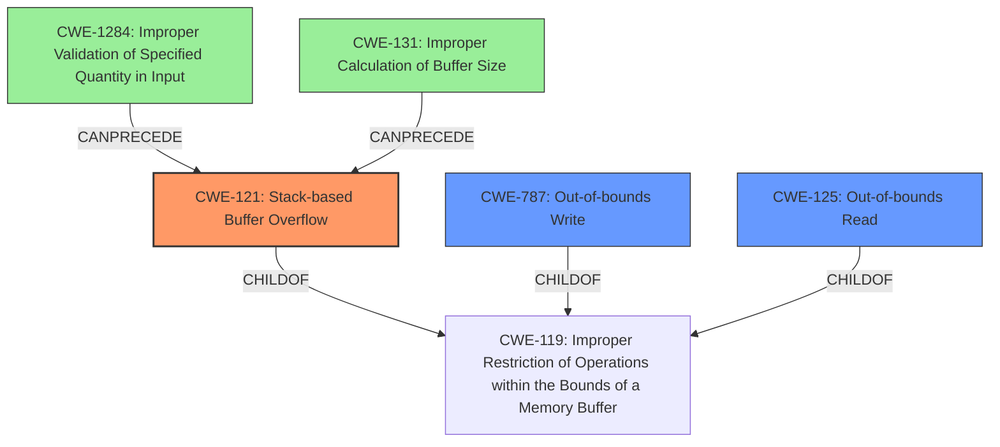

# Final Resolution for CVE-2021-39048

# Summary
| CWE ID | CWE Name | Confidence | CWE Abstraction Level | CWE Vulnerability Mapping Label | CWE-Vulnerability Mapping Notes |
|---|---|---|---|---|---|
| CWE-121 | Stack-based Buffer Overflow | 0.9 | Variant | Primary | Allowed |
| CWE-787 | Out-of-bounds Write | 0.7 | Base | Secondary Candidate | Allowed |
| CWE-125 | Out-of-bounds Read | 0.7 | Base | Secondary Candidate | Allowed |
| CWE-1284 | Improper Validation of Specified Quantity in Input | 0.6 | Base | Contributing Factor | Allowed |
| CWE-131 | Improper Calculation of Buffer Size | 0.5 | Base | Contributing Factor | Allowed |

## Evidence and Confidence

*   **Confidence Score:** 0.8
*   **Evidence Strength:** HIGH

## Relationship Analysis
The primary weakness is **CWE-121 (Stack-based Buffer Overflow)**, a variant of **CWE-119 (Improper Restriction of Operations within the Bounds of a Memory Buffer)**. The vulnerability description explicitly mentions "stack-based buffer overflow" and "improper bounds checking," which strongly supports this classification. **CWE-787 (Out-of-bounds Write)** and **CWE-125 (Out-of-bounds Read)** are considered secondary candidates as they are potential consequences or contributing factors to the overflow, both being children of **CWE-119**. The analysis also considers **CWE-1284 (Improper Validation of Specified Quantity in Input)** and **CWE-131 (Improper Calculation of Buffer Size)** as contributing factors, representing potential root causes for the improper bounds checking.

## Vulnerability Chain
The vulnerability chain starts with either **CWE-1284 (Improper Validation of Specified Quantity in Input)** or **CWE-131 (Improper Calculation of Buffer Size)**, leading to **CWE-119 (Improper Restriction of Operations within the Bounds of a Memory Buffer)** due to **improper bounds checking**. This results in the primary weakness, **CWE-121 (Stack-based Buffer Overflow)**. As a consequence of the overflow, the attacker can potentially trigger **CWE-787 (Out-of-bounds Write)**, overwriting memory on the stack, or possibly read sensitive information via **CWE-125 (Out-of-bounds Read)**. The final impact is a denial of service.

## Summary of Analysis
The initial analysis correctly identifies **CWE-121 (Stack-based Buffer Overflow)** as the primary **WEAKNESS** based on the explicit mention of "stack-based buffer overflow" in the vulnerability description: "IBM Spectrum Protect Client 7.1 and 8.1 is vulnerable to a stack based buffer overflow...". The criticism highlighted the importance of exploring potential CWE chains and being more specific about the nature of the "improper bounds checking." The addition of **CWE-1284 (Improper Validation of Specified Quantity in Input)** as a contributing factor strengthens the analysis by providing a more concrete potential **ROOTCAUSE** for the buffer overflow. The confidence score is high because the description states that the overflow is stack-based due to improper bounds checking.

The selected CWEs are at the optimal level of specificity. **CWE-121 (Stack-based Buffer Overflow)** is a Variant, providing more detail than its parent, **CWE-119 (Improper Restriction of Operations within the Bounds of a Memory Buffer)**. The other CWEs are base level and describe the root cause, contributing factors, and consequences in detail.