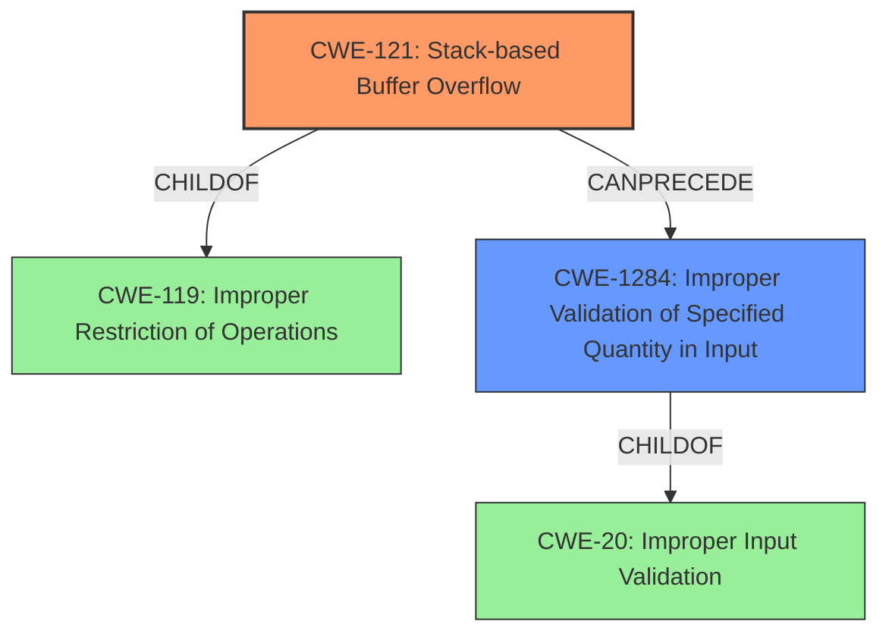

# Final Resolution for CVE-2021-39050

# Summary
| CWE ID  | CWE Name                                                        | Confidence | CWE Abstraction Level | CWE Vulnerability Mapping Label | CWE-Vulnerability Mapping Notes |
| :-------- | :-------------------------------------------------------------- | :--------- | :-------------------- | :------------------------------ | :------------------------------ |
| CWE-121 | Stack-based Buffer Overflow                                   | 0.95       | Variant               | Allowed                         | Primary CWE                     |
| CWE-1284 | Improper Validation of Specified Quantity in Input | 0.80       | Base               | Allowed                         | Secondary Candidate                     |

## Evidence and Confidence

*   **Confidence Score:** 0.90
*   **Evidence Strength:** HIGH

## Relationship Analysis
The primary relationship is the hierarchical one, where CWE-121 (Stack-based Buffer Overflow) is a variant (child) of the more general CWE-119 (Improper Restriction of Operations within the Bounds of a Memory Buffer). The selection of CWE-121 is more specific and thus more appropriate given the explicit mention of a stack-based overflow in the vulnerability description. CWE-1284 (Improper Validation of Specified Quantity in Input) is a base CWE that describes the **root cause** of the buffer overflow. It is related to CWE-20 (Improper Input Validation) but is more specific.

## Vulnerability Chain
The vulnerability chain starts with **improper validation** of the input size (CWE-1284). This **root cause** leads to a **stack-based buffer overflow** (CWE-121). The overflow allows a local attacker to overwrite memory on the stack, potentially gaining lower-level privileges.

## Summary of Analysis
The initial analysis and criticism both accurately identified the primary **weakness** as CWE-121 (Stack-based Buffer Overflow). The vulnerability description explicitly states this **weakness**, providing strong evidence for this classification. The secondary classification of CWE-1284 (Improper Validation of Specified Quantity in Input) is also appropriate, as the **improper bounds checking** indicates a failure to validate the size of the input.

The graph relationships reinforce this decision, with CWE-121 being a specific type of buffer overflow (child of CWE-119) and CWE-1284 representing the **root cause** (improper input validation).

The selected CWEs are at the optimal level of specificity. CWE-121 is more specific than its parent CWE-119, and CWE-1284 is more specific than the general CWE-20. The evidence supports these classifications, and the MITRE mapping guidance allows for their use.

The confidence score has been slightly increased to 0.95 for CWE-121 and 0.80 for CWE-1284 to reflect the high degree of certainty based on the provided evidence and the analysis of relationships.