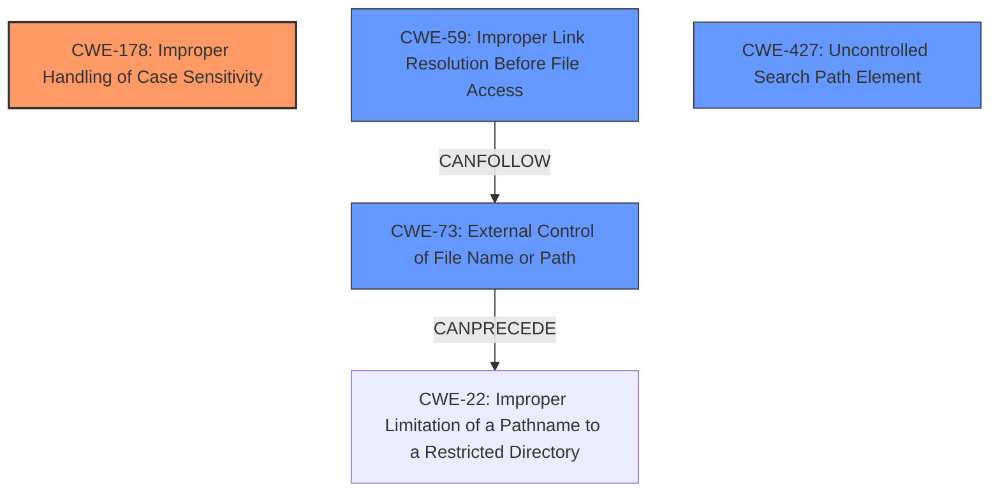

# Final Resolution for CVE-2021-39134

# Summary
| CWE ID | CWE Name | Confidence | CWE Abstraction Level | CWE Vulnerability Mapping Label | CWE-Vulnerability Mapping Notes |
|---|---|---|---|---|---|
| CWE-178 | Improper Handling of Case Sensitivity | 0.95 | Base | Allowed | Primary CWE |
| CWE-59 | Improper Link Resolution Before File Access ('Link Following') | 0.80 | Base | Allowed | Secondary Candidate CWE |
| CWE-73 | External Control of File Name or Path | 0.70 | Base | Allowed | Secondary Candidate CWE |
| CWE-427 | Uncontrolled Search Path Element | 0.60 | Base | Allowed | Secondary Candidate CWE |

## Evidence and Confidence

*   **Confidence Score:** 0.90
*   **Evidence Strength:** HIGH

## Relationship Analysis
The primary **WEAKNESS** is **CWE-178 (Improper Handling of Case Sensitivity)**, which leads to issues with file access and dependency resolution. The exploitation is enabled by **CWE-59 (Improper Link Resolution Before File Access)**, as the symlink dependencies are used to redirect file operations. **CWE-73 (External Control of File Name or Path)** is also relevant because the `file:` specifier allows external control of the target path. Additionally, **CWE-427 (Uncontrolled Search Path Element)** is applicable as the `npm` dependency resolution may find a malicious package due to case-insensitive searching.

## Vulnerability Chain
The chain of events is as follows:
1.  **ROOTCAUSE**: **CWE-178 (Improper Handling of Case Sensitivity)**: The tool does not properly distinguish between package names that differ only in case.
2.  **CWE-59 (Improper Link Resolution Before File Access)**: Symlink dependencies allow for redirection of file access.
3.  **CWE-73 (External Control of File Name or Path)**: The `file:` specifier allows the attacker to control the destination path.
4.  **CWE-427 (Uncontrolled Search Path Element)**: Case-insensitive search may lead to the resolution of a malicious package.
5.  Impact: Arbitrary file overwrite.

## Summary of Analysis
The analysis provided initially identified **CWE-178 (Improper Handling of Case Sensitivity)**, **CWE-59 (Improper Link Resolution Before File Access)**, and **CWE-73 (External Control of File Name or Path)** as relevant CWEs. The initial assessment is mostly correct, but it can be improved by clarifying the relationships between the CWEs and increasing the confidence in **CWE-73 (External Control of File Name or Path)**. Also adding **CWE-427 (Uncontrolled Search Path Element)** provides a more complete picture.

Here's how the graph relationships influenced the final selection:
*   The `CANFOLLOW` relationship between **CWE-59 (Improper Link Resolution Before File Access)** and **CWE-73 (External Control of File Name or Path)** shows how link following leads to external control of the file path.
*   The `CANPRECEDE` relationship between **CWE-73 (External Control of File Name or Path)** and **CWE-22 (Improper Limitation of a Pathname to a Restricted Directory)** highlights how external control bypasses intended restrictions.

The selected CWEs are at the optimal level of specificity because they directly address the root causes and contributing factors of the vulnerability. The core **WEAKNESS** is the **improper handling of case sensitivity**, which leads to a vulnerability when combined with symlinks and external control of file paths. The inclusion of **CWE-427 (Uncontrolled Search Path Element)** further refines the understanding of how a malicious package might be resolved in the first place.

The evidence from the vulnerability description supports this classification:
> "When multiple dependencies differ only in the case of their name, Arborists internal data structure saw them as separate items that could coexist within the same level in the `node_modules` hierarchy. However, on case-insensitive file systems (such as macOS and Windows), this is not the case. Combined with a symlink dependency such as `file/some/path`, this allowed an attacker to create a situation in which arbitrary contents could be written to any location on the filesystem."

This quote directly demonstrates the **improper handling of case sensitivity** and the use of symlinks to achieve arbitrary file writes.