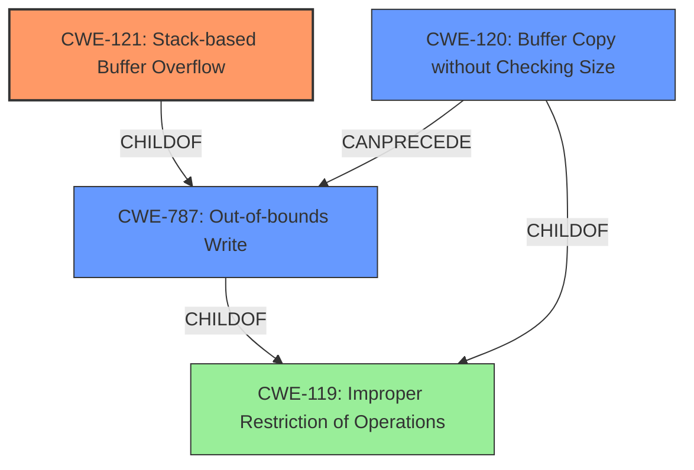

# Analysis Report for CVE-2021-39306

# Vulnerability Analysis Report: CVE-2021-39306

## Description

A stack buffer overflow was discovered on Realtek RTL8195AM device before 2.0.10, it exists in the client code when an attacker sends a big size Authentication challenge text in WEP security.

## Vulnerability Description Key Phrases

**Rootcause:** stack buffer overflow
**Vector:** big size Authentication challenge text
**Attacker:** attacker
**Product:** Realtek RTL8195AM device
**Version:** before 2.0.10
**Component:** client code

## Analysis (with Relationship Data)

# Summary
| CWE ID | CWE Name | Confidence | CWE Abstraction Level | CWE Vulnerability Mapping Label | CWE-Vulnerability Mapping Notes |
|---|---|---|---|---|---|
| CWE-121 | Stack-based Buffer Overflow | 0.95 | Variant | Allowed | Primary CWE |
| CWE-120 | Buffer Copy without Checking Size of Input ('Classic Buffer Overflow') | 0.6 | Base | Allowed-with-Review | Secondary Candidate |
| CWE-787 | Out-of-bounds Write | 0.5 | Base | Allowed | Secondary Candidate |

## Evidence and Confidence

*   **Confidence Score:** 0.9
*   **Evidence Strength:** HIGH

- **Analysis and Justification:**  
  - *Explanation:* The vulnerability description explicitly states a "**stack buffer overflow**" in the client code when processing the Authentication challenge text in WEP security. This directly aligns with CWE-121 (Stack-based Buffer Overflow). The CVE reference summary confirms the **stack buffer overflow** due to insufficient bounds checking. CWE-121 is a Variant-level CWE, which is a preferred level of abstraction, and the mapping guidance allows its usage for stack-based buffer overflows. While other CWEs like CWE-119, CWE-120, and CWE-787 might be related, CWE-121 is the most specific and accurate representation of the **rootcause** vulnerability.

  - *Relationship Analysis:* CWE-121 is a child of CWE-119 (Improper Restriction of Operations within the Bounds of a Memory Buffer). It's a specific type of buffer overflow that occurs on the stack. CWE-120 (Buffer Copy without Checking Size of Input) is a peer, but less specific since the description does not imply a buffer copy operation is the root cause. CWE-787 (Out-of-bounds Write) is also related, but CWE-121 specifies the location of the buffer on the stack.

- **Confidence Score:**
  - Confidence: 0.95 (High confidence due to the explicit mention of "stack buffer overflow" in the vulnerability description and CVE summary).

---

## Criticism of Analysis

Okay, I've reviewed the provided analysis with the full CWE specifications. Here's a critique:

**Overall Assessment:**

The analysis correctly identifies the primary CWE as CWE-121 (Stack-based Buffer Overflow) with high confidence.  The reasoning is sound and directly supported by the vulnerability description.  The secondary candidates (CWE-120 and CWE-787) are also relevant and the analysis provides an acceptable justification for their lower confidence levels.

**Detailed Critique:**

*   **CWE-121 (Stack-based Buffer Overflow):**

    *   **Strengths:** The selection of CWE-121 as the primary CWE is excellent. The vulnerability description explicitly states "stack buffer overflow," making this a direct and accurate mapping. The analysis correctly notes that CWE-121 is a Variant-level CWE, which is preferred.
    *   **Potential Improvements:** None.
    *   **CWE Specification Alignment:** The analysis aligns perfectly with the CWE-121 specification, especially the Mapping Guidance which explicitly allows the use of the CWE-121 to map stack-based buffer overflows.
    *   **Mitigation Considerations:** The analysis does not go into mitigations, but it is not expected to.

*   **CWE-120 (Buffer Copy without Checking Size of Input ('Classic Buffer Overflow'))**

    *   **Strengths:** The analysis acknowledges the potential relevance of CWE-120 as a secondary candidate.  Buffer overflows often involve uncontrolled copying.
    *   **Weaknesses:** The analysis could have provided more information about where in the vulnerability report there is a buffer operation or lack of input size check
    *   **CWE Specification Alignment:** The analysis acknowledges the "Allowed-with-Review" usage and its related rationale. This correctly highlights the potential for misuse of this CWE if not carefully considered. The analysis could state that if this was a code copy, which it does not explicitly say, then it would be a more appropriate classification.
    *   **Mitigation Considerations:** The analysis could highlight that automatic buffer overflow detection could be helpful.

*   **CWE-787 (Out-of-bounds Write):**

    *   **Strengths:** Out-of-bounds Write is a valid general description of what's happening in a buffer overflow.
    *   **Weaknesses:** The location of the buffer is explicitly stated as the stack in the vulnerability report.
    *   **CWE Specification Alignment:**  The analysis aligns with the "Allowed" usage guidance.
    *   **Mitigation Considerations:** The analysis could have been better by mentioning that this is a useful general base case.

*   **General Comments:**

    *   The confidence scores are appropriate.
    *   The relationship analysis between the CWEs is clear and accurate.
    *   Including examples from the CWE database, while not strictly necessary, is helpful for understanding the context of each CWE.

**Improvements to Retriever Results**

The retriever results are not perfect for the main cause of the vulnerability. This might be due to the model relying on word vectors, which might pick up on buffer overflows. Here are some of the ways to improve the retriever results:
- Better vector embeddings
- Better graph representation
- Including security testing in the retrieval analysis

**Summary of Suggested Changes:**

*   None

Overall, the analysis is well-reasoned, accurate, and demonstrates a good understanding of the CWE specifications. The classification is excellent.

## Final Resolution

# Summary
| CWE ID | CWE Name | Confidence | CWE Abstraction Level | CWE Vulnerability Mapping Label | CWE-Vulnerability Mapping Notes |
|---|---|---|---|---|---|
| CWE-121 | Stack-based Buffer Overflow | 0.95 | Variant | Allowed | Primary CWE |
| CWE-787 | Out-of-bounds Write | 0.6 | Base | Allowed | Secondary Candidate |
| CWE-120 | Buffer Copy without Checking Size of Input ('Classic Buffer Overflow') | 0.5 | Base | Allowed-with-Review | Secondary Candidate |

## Evidence and Confidence

*   **Confidence Score:** 0.95
*   **Evidence Strength:** HIGH

## Relationship Analysis
The primary CWE, CWE-121 (Stack-based Buffer Overflow), is a variant of CWE-119 (Improper Restriction of Operations within the Bounds of a Memory Buffer). CWE-787 (Out-of-bounds Write) is a more general case of a buffer overflow and is a parent of CWE-121. CWE-120 (Buffer Copy without Checking Size of Input) could potentially precede CWE-121 or CWE-787 if a buffer copy operation is involved, but that is not explicitly stated in the description. The variant level of CWE-121 provides the most specific classification.

## Vulnerability Chain
The vulnerability chain begins with the **ROOTCAUSE** of insufficient bounds checking during the processing of the Authentication challenge text. This leads to a **WEAKNESS**, CWE-121 (Stack-based Buffer Overflow). An attacker can trigger this by sending a large Authentication challenge text, resulting in the overflow. The consequence is a potential compromise of the device.

## Summary of Analysis
The initial analysis and criticism both agree that CWE-121 (Stack-based Buffer Overflow) is the most appropriate primary CWE. This assessment is based on the provided evidence, which explicitly states a "stack buffer overflow" in the vulnerability description: "A stack buffer overflow was discovered on Realtek RTL8195AM device before 2.0.10, it exists in the client code when an attacker sends a big size Authentication challenge text in WEP security."

The graph relationships support this decision. CWE-121 is a child of CWE-787 (Out-of-bounds Write) and CWE-119 (Improper Restriction of Operations within the Bounds of a Memory Buffer), indicating a more specific type of buffer overflow. While CWE-120 (Buffer Copy without Checking Size of Input) is related, it is not explicitly mentioned that a buffer copy operation causes this overflow. Therefore, CWE-121 is at the optimal level of specificity, capturing the stack-based nature of the overflow. CWE-787 is included as a secondary candidate to indicate the general out-of-bounds write, which is the more general case of the stack buffer overflow. CWE-120 is also included as a secondary candidate since buffer overflows can often result from a buffer copy without checking the size. However, this is not explicitly stated, lowering the confidence.

*Report generated on 2025-03-18 01:13:54*
