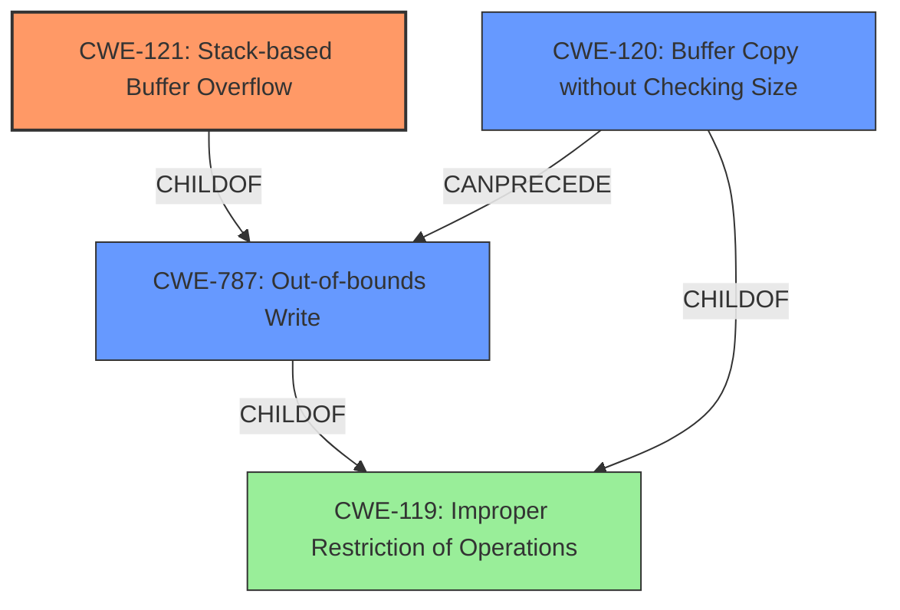

# Final Resolution for CVE-2021-39306

# Summary
| CWE ID | CWE Name | Confidence | CWE Abstraction Level | CWE Vulnerability Mapping Label | CWE-Vulnerability Mapping Notes |
|---|---|---|---|---|---|
| CWE-121 | Stack-based Buffer Overflow | 0.95 | Variant | Allowed | Primary CWE |
| CWE-787 | Out-of-bounds Write | 0.6 | Base | Allowed | Secondary Candidate |
| CWE-120 | Buffer Copy without Checking Size of Input ('Classic Buffer Overflow') | 0.5 | Base | Allowed-with-Review | Secondary Candidate |

## Evidence and Confidence

*   **Confidence Score:** 0.95
*   **Evidence Strength:** HIGH

## Relationship Analysis
The primary CWE, CWE-121 (Stack-based Buffer Overflow), is a variant of CWE-119 (Improper Restriction of Operations within the Bounds of a Memory Buffer). CWE-787 (Out-of-bounds Write) is a more general case of a buffer overflow and is a parent of CWE-121. CWE-120 (Buffer Copy without Checking Size of Input) could potentially precede CWE-121 or CWE-787 if a buffer copy operation is involved, but that is not explicitly stated in the description. The variant level of CWE-121 provides the most specific classification.

## Vulnerability Chain
The vulnerability chain begins with the **ROOTCAUSE** of insufficient bounds checking during the processing of the Authentication challenge text. This leads to a **WEAKNESS**, CWE-121 (Stack-based Buffer Overflow). An attacker can trigger this by sending a large Authentication challenge text, resulting in the overflow. The consequence is a potential compromise of the device.

## Summary of Analysis
The initial analysis and criticism both agree that CWE-121 (Stack-based Buffer Overflow) is the most appropriate primary CWE. This assessment is based on the provided evidence, which explicitly states a "stack buffer overflow" in the vulnerability description: "A stack buffer overflow was discovered on Realtek RTL8195AM device before 2.0.10, it exists in the client code when an attacker sends a big size Authentication challenge text in WEP security."

The graph relationships support this decision. CWE-121 is a child of CWE-787 (Out-of-bounds Write) and CWE-119 (Improper Restriction of Operations within the Bounds of a Memory Buffer), indicating a more specific type of buffer overflow. While CWE-120 (Buffer Copy without Checking Size of Input) is related, it is not explicitly mentioned that a buffer copy operation causes this overflow. Therefore, CWE-121 is at the optimal level of specificity, capturing the stack-based nature of the overflow. CWE-787 is included as a secondary candidate to indicate the general out-of-bounds write, which is the more general case of the stack buffer overflow. CWE-120 is also included as a secondary candidate since buffer overflows can often result from a buffer copy without checking the size. However, this is not explicitly stated, lowering the confidence.