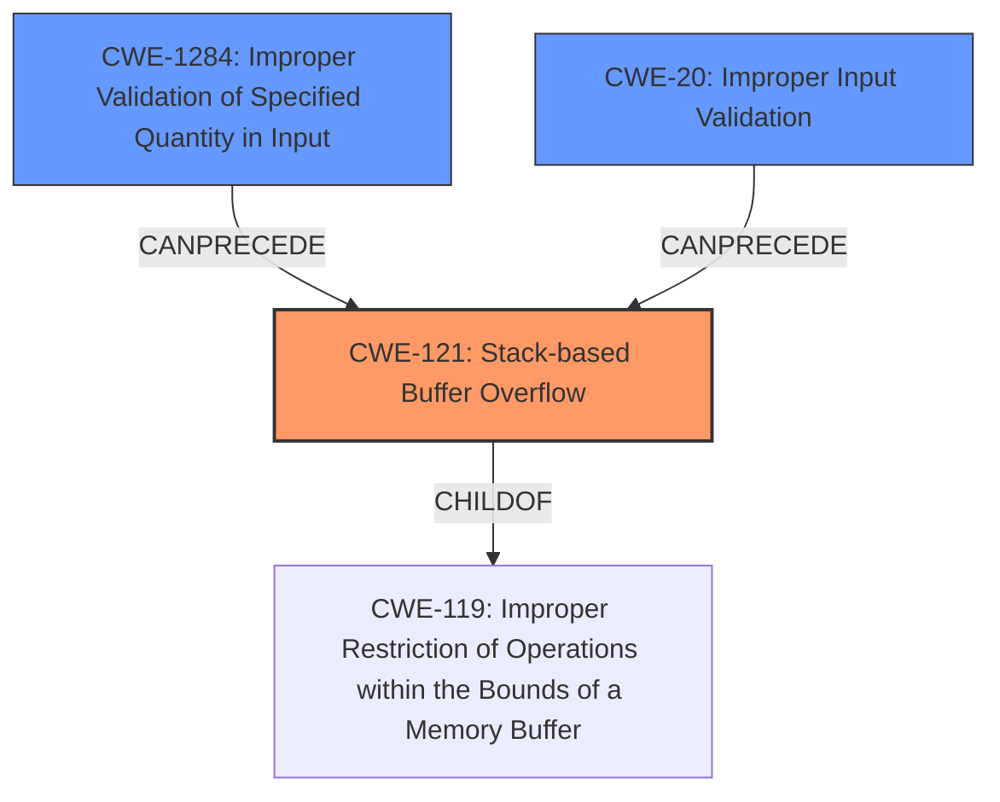

# Analysis Report for CVE-2021-3942

# Vulnerability Analysis Report: CVE-2021-3942

## Description

Certain HP Print products and Digital Sending products may be vulnerable to potential remote code execution and buffer overflow with use of Link-Local Multicast Name Resolution or LLMNR.

## Vulnerability Description Key Phrases

**Impact:** ['remote code execution', 'buffer overflow']
**Vector:** use of Link-Local Multicast Name Resolution or LLMNR
**Product:** HP Print products and Digital Sending products

## Analysis (with Relationship Data)

# Summary
| CWE ID | CWE Name | Confidence | CWE Abstraction Level | CWE Vulnerability Mapping Label | CWE-Vulnerability Mapping Notes |
|---|---|---|---|---|---|
| CWE-121 | Stack-based Buffer Overflow | 0.7 | Variant | Allowed | Primary CWE |

## Evidence and Confidence

*   **Confidence Score:** 0.7
*   **Evidence Strength:** MEDIUM

- **Analysis and Justification:**  
  - *Explanation:* The vulnerability description mentions a "**buffer overflow**" in HP Print and Digital Sending products, which can lead to "**remote code execution**". Given the limited information, it is difficult to pinpoint the exact nature of the buffer overflow. However, considering the potential for remote code execution, a stack-based buffer overflow (CWE-121) is a plausible scenario. While heap overflows (CWE-122) are also possible, the lack of explicit mention of heap allocation makes CWE-121 a reasonable initial mapping. The retriever results also suggest CWE-121 as a potential candidate.
  
  - *Relationship Analysis:* CWE-121 is a variant of CWE-119 (Improper Restriction of Operations within the Bounds of a Memory Buffer), which is a broader class. Since the description specifies a buffer overflow, CWE-121 provides a more specific classification.

- **Confidence Score:**  
  - Confidence: 0.7 (The description mentions "buffer overflow" and "remote code execution", but lacks specific details about memory allocation. The retriever results also suggest CWE-121 as a potential candidate.)

## Criticism of Analysis

Okay, here's a review of the provided analysis, considering the full CWE specifications:

**Overall Assessment:**

The analysis correctly identifies `CWE-121: Stack-based Buffer Overflow` as the primary CWE, given the limited information. However, the confidence level of 0.7 might be a bit generous. While "buffer overflow" is mentioned, it lacks specific details about stack allocation. Let's delve deeper.

**Detailed Review:**

*   **CWE-121: Stack-based Buffer Overflow**

    *   **Mapping Guidance Appropriateness:** The analysis follows the "Allowed" usage of CWE-121, which is at the Variant level of abstraction. The rationale provided is sound: since a buffer overflow is specified and remote code execution is possible, stack overflow is a plausible attack vector. The justification notes that Heap Overflows (CWE-122) are possible, but the lack of evidence related to dynamic memory allocation makes CWE-121 a reasonable starting point.
    *   **Confidence Justification:** The confidence justification is good, acknowledging the lack of specific details. The mention of remote code execution does increase the likelihood of it being a buffer overflow, as that is a common consequence of that type of vulnerability.
    *   **Alternative Considerations:** The analysis acknowledges CWE-119 as a broader category.
    *   **CWE Examples from Database:** The examples used are actually for CWE-122 (Heap-based Buffer Overflow). These should be changed to match the selected CWE.
    *   **Overall Assessment of CWE-121:** Justified and appropriate given the limited information.

*   **Retriever Results Review**

    *   The retriever results provide several interesting options.
    *   **CWE-78, OS Command Injection:** The mention of LLMNR as the vector for the vulnerability makes command injection less likely, but not impossible. LLMNR is a name resolution protocol and vulnerabilities within the processing of a name resolution could lead to command injection if there is an OS command being executed using the resolved name.
    *   **CWE-1284, Improper Validation of Specified Quantity in Input:** This is a good potential CWE. If the LLMNR resolution involves specifying a size or length, then improper validation could lead to a buffer overflow.
    *   **CWE-190, Integer Overflow:** Similar to CWE-1284, an integer overflow could be related to the size of the buffer being allocated for the LLMNR resolution.
    *   **CWE-288 Authentication Bypass:** This one is less likely given the description.
    *   **CWE-119 Improper Restriction of Memory Buffer:** Discouraged as it is a Class.

*   **Mitigation Considerations:**

    *   The mitigations suggested for CWE-121 are generally applicable (compiler flags, safe libraries, input validation), but they lack context.
    *   It is not clear if the mitigations are more specific to stack overflows or if they can be generalized for buffer overflows in general.

**Suggestions for Improvement:**

1.  **Increase Specificity:** If further information is available about how LLMNR is used and where the buffer overflow occurs, try to narrow down the CWE selection. For example:

    *   If a fixed-size buffer on the stack is used to store the resolved name, then CWE-121 is appropriate.
    *   If memory is dynamically allocated on the heap, consider CWE-122.
    *   If an integer related to the size calculation overflows leading to the BO, consider a chain involving CWE-190.

2.  **Confidence Level Adjustment:** Reduce the confidence score from 0.7 to 0.6. The information is too vague to have strong certainty.

3.  **Mitigation Context:** Provide more context when discussing mitigations.  Instead of just listing them, explain how they would specifically apply to this scenario (LLMNR processing, etc.).

4.  **Update CWE Examples:** Update the CWE Examples to match the selected CWE, or remove them entirely.

5. **Consider Input Validation:** Since the vector involves LLMNR, investigate if the resolved name from LLMNR is being validated before being used. If not, then adding CWE-20 to the chain is important.

**Revised Summary Table**

| CWE ID | CWE Name | Confidence | CWE Abstraction Level | CWE Vulnerability Mapping Label | CWE-Vulnerability Mapping Notes |
|---|---|---|---|---|---|
| CWE-121 | Stack-based Buffer Overflow | 0.6 | Variant | Allowed | Primary CWE |

By following these suggestions, you can create a more accurate and actionable CWE mapping for this vulnerability. Remember that the goal is to provide information that helps developers understand the root cause of the problem and implement effective mitigations.

## Final Resolution

# Summary
| CWE ID | CWE Name | Confidence | CWE Abstraction Level | CWE Vulnerability Mapping Label | CWE-Vulnerability Mapping Notes |
|---|---|---|---|---|---|
| CWE-121 | Stack-based Buffer Overflow | 0.6 | Variant | Allowed | Primary CWE |
| CWE-1284 | Improper Validation of Specified Quantity in Input | 0.4 | Base | Allowed | Secondary Candidate |
| CWE-20 | Improper Input Validation | 0.3 | Class | Allowed | Secondary Candidate |

## Evidence and Confidence

*   **Confidence Score:** 0.6
*   **Evidence Strength:** MEDIUM

## Relationship Analysis
The primary CWE is CWE-121 (**Stack-based Buffer Overflow**), which is a variant of CWE-119 (**Improper Restriction of Operations within the Bounds of a Memory Buffer**). The analysis suggests considering CWE-1284 (**Improper Validation of Specified Quantity in Input**) and CWE-20 (**Improper Input Validation**) as contributing factors, especially given the LLMNR vector. CWE-1284 could lead to an incorrect buffer size calculation, potentially triggering the buffer overflow. CWE-20 is considered because LLMNR input validation could be missing.

## Vulnerability Chain
The vulnerability chain starts with potentially **Improper Input Validation (CWE-20)** or **Improper Validation of Specified Quantity in Input (CWE-1284)** if the size of the resolved LLMNR name is not validated. This can then lead to a **Stack-based Buffer Overflow (CWE-121)** when the data is copied into a stack-allocated buffer without proper bounds checking. The ultimate impact is potential remote code execution.

## Summary of Analysis
The initial analysis correctly identified **CWE-121 (Stack-based Buffer Overflow)** as a plausible primary CWE, given the mention of "buffer overflow" and "remote code execution." The criticism suggested lowering the confidence score to 0.6 due to the limited information about stack allocation. I agree with this assessment and have reduced the confidence to 0.6.

The retriever results and the criticism also highlighted the potential for **CWE-1284 (Improper Validation of Specified Quantity in Input)** and **CWE-20 (Improper Input Validation)**, considering the LLMNR vector. If the size of the resolved LLMNR name is not validated, it could lead to an overflow. Therefore, I'm adding CWE-1284 and CWE-20 as secondary CWEs with lower confidence scores (0.4 and 0.3 respectively).

The graph relationships influenced the selection by highlighting how CWE-1284 and CWE-20 can precede CWE-121 in a vulnerability chain.

**Evidence:** The vulnerability description mentions "buffer overflow" and "remote code execution" in HP Print products and Digital Sending products when using LLMNR. This provides direct evidence for a buffer overflow, making CWE-121 a reasonable primary candidate.

The selected CWEs are at the optimal level of specificity because CWE-121 is a variant that specifies the location of the buffer (stack). While more information could refine this further (e.g., specific code details), the current evidence supports this classification. Adding CWE-1284 and CWE-20 provide more specific root causes that could contribute to the overflow.

*Report generated on 2025-03-18 01:14:34*
