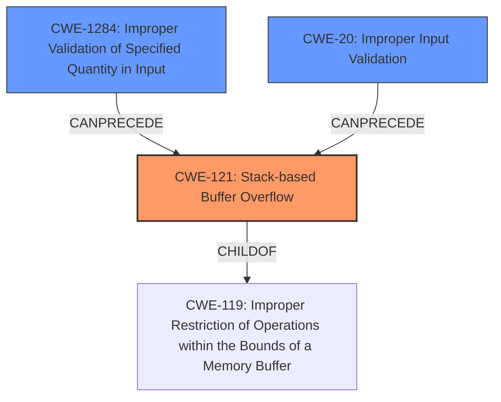

# Final Resolution for CVE-2021-3942

# Summary
| CWE ID | CWE Name | Confidence | CWE Abstraction Level | CWE Vulnerability Mapping Label | CWE-Vulnerability Mapping Notes |
|---|---|---|---|---|---|
| CWE-121 | Stack-based Buffer Overflow | 0.6 | Variant | Allowed | Primary CWE |
| CWE-1284 | Improper Validation of Specified Quantity in Input | 0.4 | Base | Allowed | Secondary Candidate |
| CWE-20 | Improper Input Validation | 0.3 | Class | Allowed | Secondary Candidate |

## Evidence and Confidence

*   **Confidence Score:** 0.6
*   **Evidence Strength:** MEDIUM

## Relationship Analysis
The primary CWE is CWE-121 (**Stack-based Buffer Overflow**), which is a variant of CWE-119 (**Improper Restriction of Operations within the Bounds of a Memory Buffer**). The analysis suggests considering CWE-1284 (**Improper Validation of Specified Quantity in Input**) and CWE-20 (**Improper Input Validation**) as contributing factors, especially given the LLMNR vector. CWE-1284 could lead to an incorrect buffer size calculation, potentially triggering the buffer overflow. CWE-20 is considered because LLMNR input validation could be missing.

## Vulnerability Chain
The vulnerability chain starts with potentially **Improper Input Validation (CWE-20)** or **Improper Validation of Specified Quantity in Input (CWE-1284)** if the size of the resolved LLMNR name is not validated. This can then lead to a **Stack-based Buffer Overflow (CWE-121)** when the data is copied into a stack-allocated buffer without proper bounds checking. The ultimate impact is potential remote code execution.

## Summary of Analysis
The initial analysis correctly identified **CWE-121 (Stack-based Buffer Overflow)** as a plausible primary CWE, given the mention of "buffer overflow" and "remote code execution." The criticism suggested lowering the confidence score to 0.6 due to the limited information about stack allocation. I agree with this assessment and have reduced the confidence to 0.6.

The retriever results and the criticism also highlighted the potential for **CWE-1284 (Improper Validation of Specified Quantity in Input)** and **CWE-20 (Improper Input Validation)**, considering the LLMNR vector. If the size of the resolved LLMNR name is not validated, it could lead to an overflow. Therefore, I'm adding CWE-1284 and CWE-20 as secondary CWEs with lower confidence scores (0.4 and 0.3 respectively).

The graph relationships influenced the selection by highlighting how CWE-1284 and CWE-20 can precede CWE-121 in a vulnerability chain.

**Evidence:** The vulnerability description mentions "buffer overflow" and "remote code execution" in HP Print products and Digital Sending products when using LLMNR. This provides direct evidence for a buffer overflow, making CWE-121 a reasonable primary candidate.

The selected CWEs are at the optimal level of specificity because CWE-121 is a variant that specifies the location of the buffer (stack). While more information could refine this further (e.g., specific code details), the current evidence supports this classification. Adding CWE-1284 and CWE-20 provide more specific root causes that could contribute to the overflow.