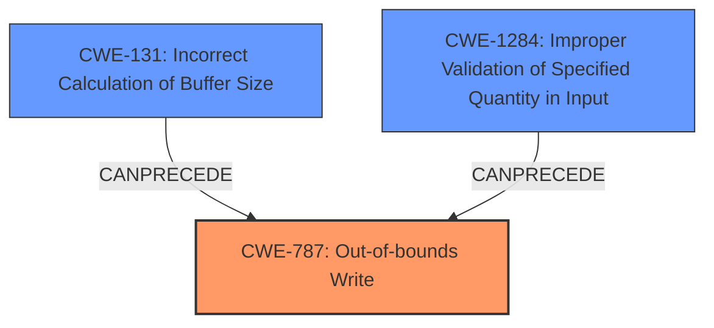

# Final Resolution for CVE-2021-39623

# Summary
| CWE ID | CWE Name | Confidence | CWE Abstraction Level | CWE Vulnerability Mapping Label | CWE-Vulnerability Mapping Notes |
|---|---|---|---|---|---|
| CWE-787 | Out-of-bounds Write | 0.95 | Base | Allowed | This CWE entry is at the Base level of abstraction, which is a preferred level of abstraction for mapping to the root causes of vulnerabilities. |
| CWE-131 | Incorrect Calculation of Buffer Size | 0.75 | Base | Allowed | This CWE entry is at the Base level of abstraction, which is a preferred level of abstraction for mapping to the root causes of vulnerabilities. |
| CWE-1284 | Improper Validation of Specified Quantity in Input | 0.70 | Base | Allowed | This CWE entry is at the Base level of abstraction, which is a preferred level of abstraction for mapping to the root causes of vulnerabilities. |

## Evidence and Confidence

*   **Confidence Score:** 0.90
*   **Evidence Strength:** HIGH

## Relationship Analysis
The primary weakness is **CWE-787 (Out-of-bounds Write)**, indicating a write operation that goes beyond the intended buffer boundaries. This is often a consequence of **CWE-131 (Incorrect Calculation of Buffer Size)** or **CWE-1284 (Improper Validation of Specified Quantity in Input)**. **CWE-131** and **CWE-1284** can precede **CWE-787**, as an incorrect size calculation or input validation failure may lead to writing beyond buffer limits. Although the report states that it could be a heap overflow, and therefore **CWE-122** could be a candidate, the root cause still stems from the **out-of-bounds write**. Therefore, **CWE-787** is the best choice.

## Vulnerability Chain
The vulnerability chain begins with either an **incorrect calculation of the buffer size (CWE-131)** or **improper validation of the input size (CWE-1284)**. This leads to an **out-of-bounds write (CWE-787)**. The impact of the **out-of-bounds write** includes remote escalation of privilege with no additional execution privileges needed.

## Summary of Analysis
The initial analysis was a good starting point, but needed strengthening with some retriever result CWEs. The vulnerability description clearly indicates an **out-of-bounds write**, making **CWE-787** the primary weakness. The incorrect bounds check mentioned in the description suggests that either the buffer size calculation was flawed (**CWE-131**) or there was an improper input validation (**CWE-1284**), or potentially a combination of both. While **CWE-122 (Heap-based Buffer Overflow)** could also be considered, **CWE-787** is a more direct representation of the vulnerability. The weakness description does not mention reading out of bounds, so **CWE-125** was removed.

The retriever results supported the likelihood of **CWE-787**, **CWE-131**, and **CWE-1284** and helped to inform the confidence score and selection of candidate CWEs. The fact that exploitation requires no user interaction once a malicious app is installed significantly increases the severity.

The selected CWEs are at the optimal level of specificity because they directly reflect the root cause and contributing factors to the vulnerability based on the evidence provided.