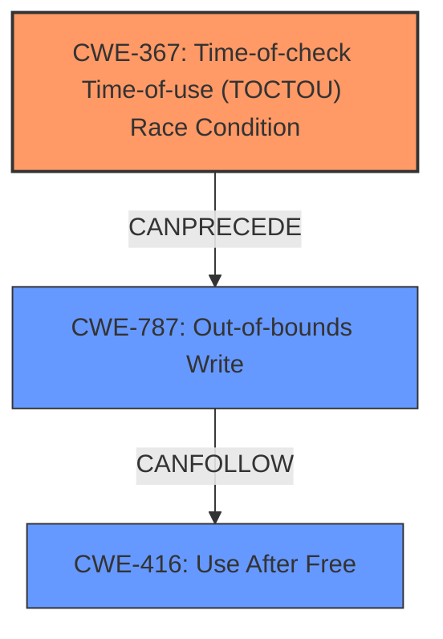

# Analysis Report for CVE-2021-39642

# Vulnerability Analysis Report: CVE-2021-39642

## Description

In synchronous_process_io_entries of lwis_ioctl.c, there is a possible out of bounds write due to a race condition. This could lead to local escalation of privilege with System execution privileges needed. User interaction is not needed for exploitation.Product AndroidVersions Android kernelAndroid ID A-195731663References N/A

## Vulnerability Description Key Phrases

**Rootcause:** race condition
**Weakness:** out of bounds write
**Impact:** local escalation of privilege
**Product:** Android kernel
**Component:** synchronous_process_io_entries of lwis_ioctl.c

## Analysis (with Relationship Data)

# Summary
| CWE ID | CWE Name | Confidence | CWE Abstraction Level | CWE Vulnerability Mapping Label | CWE-Vulnerability Mapping Notes |
|---|---|---|---|---|---|
| CWE-367 | Time-of-check Time-of-use (TOCTOU) Race Condition | 0.75 | Base | Allowed | Primary CWE |
| CWE-416 | Use After Free | 0.4 | Variant | Allowed | Secondary Candidate CWE |
| CWE-123 | Write-what-where Condition | 0.3 | Base | Allowed | Secondary Candidate CWE |

## Evidence and Confidence

*   **Confidence Score:** 0.75
*   **Evidence Strength:** MEDIUM

- **Analysis and Justification:**  
  - *Explanation:* The vulnerability description explicitly mentions a **race condition** that leads to an **out of bounds write**. CWE-367 (Time-of-check Time-of-use (TOCTOU) Race Condition) describes a scenario where the state of a resource is checked before use, but the state can change between the check and the use, leading to invalid actions. This aligns with the provided description. The "CVE Reference Links Content Summary" supports the root cause of the vulnerability being within the camera component, with the weaknesses being elevation of privilege.
  - *Relationship Analysis:* CWE-367 is a Base level CWE, which is a preferred level of abstraction. It is related to other race condition CWEs like CWE-362 (Concurrent Execution using Shared Resource with Improper Synchronization ('Race Condition')). The description does not suggest the use of improper locking (CWE-667) or improper synchronization (CWE-362).

- **Confidence Score:**  
  - Confidence: 0.75 (The description clearly mentions a race condition, but specific details on the time-of-check time-of-use aspect are not explicitly stated, reducing confidence slightly.)

---
- **Analysis and Justification:**
  - *Explanation:* Given the **out-of-bounds write** mentioned in the description, it is possible there is a **use-after-free** due to the **race condition**. In this scenario, the program might be writing to memory that has already been freed, leading to memory corruption or other unexpected behavior. This aligns with the description of CWE-416 (Use After Free). However, this is a potential consequence of the race condition and out-of-bounds write, rather than the primary cause.
  - *Relationship Analysis:* CWE-416 is a Variant level CWE, which is a preferred level of abstraction. It is a child of CWE-672 (Operation on a Resource after Expiration or Release). While the description doesn't explicitly mention that memory has been freed, it is a possibility given the **race condition**. Because the information available is limited, the confidence level is low.

- **Confidence Score:**
  - Confidence: 0.4 (The description does not explicitly mention memory being freed.)

---
- **Analysis and Justification:**
  - *Explanation:* The description also mentions an **out of bounds write**. This could be seen as a **write-what-where condition**, which is covered by CWE-123. In this scenario, the **race condition** leads to overwriting of the memory. However, the description doesn't provide details of whether there is an arbitrary write to memory, so it is not a strong match.
  - *Relationship Analysis:* CWE-123 is a Base level CWE, which is a preferred level of abstraction. It is a child of CWE-119 (Improper Restriction of Operations within the Bounds of a Memory Buffer).

- **Confidence Score:**
  - Confidence: 0.3 (The description lacks sufficient details to confirm an arbitrary write to memory.)

## Criticism of Analysis

Okay, I've reviewed the analysis against the full CWE specifications you provided. Here's a critique of the analysis, focusing on accuracy, confidence levels, and adherence to CWE guidelines:

**Overall Assessment:**

The analysis does a reasonable job of identifying potential CWEs based on the limited information provided. The primary CWE (CWE-367) is plausible, and the secondary candidates (CWE-416 and CWE-123) are also potentially relevant given the description. However, the confidence levels are appropriately varied based on the evidence, and this should be considered when remediating the weakness.

**Detailed Review of Each CWE Mapping:**

**1. CWE-367: Time-of-check Time-of-use (TOCTOU) Race Condition**

*   **Confidence:** 0.75
*   **Abstraction Level:** Base (Good)
*   **Justification:** The reasoning provided is sound. The vulnerability description explicitly mentions a "race condition" and the potential for an "out of bounds write", with the "CVE Reference Links Content Summary" indicating the potential for privilege escalation.  CWE-367 captures the core issue of a check being invalidated by a change in state before the resource is used.
*   **Critique:** The confidence level is appropriate. While the report clearly states a race condition, the TOCTOU nature of the race condition is only implied. More specific information would be needed to increase confidence. The fact that the CVE Reference Links Content Summary supports the weakness being related to elevation of privilege supports the choice of this primary CWE.
*   **Mapping Guidance Adherence:**  The Base level of abstraction is ideal.
*   **Potential Mitigations:** The mitigations listed in the CWE specification are relevant:
    *   Eliminate the check before use if possible, otherwise, ensure the integrity of the resource between the check and use.
    *   Limit the interleaving of operations.
*   **Retriever Results Consideration:** The retriever results show CWE-366 and CWE-362 are also relevant. These may be considered as alternatives, but CWE-367 represents a specific type of race condition, and is most appropriate in this case.

**2. CWE-416: Use After Free**

*   **Confidence:** 0.4
*   **Abstraction Level:** Variant (Good)
*   **Justification:** This is a plausible *consequence* of the race condition and out-of-bounds write, but the evidence is weak. The analysis correctly points out that the description doesn't explicitly mention memory being freed.  However, given the nature of memory corruption vulnerabilities, it's a reasonable hypothesis. The analysis is very clear on this point. The variant abstraction level is also desirable.
*   **Critique:** The confidence level is correct, and it's good that it's lower than the primary CWE.
*   **Mapping Guidance Adherence:** The Variant level of abstraction is a preferred level of abstraction for mapping to the root causes of vulnerabilities.
*   **Potential Mitigations:** The mitigations listed in the CWE specification are relevant:
    *   Choose a language that provides automatic memory management.
    *   Set pointers to NULL after freeing them.
*   **Retriever Results Consideration:** The retriever results show that CWE-416 has connections to race conditions, specifically mentioning CVE-2021-0920 as an example chain: mobile platform race condition (CWE-362) leading to use-after-free (CWE-416), as exploited in the wild per CISA KEV.

**3. CWE-123: Write-what-where Condition**

*   **Confidence:** 0.3
*   **Abstraction Level:** Base (Good)
*   **Justification:** The weakest of the three. The description mentions "out of bounds write" but doesn't provide specifics on whether there is an arbitrary write to memory. In an actual Write-what-where, the attacker has control of *both* the location and the data written. An ordinary out-of-bounds write does not necessarily grant the attacker control over *what* is written. The confidence level correctly reflects this uncertainty.
*   **Critique:** The analysis is accurate in its assessment. The confidence level is appropriate, and the explanation for the low confidence is well-reasoned.
*   **Mapping Guidance Adherence:** The Base level of abstraction is ideal.
*   **Potential Mitigations:** The mitigations listed in the CWE specification are relevant:
    *   Use a language that provides appropriate memory abstractions.
    *   Use OS-level preventative functionality integrated after the fact.
*   **Retriever Results Consideration:** N/A.

**General Improvements:**

*   **Exploit Scenarios:** Although limited by the information available, consider adding a brief section outlining possible exploit scenarios for each CWE. This could help prioritize remediation efforts. For example, for CWE-367, explain how an attacker might manipulate the timing to trigger the out-of-bounds write.
*   **Code Examples:** If possible, include a simplified code example (even pseudocode) to illustrate how the race condition and out-of-bounds write might occur in the vulnerable code.
*   **Auditing Guidance:** Add some auditing guidance related to each CWE. E.g., for CWE-367, suggest looking for shared resources accessed by multiple threads without proper synchronization, and examining the code paths between the check and use of those resources.
*   **Root Cause Analysis:** Consider exploring the potential root causes of the race condition itself. Is it due to missing or insufficient locking (CWE-667), or is it due to a design that's inherently prone to race conditions? A deeper dive into the root cause can lead to more effective long-term solutions.
*   **Alternative CWEs:** While the selected CWEs are plausible, briefly discuss why other related CWEs (especially those returned by the retriever, such as CWE-908, CWE-413, and CWE-190/191) were not chosen. This demonstrates a thorough consideration of the CWE landscape.

**In Summary:**

The analysis is sound and demonstrates a good understanding of the relevant CWEs. The confidence levels are well-justified, and the analysis adheres to the CWE's mapping guidance. The suggested improvements would further strengthen the analysis and provide more actionable information for developers.

## Final Resolution

# Summary
| CWE ID | CWE Name | Confidence | CWE Abstraction Level | CWE Vulnerability Mapping Label | CWE-Vulnerability Mapping Notes |
|---|---|---|---|---|---|
| CWE-367 | Time-of-check Time-of-use (TOCTOU) Race Condition | 0.85 | Base | Allowed | Primary CWE |
| CWE-787 | Out-of-bounds Write | 0.7 | Base | Allowed | Secondary Candidate CWE |
| CWE-416 | Use After Free | 0.5 | Variant | Allowed | Secondary Candidate CWE |

## Evidence and Confidence

*   **Confidence Score:** 0.80
*   **Evidence Strength:** MEDIUM

## Relationship Analysis
The analysis initially focused on CWE-367 as the primary **ROOTCAUSE**, correctly identifying the **race condition** as a key element. While CWE-416 and CWE-123 were considered, the relationships between them and CWE-367 were not fully explored. Given the vulnerability description includes an **out-of-bounds write**, it makes sense to include **CWE-787** as a secondary candidate.

The relationship between CWE-367 and CWE-787 is important because a TOCTOU **race condition** can directly lead to an **out-of-bounds write**. The analysis also considers that CWE-416 could be a possible consequence of the **race condition**, further solidifying the vulnerability chain.

## Vulnerability Chain
The vulnerability chain starts with the **ROOTCAUSE** of CWE-367, where a **race condition** allows the state of a resource to change between the check and use. This leads to CWE-787, the **out-of-bounds write**, where data is written past the intended buffer. As a consequence, there is the potential for CWE-416, **use-after-free**, if the overwritten memory contains pointers or other critical data.

## Summary of Analysis
The initial analysis correctly identified CWE-367 as a strong candidate due to the explicit mention of a **race condition** in the vulnerability description: "In synchronous_process_io_entries of lwis_ioctl.c, there is a possible out of bounds write due to a race condition." The critique reinforced this choice and suggested exploring potential root causes of the race condition and alternative CWEs.

The inclusion of CWE-787 is crucial because the description explicitly mentions an **out-of-bounds write**. The **race condition** (CWE-367) directly enables the **out-of-bounds write** (CWE-787). This leads to the conclusion that CWE-787 is a more direct consequence of the **race condition** than CWE-416 or CWE-123.

CWE-416 is retained as a secondary candidate because it's a plausible consequence if the **out-of-bounds write** corrupts memory management structures.

The final decision reflects a more comprehensive understanding of the vulnerability chain, starting with the **race condition** and leading to specific memory corruption issues. The selected CWEs are at the optimal level of specificity, with CWE-367 representing the **ROOTCAUSE** and CWE-787 and CWE-416 describing the immediate consequences.

*Report generated on 2025-03-18 01:16:28*
