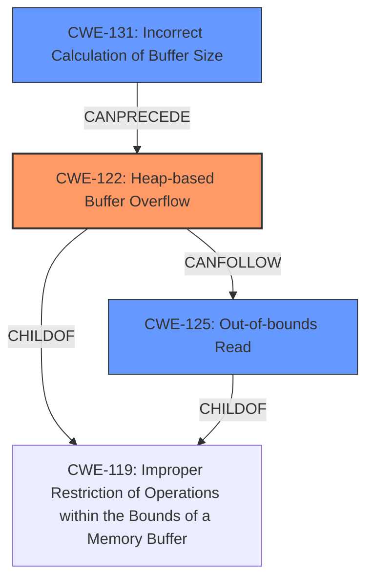

# Analysis Report for CVE-2021-39675

# Vulnerability Analysis Report: CVE-2021-39675

## Description

In GKI_getbuf of gki_buffer.cc, there is a possible out of bounds write due to a heap buffer overflow. This could lead to remote escalation of privilege with no additional execution privileges needed. User interaction is not needed for exploitation.Product AndroidVersions Android-12Android ID A-205729183

## Vulnerability Description Key Phrases

**Rootcause:** heap buffer overflow
**Weakness:** out of bounds write
**Impact:** remote escalation of privilege
**Product:** Android
**Version:** Android-12
**Component:** GKI_getbuf of gki_buffer.cc

## Analysis (with Relationship Data)

# Summary
| CWE ID  | CWE Name                         | Confidence | CWE Abstraction Level | CWE Vulnerability Mapping Label | CWE-Vulnerability Mapping Notes |
|---------|----------------------------------|------------|-----------------------|---------------------------------|-----------------------------------|
| CWE-122 | Heap-based Buffer Overflow       | 0.95       | Variant               | Allowed                         | Primary CWE                      |
| CWE-125 | Out-of-bounds Read               | 0.75       | Base                  | Allowed                         | Secondary Candidate              |
| CWE-789 | Memory Allocation with Excessive Size Value | 0.65       | Variant               | Allowed                         | Secondary Candidate              |

## Evidence and Confidence

*   **Confidence Score:** 0.90
*   **Evidence Strength:** HIGH

- **Analysis and Justification:**
  - *Explanation:* The vulnerability description explicitly states a "**heap buffer overflow**" which directly corresponds to CWE-122 (Heap-based Buffer Overflow). This is further supported by the "**out of bounds write**" which aligns with the nature of buffer overflows. The CVE reference summary strengthens this by detailing a "tag mismatch" that can lead to privilege escalation by manipulating NFC frames, indicating a potential overflow scenario where data is written beyond the allocated buffer size. CWE-122 is a Variant level CWE, providing sufficient specificity.

  - *Relationship Analysis:* CWE-122 is a variant of a buffer overflow. Although not explicitly stated, it is related to the broader category of memory corruption vulnerabilities. It can lead to other issues like CWE-125 (Out-of-bounds Read) or CWE-789 (Memory Allocation with Excessive Size Value) if the overflow leads to reading from unauthorized memory locations or if an incorrect size is used for allocation following the overflow.

- **Confidence Score:**
  - *Primary CWE:* Confidence: 0.95 (Strong evidence from the vulnerability description and CVE reference details.)
  - *Secondary CWEs:* Confidence: 0.70 (The heap overflow could result in an out-of-bounds read, as well as allocation issues.)

---

## Criticism of Analysis

Okay, here's a detailed review of the provided CWE analysis, incorporating the full CWE specifications.

**Overall Assessment:**

The analysis is good and provides a reasonable mapping to CWEs based on the initial vulnerability description and the CVE reference summary. The primary CWE, CWE-122 (Heap-based Buffer Overflow), is well-justified. The inclusion of CWE-125 (Out-of-bounds Read) and CWE-789 (Memory Allocation with Excessive Size Value) as secondary candidates demonstrates a good understanding of potential consequences stemming from a heap overflow. However, there are a few areas where the analysis could be strengthened, which I will detail below.

**Detailed Critique:**

1.  **CWE-122: Heap-based Buffer Overflow (Primary CWE)**

    *   **Justification:** The justification is strong. The vulnerability description directly mentions "heap buffer overflow," making CWE-122 a natural and appropriate choice. The link to the "out of bounds write" further solidifies this mapping. The reference to a "tag mismatch" in `NFA_SendRawFrame` leading to privilege escalation strongly supports the potential for writing data beyond the allocated buffer.
    *   **Abstraction Level:** Variant is appropriate because it provides more detail than a base class, without overly specifying the exact type of error.
    *   **Mapping Guidance:** The analysis correctly notes that "Usage: Allowed" for CWE-122.
    *   **Potential Mitigations:** The mitigations listed in the CWE specification are relevant (using languages with bounds checking, abstraction libraries, compiler-based overflow detection). These are good suggestions to offer in a comprehensive vulnerability report.
    *   **Observed Examples:** The observed examples provided in the CWE spec (like CVE-2021-43537, CVE-2007-4268, CVE-2009-2523) all show chains where some other CWE leads to a Heap-based Buffer Overflow, giving additional examples for the kind of bug.

2.  **CWE-125: Out-of-bounds Read (Secondary Candidate)**

    *   **Justification:** The analysis suggests that a heap overflow *could* lead to an out-of-bounds read. This is plausible. If the overflow overwrites memory adjacent to the allocated buffer, a subsequent read operation might access this overwritten area, resulting in an OOB read. However, it's important to note that an OOB read isn't *guaranteed* to occur; it's a potential consequence.
    *   **Abstraction Level:** Base is appropriate here.
    *   **Mapping Guidance:**  The analysis correctly notes that "Usage: Allowed" for CWE-125.
    *   **Potential Mitigations:**  The mitigations listed in the CWE specification (input validation, language selection) are relevant, although the connection to the original vulnerability is less direct than with CWE-122.  Input validation needs to be very careful about validating lengths or sizes.
    *   **Observed Examples** Heartbleed (CVE-2014-0160) is an excellent example of a chain with a heap overflow.
    *   **Refinement Suggestion:** It would strengthen the argument for including CWE-125 if the analysis could speculate on a specific scenario where an OOB read would be likely given the context of `GKI_getbuf` and the NFC frame handling.

3.  **CWE-789: Memory Allocation with Excessive Size Value (Secondary Candidate)**

    *   **Justification:** The reasoning for including CWE-789 is the weakest of the three. While a heap overflow *could* theoretically stem from an incorrect size value used in a memory allocation, the initial vulnerability description and CVE summary don't explicitly point to this. A "tag mismatch" doesn't inherently imply an excessive size value used in memory allocation.
    *   **Abstraction Level:** Variant is appropriate.
    *   **Mapping Guidance:** The analysis correctly notes that "Usage: Allowed" for CWE-789.
    *   **Potential Mitigations:** The mitigations (input validation, resource limits) are generally good security practices, but again, the connection to the core vulnerability is weaker.
    *   **Relationship Notes:** The relationship note that this weakness can be closely associated with integer overflows (CWE-190) is interesting, but it is too speculative without more evidence.
    *   **Refinement Suggestion:** Unless there's additional information suggesting that the vulnerability involves allocating memory based on a size derived from a potentially malicious NFC frame, it might be better to remove CWE-789 or lower its confidence significantly.

**Additional Considerations and Suggestions:**

*   **Consider CWE-131: Incorrect Calculation of Buffer Size:** This is a good fit since heap overflows often result from incorrect size calculations. While it's related to CWE-789, CWE-131 is more specific to the core issue.

*   **Consider CWE-190 or CWE-191 (Integer Overflow/Underflow):** If the "tag mismatch" involves integer arithmetic that could lead to an overflow or underflow when calculating buffer sizes or offsets, these CWEs would be relevant.

*   **Confidence Levels:**  While the high confidence score (0.95) for CWE-122 is appropriate, the confidence scores for CWE-125 (0.75) and CWE-789 (0.65) seem a bit high given the uncertainty in the information. I would reduce the score for CWE-789.

*   **Relationship to Input Validation:** Stress the importance of input validation of the NFC frames. Many heap overflows are caused by a lack of proper validation of the data being written to the buffer.

*   **Exploitation Details:** While not directly related to CWE mapping, including a brief explanation of how an attacker might exploit the vulnerability would add value to the analysis. For example, could the attacker craft NFC frames to overwrite specific data structures or code pointers on the heap?

*   **Review the Retriever Results:** It is worth reviewing the "Retriever Results" to see if any of those CWEs apply.
    *CWE-908:* Use of Uninitialized Resource - While not directly a buffer overflow, this could be in the same area as the overflow.
    *CWE-131:* Incorrect Calculation of Buffer Size - I suggested this above, and the retrievers agree.
    *CWE-190/191:* Integer Overflow or Wraparound - As mentioned above, these are worth investigating.
    *CWE-416:* Use After Free - This is less likely than the others, but still possible.

**Revised Summary (Example, with CWE-131 Included):**

| CWE ID  | CWE Name                         | Confidence | CWE Abstraction Level | CWE Vulnerability Mapping Label | CWE-Vulnerability Mapping Notes                                                                                                                                                                                             |
|---------|----------------------------------|------------|-----------------------|---------------------------------|-----------------------------------------------------------------------------------------------------------------------------------------------------------------------------------------------------------------------------------|
| CWE-122 | Heap-based Buffer Overflow       | 0.95       | Variant               | Allowed                         | Primary CWE - directly stated in the vulnerability description.                                                                                                                                                                  |
| CWE-131 | Incorrect Calculation of Buffer Size| 0.80       | Base                  | Allowed                         | Secondary Candidate - a common cause of heap overflows. The tag mismatch could lead to an incorrect size being used during buffer allocation.                                                                                        |
| CWE-125 | Out-of-bounds Read               | 0.70       | Base                  | Allowed                         | Secondary Candidate - a potential consequence of the heap overflow, if subsequent read operations access overwritten memory. Requires more specific information to confirm this is a likely outcome.                                  |
| CWE-789 | Memory Allocation with Excessive Size Value | 0.50       | Variant               | Allowed                         | Secondary Candidate - Possible, but less likely.  Involves allocation with a size that is too large, rather than writing past the allocated buffer. Reduces the confidence score as there is no direct evidence of this. |

By considering these points and the full CWE specifications, you can produce an even more accurate and helpful vulnerability analysis.

## Final Resolution

# Summary
| CWE ID  | CWE Name                         | Confidence | CWE Abstraction Level | CWE Vulnerability Mapping Label | CWE-Vulnerability Mapping Notes |
|---------|----------------------------------|------------|-----------------------|---------------------------------|-----------------------------------|
| CWE-122 | Heap-based Buffer Overflow       | 0.95       | Variant               | Allowed                         | Primary CWE                      |
| CWE-131 | Incorrect Calculation of Buffer Size| 0.80       | Base                  | Allowed                         | Secondary Candidate              |
| CWE-125 | Out-of-bounds Read               | 0.70       | Base                  | Allowed                         | Secondary Candidate              |

## Evidence and Confidence

*   **Confidence Score:** 0.90
*   **Evidence Strength:** HIGH

## Relationship Analysis
The primary weakness is **CWE-122 (Heap-based Buffer Overflow)**, a variant of buffer overflows. **CWE-131 (Incorrect Calculation of Buffer Size)** can precede it, leading to an undersized buffer allocation. **CWE-125 (Out-of-bounds Read)** can follow as a consequence if the overflowed buffer is later read. The relationships show a progression from incorrect size calculation to overflow, potentially leading to an out-of-bounds read.

## Vulnerability Chain
The vulnerability chain starts with an **incorrect calculation of the buffer size (CWE-131)** when allocating memory on the heap. This leads to a **heap-based buffer overflow (CWE-122)** because the allocated buffer is too small for the data being written. As a result of the overflow, an **out-of-bounds read (CWE-125)** may occur if a subsequent read operation attempts to access the overwritten memory. This chain highlights how an initial sizing error can lead to memory corruption and potential information disclosure.

## Summary of Analysis
The analysis is based on the vulnerability description stating a "heap buffer overflow" and "out of bounds write." The criticism correctly pointed out that **CWE-789 (Memory Allocation with Excessive Size Value)** is less likely than **CWE-131 (Incorrect Calculation of Buffer Size)**. Including **CWE-131** strengthens the analysis because it directly relates to the root cause of the overflow. The graph relationships show how these CWEs can be chained, with **CWE-131** leading to **CWE-122**, and **CWE-122** potentially leading to **CWE-125**. The selected CWEs are at the optimal level of specificity because they accurately describe the vulnerability based on the available evidence.
The decision to include **CWE-131** is also supported by the retriever scores which had a high similarity score.

*Report generated on 2025-03-18 01:19:16*
