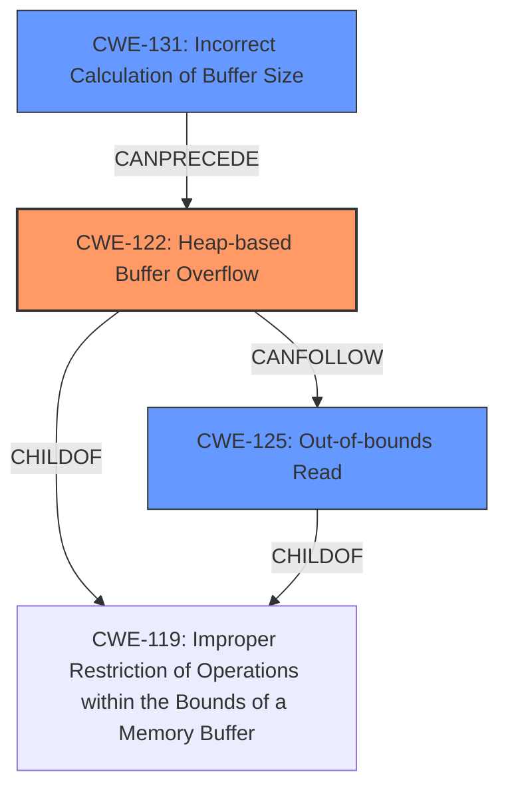

# Final Resolution for CVE-2021-39675

# Summary
| CWE ID  | CWE Name                         | Confidence | CWE Abstraction Level | CWE Vulnerability Mapping Label | CWE-Vulnerability Mapping Notes |
|---------|----------------------------------|------------|-----------------------|---------------------------------|-----------------------------------|
| CWE-122 | Heap-based Buffer Overflow       | 0.95       | Variant               | Allowed                         | Primary CWE                      |
| CWE-131 | Incorrect Calculation of Buffer Size| 0.80       | Base                  | Allowed                         | Secondary Candidate              |
| CWE-125 | Out-of-bounds Read               | 0.70       | Base                  | Allowed                         | Secondary Candidate              |

## Evidence and Confidence

*   **Confidence Score:** 0.90
*   **Evidence Strength:** HIGH

## Relationship Analysis
The primary weakness is **CWE-122 (Heap-based Buffer Overflow)**, a variant of buffer overflows. **CWE-131 (Incorrect Calculation of Buffer Size)** can precede it, leading to an undersized buffer allocation. **CWE-125 (Out-of-bounds Read)** can follow as a consequence if the overflowed buffer is later read. The relationships show a progression from incorrect size calculation to overflow, potentially leading to an out-of-bounds read.

## Vulnerability Chain
The vulnerability chain starts with an **incorrect calculation of the buffer size (CWE-131)** when allocating memory on the heap. This leads to a **heap-based buffer overflow (CWE-122)** because the allocated buffer is too small for the data being written. As a result of the overflow, an **out-of-bounds read (CWE-125)** may occur if a subsequent read operation attempts to access the overwritten memory. This chain highlights how an initial sizing error can lead to memory corruption and potential information disclosure.

## Summary of Analysis
The analysis is based on the vulnerability description stating a "heap buffer overflow" and "out of bounds write." The criticism correctly pointed out that **CWE-789 (Memory Allocation with Excessive Size Value)** is less likely than **CWE-131 (Incorrect Calculation of Buffer Size)**. Including **CWE-131** strengthens the analysis because it directly relates to the root cause of the overflow. The graph relationships show how these CWEs can be chained, with **CWE-131** leading to **CWE-122**, and **CWE-122** potentially leading to **CWE-125**. The selected CWEs are at the optimal level of specificity because they accurately describe the vulnerability based on the available evidence.
The decision to include **CWE-131** is also supported by the retriever scores which had a high similarity score.