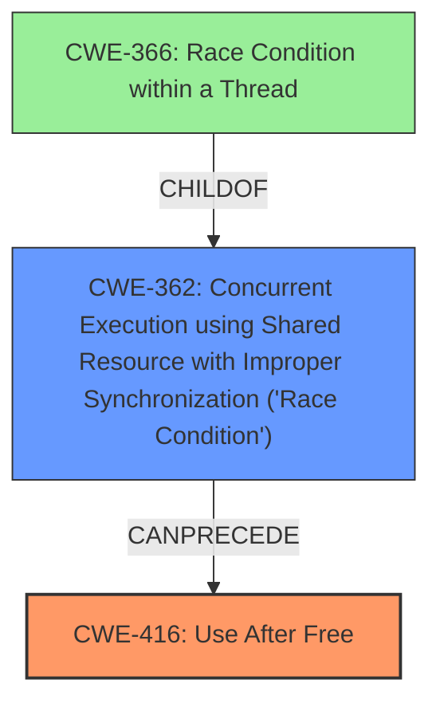

# Analysis Report for CVE-2021-39712

# Vulnerability Analysis Report: CVE-2021-39712

## Description

In TBD of TBD, there is a possible user after free vulnerability due to a race condition. This could lead to local escalation of privilege with System execution privileges needed. User interaction is not needed for exploitation.Product AndroidVersions Android kernelAndroid ID A-176918884References N/A

## Vulnerability Description Key Phrases

**Rootcause:** race condition
**Weakness:** use after free
**Impact:** local escalation of privilege
**Product:** Android kernel

## Analysis (with Relationship Data)

# Summary
| CWE ID | CWE Name | Confidence | CWE Abstraction Level | CWE Vulnerability Mapping Label | CWE-Vulnerability Mapping Notes |
|---|---|---|---|---|---|
| CWE-416 | Use After Free | 0.9 | Variant | Allowed | Primary CWE |
| CWE-366 | Race Condition within a Thread | 0.8 | Base | Allowed | Secondary Candidate |

## Evidence and Confidence

*   **Confidence Score:** 0.85
*   **Evidence Strength:** HIGH

- **Analysis and Justification:**  
  - *Explanation:* The vulnerability description clearly states a "**use after free vulnerability**" due to a "**race condition**". CWE-416 (Use After Free) directly addresses the condition where memory is accessed after it has been freed, leading to unpredictable behavior. The presence of a **race condition** suggests concurrent access issues, making CWE-366 (Race Condition within a Thread) a relevant secondary factor. CWE-416 is a Variant-level CWE, offering a more specific description of the **use after free** issue than its parent classes. The retriever results also rank CWE-416 highly, and its usage is ALLOWED.
  
  - *Relationship Analysis:* CWE-416 is related to resource management issues and can lead to other vulnerabilities. CWE-366 describes the **race condition** aspect, which enables the **use after free**. CWE-416 is a variant of CWE-672 (Operation on Resource after Expiry). CWE-366 is a base CWE related to concurrent access and is a child of CWE-362 (Concurrent Execution using Shared Resource with Improper Synchronization ('Race Condition')).

- **Confidence Score:**  
  - Confidence: 0.9 (High confidence due to direct evidence of **use after free** and **race condition** from the vulnerability description).
---

## Criticism of Analysis

Okay, I've reviewed the provided analysis along with the full CWE specifications. Here's a critique:

**Overall Assessment:**

The analysis is generally good. The primary CWE, CWE-416 (Use After Free), is a strong match given the vulnerability description. The secondary candidate, CWE-366 (Race Condition within a Thread), is also well-justified as the race condition is a critical component that enables the UAF. The confidence score is appropriate.  However, there's room for improvement in refining the understanding of the race condition involved, and considering related weaknesses.

**Detailed Critique:**

1.  **CWE-416 (Use After Free):**

    *   **Strengths:** The identification of CWE-416 is accurate. The description of the vulnerability clearly indicates a use-after-free condition. The analysis correctly notes that CWE-416 is a Variant-level CWE, which is desirable for mapping to specific root causes.
    *   **Weaknesses:** The analysis could benefit from briefly describing *how* the use-after-free occurs.  Is it a simple case of freeing memory and then using the pointer without re-initialization?  Is it more complex, involving multiple objects and ownership issues? While the root cause is a race condition, the specific *mechanisms* leading to the UAF could be explored, even if not fully known.
    *   **CWE Specification Considerations:**
        *   The relationships section of the CWE-416 specification is relevant. Specifically, `CanFollow -> CWE-362`. This confirms that the race condition is a potential enabler.
        *   The potential mitigations also are relevant, with `Strategy: Language Selection` and the second implementation mitigation `Attack Surface Reduction`.
    *   **Recommendation:** Consider adding a brief (even speculative) explanation of the UAF mechanism based on the available information.

2.  **CWE-366 (Race Condition within a Thread):**

    *   **Strengths:** Identifying a race condition is correct, as the vulnerability description mentions it directly. It's important to include this to represent the concurrent nature of the bug.
    *   **Weaknesses:** CWE-366 is a Base CWE, and as the analysis correctly identifies, the mapping guidance suggests examining children for a better fit.  The analysis should consider CWE-362 (Concurrent Execution using Shared Resource with Improper Synchronization ('Race Condition')) more thoroughly.  While CWE-362 is a *Class* and thus might not be optimal, the description of CWE-362 aligns well with the vulnerability.  The child CWEs of CWE-362 are also useful, and I will make a suggestion for a better fit further below.
    *   **CWE Specification Considerations:**
        *   The relationships section of the CWE-366 Specification is relevant. Specifically, `ChildOf -> CWE-362`.
        *   The potential mitigations are relevant, and the mitigations mentioned for CWE-362 also apply here.
    *   **Recommendation:** Consider replacing CWE-366 with CWE-362 or examining potential chain relationships, especially `CWE-667 -> CWE-362 -> CWE-416`. The example CVEs from the CWE database also are relevant:
        *   **CVE-2021-0920:** Chain: mobile platform race condition (CWE-362) leading to use-after-free (CWE-416), as exploited in the wild per CISA KEV.
        *   **CVE-2020-6819:** Chain: race condition (CWE-362) leads to use-after-free (CWE-416), as exploited in the wild per CISA KEV.

3.  **Other CWEs to Consider:**

    *   **CWE-413 (Improper Resource Locking):** The retriever results lists this second and given a race condition, it is possible the code is not correctly locking the resource, which leads to both the race condition and the use-after-free.
    *   **CWE-367 (Time-of-check Time-of-use (TOCTOU) Race Condition):** While not necessarily a TOCTOU in the traditional file system sense, the core principle of checking a resource and then using it later when it may have changed applies.
        * CWE-367 has a chain relationship with CWE-416.

4.  **Confidence Score:**

    *   The confidence score of 0.9 for CWE-416 is reasonable, but the score of 0.8 for CWE-366 is slightly high given that it's a less specific Base CWE.
    *   **Recommendation:** If CWE-366 was replaced with CWE-362, the confidence for that should remain about the same.

5.  **CWE Database Examples:**

    *   The included examples for CWE-362 and CWE-366 are helpful in demonstrating real-world instances of race conditions leading to UAF vulnerabilities.

6.  **Mitigations:**

    *   The analysis doesn't discuss specific mitigation strategies. It would be beneficial to mention some general mitigations based on the CWE specifications, such as using synchronization primitives (for race conditions) and setting pointers to NULL after freeing (for UAF).

**Revised Summary Table Suggestion:**

| CWE ID  | CWE Name                                                                                    | Confidence | CWE Abstraction Level | CWE Vulnerability Mapping Label | CWE-Vulnerability Mapping Notes                                                                                                                     |
| :------ | :------------------------------------------------------------------------------------------ | :--------- | :---------------------- | :------------------------------ | :-------------------------------------------------------------------------------------------------------------------------------------------------- |
| CWE-416 | Use After Free                                                                              | 0.9        | Variant                | Allowed                       | Primary CWE                                                                                                                                       |
| CWE-362 | Concurrent Execution using Shared Resource with Improper Synchronization ('Race Condition') | 0.8        | Class                  | Allowed-with-Review             | Secondary Candidate - Consider that a more specific child of CWE-362 may be a better fit given more information.                                                                        |

**Overall Recommendations:**

1.  **Expand on the UAF mechanism:**  Provide more detail (even if speculative) on how the memory is freed and then reused.
2.  **Consider Child CWEs of CWE-362:** Re-evaluate the choice of CWE-366. While it captures the general idea of a race condition, CWE-362 is more appropriate, and consider related weaknesses and the possibility for chain relationships.
3.  **Briefly Discuss Mitigations:** Include a short section on potential mitigation strategies based on the CWE specifications.
4.  **Review CVE Reference Links:** It's helpful to review the CVE references to see if more specific information about the root cause is available.

By incorporating these suggestions, the analysis can become more comprehensive and actionable.

## Final Resolution

# Summary
| CWE ID | CWE Name | Confidence | CWE Abstraction Level | CWE Vulnerability Mapping Label | CWE-Vulnerability Mapping Notes |
|---|---|---|---|---|---|
| CWE-416 | Use After Free | 0.9 | Variant | Allowed | Primary CWE |
| CWE-362 | Concurrent Execution using Shared Resource with Improper Synchronization ('Race Condition') | 0.8 | Class | Allowed-with-Review | Secondary Candidate |

## Evidence and Confidence

*   **Confidence Score:** 0.85
*   **Evidence Strength:** HIGH

## Relationship Analysis
The primary relationship impacting the decision is the chain relationship where a **race condition** (CWE-362) can lead to a **use-after-free** (CWE-416). CWE-362 is a Class CWE, but it more accurately reflects the nature of the **race condition** described in the vulnerability than CWE-366. The parent-child relationship between CWE-366 and CWE-362 was also considered, influencing the decision to choose the more descriptive CWE-362.

## Vulnerability Chain
The vulnerability chain starts with a **race condition** (CWE-362) where concurrent access to a shared resource is not properly synchronized. This leads to a state where memory is freed while another thread still holds a reference to it, resulting in a **use-after-free** vulnerability (CWE-416). The root cause is the improper synchronization, and the impact is the ability to access freed memory, potentially leading to privilege escalation.

## Summary of Analysis
The initial analysis correctly identified CWE-416 as the primary issue. The criticism highlighted the need to refine the understanding of the **race condition** and consider related weaknesses.

The decision to use CWE-362 instead of CWE-366 is based on the criticism's suggestion and the fact that CWE-362 more accurately describes the **race condition** as an improper synchronization issue, aligning better with the vulnerability description and the provided CVE examples (CVE-2021-0920, CVE-2020-6819) which explicitly link CWE-362 to CWE-416. The vulnerability description states, "In TBD of TBD, there is a possible user after free vulnerability due to a **race condition**."

The selected CWEs are at an appropriate level of specificity. CWE-416 is a Variant, providing a specific description of the **use-after-free** issue. CWE-362 is a Class, but no more specific Base CWE sufficiently describes the **race condition** within the constraints of the provided information.

*Report generated on 2025-03-18 01:21:47*
