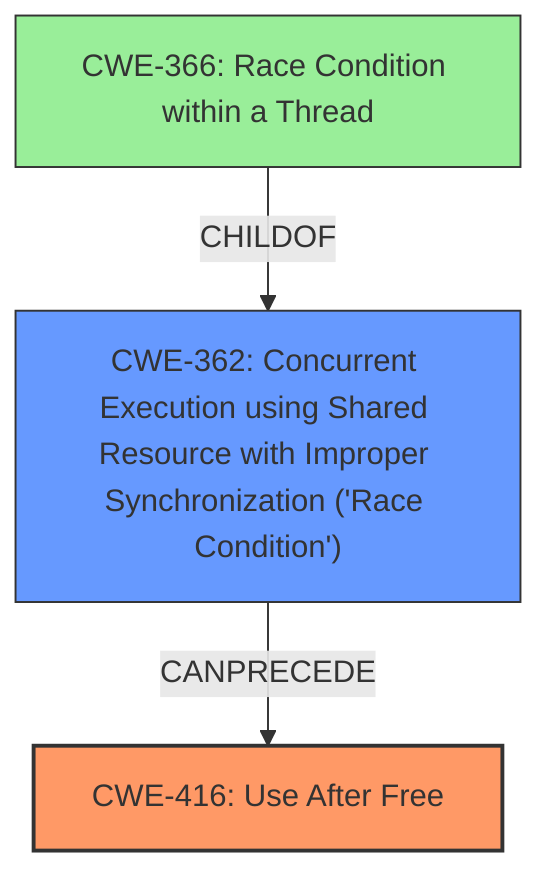

# Final Resolution for CVE-2021-39712

# Summary
| CWE ID | CWE Name | Confidence | CWE Abstraction Level | CWE Vulnerability Mapping Label | CWE-Vulnerability Mapping Notes |
|---|---|---|---|---|---|
| CWE-416 | Use After Free | 0.9 | Variant | Allowed | Primary CWE |
| CWE-362 | Concurrent Execution using Shared Resource with Improper Synchronization ('Race Condition') | 0.8 | Class | Allowed-with-Review | Secondary Candidate |

## Evidence and Confidence

*   **Confidence Score:** 0.85
*   **Evidence Strength:** HIGH

## Relationship Analysis
The primary relationship impacting the decision is the chain relationship where a **race condition** (CWE-362) can lead to a **use-after-free** (CWE-416). CWE-362 is a Class CWE, but it more accurately reflects the nature of the **race condition** described in the vulnerability than CWE-366. The parent-child relationship between CWE-366 and CWE-362 was also considered, influencing the decision to choose the more descriptive CWE-362.

## Vulnerability Chain
The vulnerability chain starts with a **race condition** (CWE-362) where concurrent access to a shared resource is not properly synchronized. This leads to a state where memory is freed while another thread still holds a reference to it, resulting in a **use-after-free** vulnerability (CWE-416). The root cause is the improper synchronization, and the impact is the ability to access freed memory, potentially leading to privilege escalation.

## Summary of Analysis
The initial analysis correctly identified CWE-416 as the primary issue. The criticism highlighted the need to refine the understanding of the **race condition** and consider related weaknesses.

The decision to use CWE-362 instead of CWE-366 is based on the criticism's suggestion and the fact that CWE-362 more accurately describes the **race condition** as an improper synchronization issue, aligning better with the vulnerability description and the provided CVE examples (CVE-2021-0920, CVE-2020-6819) which explicitly link CWE-362 to CWE-416. The vulnerability description states, "In TBD of TBD, there is a possible user after free vulnerability due to a **race condition**."

The selected CWEs are at an appropriate level of specificity. CWE-416 is a Variant, providing a specific description of the **use-after-free** issue. CWE-362 is a Class, but no more specific Base CWE sufficiently describes the **race condition** within the constraints of the provided information.