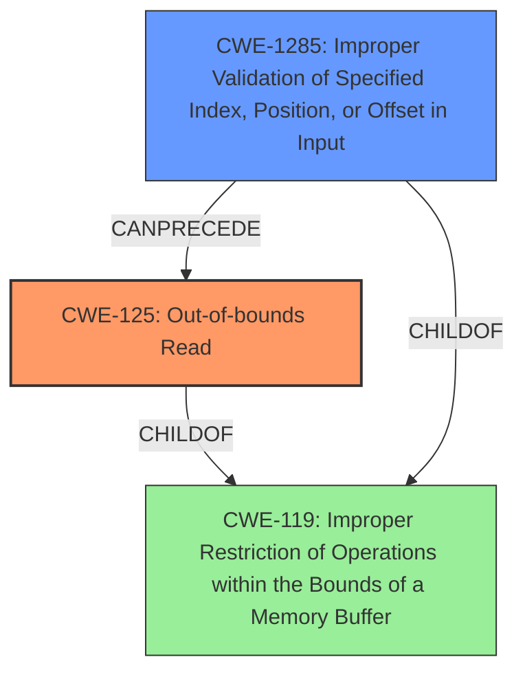

# Analysis Report for CVE-2021-39805

# Vulnerability Analysis Report: CVE-2021-39805

## Description

In l2cble_process_sig_cmd of l2c_ble.cc, there is a possible out of bounds read due to a missing bounds check. This could lead to remote information disclosure through Bluetooth with no additional execution privileges needed. User interaction is not needed for exploitation.Product AndroidVersions Android-12 Android-12LAndroid ID A-212694559

## Vulnerability Description Key Phrases

**Rootcause:** missing bounds check
**Weakness:** out of bounds read
**Impact:** remote information disclosure
**Product:** Android
**Version:** Android-12, Android-12L
**Component:** l2cble_process_sig_cmd of l2c_ble.cc

## Analysis (with Relationship Data)

# Summary
| CWE ID | CWE Name | Confidence | CWE Abstraction Level | CWE Vulnerability Mapping Label | CWE-Vulnerability Mapping Notes |
|---|---|---|---|---|---|
| CWE-125 | Out-of-bounds Read | 1.0 | Base | Allowed | The vulnerability description explicitly states "out of bounds read" due to a missing bounds check. |
| CWE-1284 | Improper Validation of Specified Quantity in Input | 0.6 | Base | Allowed | The **missing bounds check** implies that the quantity (likely an index or offset) was not validated. |

## Evidence and Confidence

*   **Confidence Score:** 1.0
*   **Evidence Strength:** HIGH

- **Analysis and Justification:**  
  - *Explanation:* The vulnerability description clearly states "**out of bounds read** due to a **missing bounds check**". This directly maps to CWE-125 (Out-of-bounds Read). The CVE Reference Links Content Summary confirms "Out-of-bounds read vulnerability." and "**Root cause of vulnerability**: The commit message indicates a potential out-of-bounds read in the L2CAP (Logical Link Control and Adaptation Protocol) component.". Therefore, CWE-125 is the most appropriate primary CWE. The retriever results also gives a high score for CWE-125 and the CWE for similar CVE Descriptions also recommends CWE-125 as the Primary CWE.
  
  - *Relationship Analysis:* CWE-125 is a base-level CWE, which is appropriate. The parent of CWE-125 is CWE-119 (Improper Restriction of Operations within the Bounds of a Memory Buffer), but since the description clearly indicates the read is out-of-bounds, CWE-125 is more specific and appropriate.

- **Confidence Score:**  
  - Confidence: 1.0 (Strong evidence from the vulnerability description, CVE reference, and retriever results.)

---

- **Analysis and Justification:**  
  - *Explanation:* The **missing bounds check** also suggests that the input was not properly validated to ensure it remains within the allowed boundaries of the buffer. This aligns with CWE-1284 (Improper Validation of Specified Quantity in Input), where a quantity (such as an index) is not validated. The retriever results show this as a possible candidate. Although CWE-20 (Improper Input Validation) is a broader category, CWE-1284 is more specific and directly addresses the **missing bounds check**.

  - *Relationship Analysis:* CWE-1284 is a base-level CWE. It is a child of CWE-20 (Improper Input Validation), but CWE-1284 is more specific to the **missing bounds check** that caused the out-of-bounds read. CWE-1284 can precede CWE-125 as improper validation could lead to out-of-bounds read.

- **Confidence Score:**  
  - Confidence: 0.6 (Supporting evidence from the **missing bounds check** in the vulnerability description, but less direct than the mapping for CWE-125.)

## Criticism of Analysis

Okay, I've reviewed the provided CWE analysis of the vulnerability in `l2cble_process_sig_cmd` of `l2c_ble.cc`, considering the full CWE specifications. Here's my critique:

**Overall Assessment:**

The analysis is generally good and identifies the primary CWE correctly. The justification is well-reasoned, and the use of supporting evidence from the vulnerability description and CVE reference is appropriate. The decision to include a secondary CWE is also reasonable given the context of a missing bounds check.

**Detailed Critique:**

**1. CWE-125: Out-of-bounds Read:**

*   **Correctness:** The primary CWE identification of CWE-125 is highly appropriate and justified. The vulnerability description explicitly mentions "out of bounds read" and "missing bounds check," which aligns perfectly with the CWE-125 definition.
*   **Abstraction Level:**  Base level is appropriate.
*   **Vulnerability Mapping Label:** Allowed.
*   **CWE-Vulnerability Mapping Notes:** Good. Accurately reflects the direct link between the description and the CWE.
*   **Mitigations:** The analysis doesn't specifically mention mitigations, but given the context, recommending mitigations related to input validation and language selection (as suggested by the CWE-125 specification) would strengthen the analysis. Specifically, mitigation 1 for CWE-125 talks about the importance of validating length argument, buffer size calculation, or offset. Also, it's crucial to avoid relying on a sentinel in untrusted inputs.
*   **Examples:** The given CVE examples for CWE-125 provide additional justification.

**2. CWE-1284: Improper Validation of Specified Quantity in Input:**

*   **Correctness:** The inclusion of CWE-1284 as a secondary CWE is reasonable. The "missing bounds check" strongly implies that a quantity (likely an index or offset) was not properly validated.  It's a plausible contributing factor.
*   **Abstraction Level:** Base level is appropriate.
*   **Vulnerability Mapping Label:** Allowed.
*   **CWE-Vulnerability Mapping Notes:** The note that the evidence is less direct is accurate. It's an inference based on the root cause (missing bounds check), rather than an explicit statement of improper input validation of a quantity.
*   **Mitigations:** Highlighting mitigations related to input validation would be useful. The key here is to "Assume all input is malicious. Use an 'accept known good' input validation strategy". The provided mitigation 1 for CWE-1284 emphasizes this "accept known good" strategy which is highly relevant to this vulnerability.
*   **Potential alternative CWE** While CWE-1284 is appropriate, a case could also be made for CWE-1285: Improper Validation of Specified Index, Position, or Offset in Input.  Since the out-of-bounds read is likely caused by an invalid index/offset, CWE-1285 might even be *more* specific than CWE-1284. The justification could be adjusted to reflect this.  However, the current analysis already acknowledges the possibility of the index/offset, so it's a minor point.

**Improvements & Suggestions:**

*   **Mitigation Details:** Expand on the mitigation strategies for both CWEs.  Instead of just listing the CWE, briefly describe *how* the mitigations would apply to the specific vulnerability in `l2cble_process_sig_cmd`. For example: "To mitigate CWE-125, ensure that the code implementing `l2cble_process_sig_cmd` includes explicit checks to verify that any index or offset used to access the buffer remains within the bounds of the buffer before a read operation is performed. Specifically, examine the code to identify the quantity/index that is used to read from memory and then assert that this index is within the valid range for the memory buffer before any reads happen."
*   **Consider a Chain:** While the current analysis focuses on individual CWEs, it could be improved by considering a possible chain of events. For example: Improper Validation of Specified Quantity (CWE-1284) -> Out-of-bounds Read (CWE-125). This shows the relationship between the two weaknesses and how fixing the first can prevent the second.
*   **CWE-119 Consideration:** Although discouraged, acknowledge why CWE-119 (Improper Restriction of Operations within the Bounds of a Memory Buffer) isn't the best fit *even though* an out-of-bounds read is involved. Explain that while CWE-119 is a parent of CWE-125, it's better to be more specific with the base-level CWE.

**Revised Summary Table:**

| CWE ID | CWE Name | Confidence | CWE Abstraction Level | CWE Vulnerability Mapping Label | CWE-Vulnerability Mapping Notes |
|---|---|---|---|---|---|
| CWE-125 | Out-of-bounds Read | 1.0 | Base | Allowed | The vulnerability description explicitly states "out of bounds read" due to a missing bounds check. Mitigation: Validate all read operations to ensure indices are within the allowed memory buffer. |
| CWE-1284 (or potentially CWE-1285) | Improper Validation of Specified Quantity in Input (or Specified Index, Position, or Offset in Input) | 0.6 | Base | Allowed | The **missing bounds check** implies that the quantity (likely an index or offset) was not validated. Mitigation: Implement an "accept known good" input validation strategy to reject any quantity that does not conform to expected value. |

**Conclusion:**

The analysis is sound, but incorporating more detail regarding mitigations and explicitly discussing potential weakness chains would elevate its quality. Consideration of CWE-1285 as an alternative or more specific choice is also valuable.

## Final Resolution

# Summary

| CWE ID | CWE Name | Confidence | CWE Abstraction Level | CWE Vulnerability Mapping Label | CWE-Vulnerability Mapping Notes |
|---|---|---|---|---|---|
| CWE-125 | Out-of-bounds Read | 1.0 | Base | Allowed | The vulnerability description explicitly states "**out of bounds read**" due to a "**missing bounds check**". Mitigation: Validate all read operations to ensure indices are within the allowed memory buffer. |
| CWE-1285 | Improper Validation of Specified Index, Position, or Offset in Input | 0.7 | Base | Allowed | The "**missing bounds check**" implies that the index/offset was not validated. Mitigation: Implement an "accept known good" input validation strategy to reject any index/offset that does not conform to expected value. |

  - The Primary CWE should be first and noted as the Primary CWEs
  - The secondary candidate CWEs should be next and noted as secondary candidates.
  - The confidence is a confidence score 0 to 1 to rate your confidence in your assessment for that CWE.
  - The CWE Abstraction Level as one of these values: Base, Variant, Pillar, Class, Compound
  - The Mapping Notes Usage as one of these values: Allowed, Allowed-with-Review, Prohibited, Discouraged

## Evidence and Confidence

*   **Confidence Score:** 0.9
*   **Evidence Strength:** HIGH

## Relationship Analysis
The primary relationship that influenced the decision was the parent-child relationship between CWE-119 (Improper Restriction of Operations within the Bounds of a Memory Buffer), CWE-125 (**Out-of-bounds Read**), and CWE-1285 (Improper Validation of Specified Index, Position, or Offset in Input). While CWE-119 is a parent of both CWE-125 and CWE-1285, the vulnerability description provides enough specificity to choose the base-level CWEs. CWE-1285 can precede CWE-125 as a lack of validation can lead to an out-of-bounds read.

## Vulnerability Chain
The vulnerability chain starts with a **missing bounds check** (implied by **CWE-1285**) which leads to an **out-of-bounds read** (**CWE-125**). The root cause is the lack of proper input validation on the index/offset used to access the buffer. The consequence is remote information disclosure.

## Summary of Analysis
The initial analysis correctly identified CWE-125 as the primary **WEAKNESS** due to the explicit mention of "**out of bounds read**" in the vulnerability description. The criticism suggested considering CWE-1285 as a potentially more specific alternative to CWE-1284. After reviewing the definitions of CWE-1284 and CWE-1285, and considering the context of the "**missing bounds check**" leading to an out-of-bounds read, CWE-1285 (Improper Validation of Specified Index, Position, or Offset in Input) is a slightly better fit than CWE-1284 (Improper Validation of Specified Quantity in Input) as the quantity in this case is likely an index or offset.

The decision to use CWE-125 and CWE-1285 is based on the evidence from the vulnerability description: "In l2cble_process_sig_cmd of l2c_ble.cc, there is a possible **out of bounds read** due to a **missing bounds check**."

The graph relationships influenced the decision by confirming that the selected CWEs are at the appropriate level of specificity. While CWE-119 is a parent, the base-level CWEs provide more precise information about the nature of the vulnerability. The selected CWEs are at the optimal level of specificity because they directly address the **ROOTCAUSE** and resulting **WEAKNESS** described in the vulnerability.

*Report generated on 2025-03-18 01:24:13*
