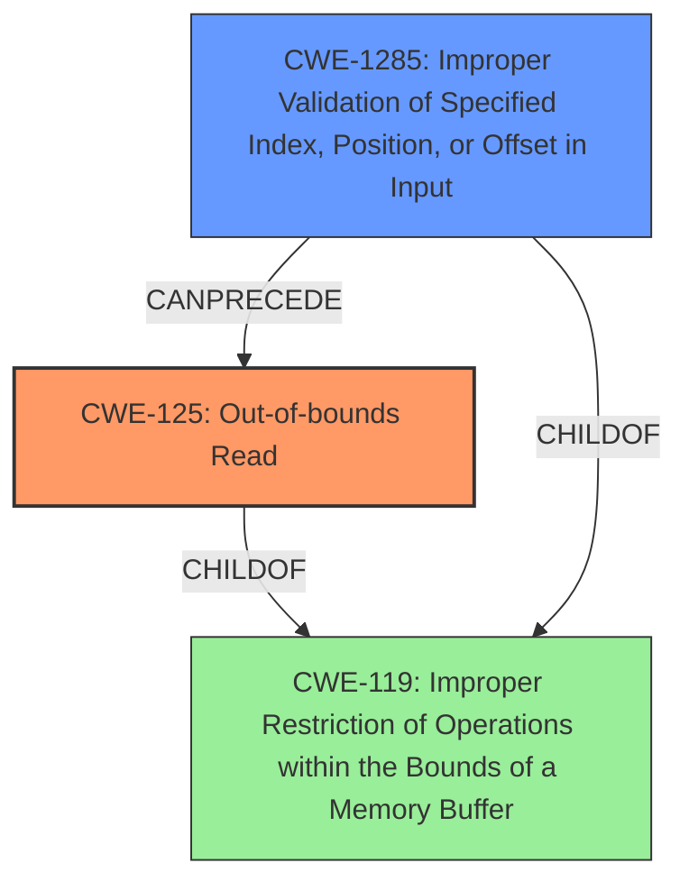

# Final Resolution for CVE-2021-39805

# Summary

| CWE ID | CWE Name | Confidence | CWE Abstraction Level | CWE Vulnerability Mapping Label | CWE-Vulnerability Mapping Notes |
|---|---|---|---|---|---|
| CWE-125 | Out-of-bounds Read | 1.0 | Base | Allowed | The vulnerability description explicitly states "**out of bounds read**" due to a "**missing bounds check**". Mitigation: Validate all read operations to ensure indices are within the allowed memory buffer. |
| CWE-1285 | Improper Validation of Specified Index, Position, or Offset in Input | 0.7 | Base | Allowed | The "**missing bounds check**" implies that the index/offset was not validated. Mitigation: Implement an "accept known good" input validation strategy to reject any index/offset that does not conform to expected value. |

  - The Primary CWE should be first and noted as the Primary CWEs
  - The secondary candidate CWEs should be next and noted as secondary candidates.
  - The confidence is a confidence score 0 to 1 to rate your confidence in your assessment for that CWE.
  - The CWE Abstraction Level as one of these values: Base, Variant, Pillar, Class, Compound
  - The Mapping Notes Usage as one of these values: Allowed, Allowed-with-Review, Prohibited, Discouraged

## Evidence and Confidence

*   **Confidence Score:** 0.9
*   **Evidence Strength:** HIGH

## Relationship Analysis
The primary relationship that influenced the decision was the parent-child relationship between CWE-119 (Improper Restriction of Operations within the Bounds of a Memory Buffer), CWE-125 (**Out-of-bounds Read**), and CWE-1285 (Improper Validation of Specified Index, Position, or Offset in Input). While CWE-119 is a parent of both CWE-125 and CWE-1285, the vulnerability description provides enough specificity to choose the base-level CWEs. CWE-1285 can precede CWE-125 as a lack of validation can lead to an out-of-bounds read.

## Vulnerability Chain
The vulnerability chain starts with a **missing bounds check** (implied by **CWE-1285**) which leads to an **out-of-bounds read** (**CWE-125**). The root cause is the lack of proper input validation on the index/offset used to access the buffer. The consequence is remote information disclosure.

## Summary of Analysis
The initial analysis correctly identified CWE-125 as the primary **WEAKNESS** due to the explicit mention of "**out of bounds read**" in the vulnerability description. The criticism suggested considering CWE-1285 as a potentially more specific alternative to CWE-1284. After reviewing the definitions of CWE-1284 and CWE-1285, and considering the context of the "**missing bounds check**" leading to an out-of-bounds read, CWE-1285 (Improper Validation of Specified Index, Position, or Offset in Input) is a slightly better fit than CWE-1284 (Improper Validation of Specified Quantity in Input) as the quantity in this case is likely an index or offset.

The decision to use CWE-125 and CWE-1285 is based on the evidence from the vulnerability description: "In l2cble_process_sig_cmd of l2c_ble.cc, there is a possible **out of bounds read** due to a **missing bounds check**."

The graph relationships influenced the decision by confirming that the selected CWEs are at the appropriate level of specificity. While CWE-119 is a parent, the base-level CWEs provide more precise information about the nature of the vulnerability. The selected CWEs are at the optimal level of specificity because they directly address the **ROOTCAUSE** and resulting **WEAKNESS** described in the vulnerability.