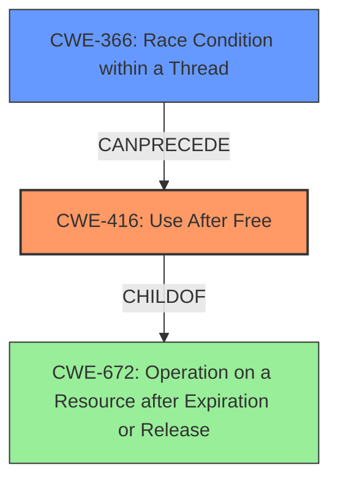

# Final Resolution for CVE-2021-39812

# Summary
| CWE ID | CWE Name | Confidence | CWE Abstraction Level | CWE Vulnerability Mapping Label | CWE-Vulnerability Mapping Notes |
|---|---|---|---|---|---|
| CWE-416 | Use After Free | 0.9 | Variant | Primary | Allowed |
| CWE-366 | Race Condition within a Thread | 0.5 | Base | Secondary | Allowed |

## Evidence and Confidence

*   **Confidence Score:** 0.8
*   **Evidence Strength:** MEDIUM

## Relationship Analysis
The primary relationship is that CWE-416 (Use After Free) can be caused by a race condition (CWE-366) or other concurrency issues. CWE-416 is a variant of CWE-672 (Operation on a Resource after Expiration or Release). The initial analysis correctly identified CWE-416. The criticism highlighted the possibility of a race condition leading to the use-after-free. Given the information, CWE-366 is a plausible contributing factor, but there's no definitive evidence of it from the vulnerability description. I considered CWE-415 (Double Free) and CWE-908 (Use of Uninitialized Resource) based on the retriever results, but neither fits the description as well as CWE-416 directly does.

## Vulnerability Chain
The vulnerability chain starts potentially with a race condition (**CWE-366**), where multiple threads access the same memory resource concurrently. This can lead to a **use after free** (**CWE-416**) condition, where memory is accessed after it has been freed. The final impact is local escalation of privilege. The vulnerability description states "...possible out of bounds read due to a use after free. This could lead to local escalation of privilege...".

## Summary of Analysis
The initial analysis correctly identified **CWE-416 (Use After Free)** as the primary weakness, and the vulnerability description explicitly states a "**use after free**" condition exists. The criticism raised valid points about potential root causes, specifically race conditions and double frees, which is why I am including **CWE-366 (Race Condition within a Thread)** as a secondary CWE. I am including it because the retriever results also suggested the same. However, there is no definitive evidence of a race condition in the vulnerability description, so my confidence in this secondary classification is lower. The selection of CWE-416 as primary is based on the direct evidence from the vulnerability description. The optimal level of specificity is achieved by using the Variant CWE-416, as it directly addresses the memory management error described. Including CWE-366 as a secondary weakness acknowledges a plausible, but not definitively proven, contributing factor. I have chosen not to include CWE-415 (Double Free) and CWE-908 (Use of Uninitialized Resource) as they are less likely given the information provided. The provided evidence supports the primary classification of CWE-416. I am including CWE-366 with less confidence as it is a reasonable deduction based on the retriever and possible vulnerability chain.